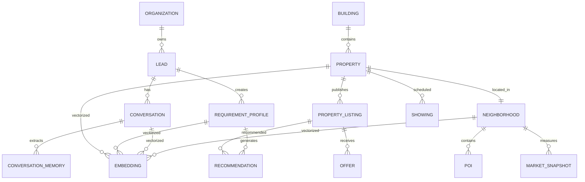

# AI Recommendation Domain Model

**AI Broker Architecture Specification (Supabase + MCP)**

## Objetivo

Diseñar un modelo de datos para un AI Broker inmobiliario preparado para:

- Compra
- Alquiler residencial
- Alquiler temporal
- Propiedades comerciales
- Recommendation Engine
- AI Agents
- RAG
- pgvector
- Supabase MCP

La arquitectura separa el dominio en Bounded Contexts (DDD), aunque puede implementarse en un único
esquema físico o distribuirse en múltiples esquemas según las necesidades operativas.

## Arquitectura del Dominio

```
                    Lead
                      │
                      ▼
            Requirement Profile
                      │
                      ▼
            Recommendation Engine
              │              │
              ▼              ▼
      Recommendation   Property Listing
                              │
                              ▼
                          Property
                              │
                              ▼
                      Building / Project
                              │
                              ▼
                     Neighborhood / POIs
```

## Bounded Contexts

| Contexto | Responsable de |
|---|---|
| **CRM** | Lead, Conversation, Conversation Memory |
| **Inventory** | Building, Property, Property Listing |
| **Recommendation** | Requirement Profile, Recommendation, Feedback, Embeddings |
| **Market Intelligence** | Neighborhood, POI, Market Snapshot |
| **AI Memory** | Buyer Persona, Conversation Memory, Embeddings |

## Modelo ERD



## Modelo de Datos (15 Tablas)

### 1. organization

| Campo | Tipo |
|---|---|
| id | uuid PK |
| name | text |
| slug | text |
| country | text |
| timezone | text |
| settings | jsonb |
| created_at | timestamptz |

### 2. lead

| Campo | Tipo |
|---|---|
| id | uuid PK |
| organization_id | uuid FK |
| external_id | text |
| full_name | text |
| phone | text |
| email | text |
| preferred_language | text |
| lead_source | text |
| status | text |
| assigned_user | uuid |
| buyer_persona | jsonb |
| created_at | timestamptz |
| updated_at | timestamptz |

### 3. conversation

| Campo | Tipo |
|---|---|
| id | uuid PK |
| lead_id | uuid FK |
| channel | text |
| status | text |
| started_at | timestamptz |
| ended_at | timestamptz |
| created_at | timestamptz |

### 4. conversation_memory

| Campo | Tipo |
|---|---|
| id | uuid PK |
| conversation_id | uuid FK |
| lead_id | uuid FK |
| memory_type | text |
| entity_name | text |
| value | jsonb |
| confidence | numeric |
| created_at | timestamptz |

### 5. requirement_profile

| Campo | Tipo |
|---|---|
| id | uuid PK |
| lead_id | uuid FK |
| transaction_type | text |
| goal | text |
| min_budget | numeric |
| max_budget | numeric |
| currency | text |
| property_category | text |
| property_type | text |
| location_preferences | jsonb |
| feature_preferences | jsonb |
| lifestyle_preferences | jsonb |
| ai_profile | jsonb |
| status | text |
| created_at | timestamptz |
| updated_at | timestamptz |

### 6. building

| Campo | Tipo |
|---|---|
| id | uuid PK |
| organization_id | uuid FK |
| name | text |
| developer | text |
| year_built | integer |
| address | text |
| district | text |
| latitude | numeric |
| longitude | numeric |
| amenities | jsonb |
| created_at | timestamptz |

### 7. property

| Campo | Tipo |
|---|---|
| id | uuid PK |
| building_id | uuid FK |
| organization_id | uuid FK |
| external_id | text |
| property_code | text |
| category | text |
| type | text |
| subtype | text |
| bedrooms | integer |
| bathrooms | numeric |
| parking | integer |
| built_area | numeric |
| land_area | numeric |
| floor | integer |
| orientation | text |
| condition | text |
| location | jsonb |
| features | jsonb |
| legal | jsonb |
| media | jsonb |
| created_at | timestamptz |
| updated_at | timestamptz |

### 8. property_listing

| Campo | Tipo |
|---|---|
| id | uuid PK |
| property_id | uuid FK |
| transaction_type | text |
| price | numeric |
| currency | text |
| maintenance | numeric |
| deposit | numeric |
| minimum_contract_months | integer |
| available_from | date |
| status | text |
| created_at | timestamptz |

### 9. recommendation

| Campo | Tipo |
|---|---|
| id | uuid PK |
| requirement_id | uuid FK |
| property_listing_id | uuid FK |
| hard_filter_score | numeric |
| semantic_score | numeric |
| location_score | numeric |
| price_score | numeric |
| lifestyle_score | numeric |
| final_score | numeric |
| rank | integer |
| explanation | text |
| feedback | jsonb |
| generated_at | timestamptz |

### 10. neighborhood

| Campo | Tipo |
|---|---|
| id | uuid PK |
| city | text |
| district | text |
| crime_index | numeric |
| noise_index | numeric |
| walkability | numeric |
| air_quality | numeric |
| market_score | numeric |
| metadata | jsonb |

### 11. poi

| Campo | Tipo |
|---|---|
| id | uuid PK |
| neighborhood_id | uuid FK |
| category | text |
| name | text |
| latitude | numeric |
| longitude | numeric |
| rating | numeric |
| metadata | jsonb |

### 12. market_snapshot

| Campo | Tipo |
|---|---|
| id | uuid PK |
| neighborhood_id | uuid FK |
| average_sale_price | numeric |
| average_rent | numeric |
| price_growth | numeric |
| rental_yield | numeric |
| vacancy | numeric |
| captured_at | timestamptz |

### 13. showing

| Campo | Tipo |
|---|---|
| id | uuid PK |
| lead_id | uuid FK |
| property_listing_id | uuid FK |
| broker_id | uuid |
| scheduled_at | timestamptz |
| status | text |
| notes | text |

### 14. offer

| Campo | Tipo |
|---|---|
| id | uuid PK |
| property_listing_id | uuid FK |
| lead_id | uuid FK |
| amount | numeric |
| currency | text |
| status | text |
| created_at | timestamptz |

### 15. embedding

| Campo | Tipo |
|---|---|
| id | uuid PK |
| entity_type | text |
| entity_id | uuid |
| embedding | vector(3072) |
| model | text |
| version | text |
| metadata | jsonb |
| updated_at | timestamptz |

---

## Comparación: 15 tablas propuestas vs Epic 2 / Epic 3

Cruce contra el catálogo de Historias de Usuario de `HU_Calificacion_Recomendacion.md` (Epic 2 —
Qualification, Epic 3 — Recommendation Engine) y contra el esquema real de Supabase auditado en esta
sesión (proyecto `bylyqznmjrqqjdfcshxj`).

| # | Tabla propuesta | Épica | Estado real | Detalle |
|---|---|---|---|---|
| 1 | `organization` | Transversal | ✅ Existe (`organizations`) | Usada tal cual, sin HU dedicada. |
| 2 | `lead` | Epic 2 | ✅ Existe (`leads`), 🔴 falta `buyer_persona` | La tabla existe pero sin la columna `buyer_persona` jsonb del doc — es exactamente **US-211**. |
| 3 | `conversation` | Transversal | ✅ Existe (`conversations`) | Usada por AI-104 (Coordinator, aún sin implementar). |
| 4 | `conversation_memory` | Epic 2 | 🔴 Pendiente — no existe | Es **AI-102**: extracción de señales libres de la conversación. |
| 5 | `requirement_profile` | Epic 2 | 🟡 Rol cubierto por `buyer_profiles` (existe) | **No se crea esta tabla** — decisión ya tomada: `buyer_profiles` cumple el mismo rol (budget/locations/property_type/timeline/must_haves). Diferencia real sin resolver: el doc permite múltiples perfiles por lead, `buyer_profiles.lead_id` es único (sin historial). El campo `ai_profile` de esta tabla sí es gap — **US-211**. |
| 6 | `building` | — | ⚪ Fuera de alcance | Ninguna HU de Epic 2/3 la cubre — pertenece al bounded context Inventory, no a Qualification/Recommendation. |
| 7 | `property` | Epic 3 | 🟡 Existe (`properties`), con drift de esquema | Falta reconciliar `zone`↔`District`/`name_address`/`Link_references`/`estado` — **US-309**. No usa la taxonomía de 3 niveles category/type/subtype propuesta más abajo (queda como mejora futura). |
| 8 | `property_listing` | — | ⚪ Fuera de alcance | Ninguna HU separa precio/oferta comercial de `property`; `properties.price` vive directo en la tabla física. Rediseño mayor, no un gap de Epic 2/3. |
| 9 | `recommendation` | Epic 3 | 🔴 Pendiente — no existe | Es **US-310**, con un diseño distinto al del doc: en vez de 5 columnas de score fijas (`hard_filter_score`/`semantic_score`/`location_score`/`price_score`/`lifestyle_score`), usa una columna `signals` jsonb con `RankingSignal[]` dinámico — refleja que `WeightedRankingEngine` ya en código no tiene un set fijo de 5 factores. Cierra también US-305, US-306, US-307. |
| 10 | `neighborhood` | — | ⚪ Fuera de alcance | El enriquecimiento (`US-307`) es una llamada en vivo a Google Maps, sin caché — cachearlo en esta tabla es una optimización futura, no un gap de Epic 2/3. |
| 11 | `poi` | — | ⚪ Fuera de alcance | Mismo caso que `neighborhood`. |
| 12 | `market_snapshot` | — | ⚪ Fuera de alcance | Ninguna HU de Epic 2/3 la requiere. |
| 13 | `showing` | — | ⚪ Fuera de alcance | Pertenece a una épica posterior (Appointment/Scheduling, Epic 4 del Backlog), no a Qualification/Recommendation. |
| 14 | `offer` | — | ⚪ Fuera de alcance | Épica posterior (Offer/Closing), no Epic 2/3. |
| 15 | `embedding` (genérica, `entity_type`/`entity_id`) | Epic 3 | 🟡 Rol cubierto por `property_embeddings` (existe, tipo incorrecto) | **No se crea la tabla polimórfica** — el código ya modela embeddings 1:1 vía FK dedicada a `properties`, y no existe ningún dispatcher `entity_type` en ninguna parte del código. `property_embeddings.vector` sigue siendo `jsonb` en vez de `vector(1536)` real — **US-304 / US-308**. |

### Resumen de la comparación

- **3 de 15 tablas ya existen y se usan tal cual**: `organization`→`organizations`, `conversation`→`conversations`, y `lead`→`leads` (parcial, falta `buyer_persona`).
- **2 de 15 no se crean como tabla nueva porque su rol ya está cubierto** por una tabla existente con otro nombre/diseño: `requirement_profile`→`buyer_profiles`, `embedding`→`property_embeddings`.
- **2 de 15 sí son gaps reales y accionables dentro de Epic 2/3**: `conversation_memory` (AI-102) y `recommendation`→`recommendations` (US-310), más `property` que existe pero necesita reconciliación (US-309).
- **6 de 15 están fuera de alcance** de Epic 2/3 tal como está definido hoy: `building`, `property_listing`, `neighborhood`, `poi`, `market_snapshot`, `showing`, `offer` — pertenecen a otros bounded contexts (Inventory, Market Intelligence) o a épicas posteriores del Backlog (Appointment, Offer).
- Es decir: de las 15 tablas del modelo de dominio, solo **2 nuevas tablas** (`conversation_memory`, `recommendations`) y **2 migraciones sobre tablas existentes** (`properties`, `property_embeddings`) son necesarias para cerrar Epic 2 y Epic 3 — el resto ya existe con otro nombre o es trabajo de otra épica.

## Uso de JSONB

**`buyer_persona`**
```json
{
  "family_stage": "Young Couple",
  "communication": "WhatsApp",
  "budget_flexibility": 0.15
}
```

**`location_preferences`**
```json
{
  "preferred": ["Miraflores", "Barranco"],
  "avoid": ["Centro"],
  "max_commute": 20
}
```

**`feature_preferences`**
```json
{
  "bedrooms": 2,
  "bathrooms": 2,
  "parking": 1,
  "pool": true,
  "gym": true,
  "pet_friendly": true
}
```

**`lifestyle_preferences`**
```json
{
  "restaurants": true,
  "parks": true,
  "walkability": true,
  "beach": false
}
```

**`ai_profile`**
```json
{
  "modern_score": 0.91,
  "luxury_score": 0.22,
  "family_score": 0.80,
  "confidence": 0.94
}
```

**`property.features`**
```json
{
  "gym": true,
  "pool": true,
  "security": true,
  "coworking": true,
  "pet_area": true
}
```

**`property.legal`**
```json
{
  "title_verified": true,
  "pets_allowed": true,
  "short_rent_allowed": false
}
```

**`property.media`**
```json
{
  "photos": [],
  "video": "",
  "virtual_tour": "",
  "floorplan": ""
}
```

## SQL para Supabase SQL Editor

**Habilitar pgvector**
```sql
create extension if not exists vector;
```

### Índices recomendados

**Relaciones**
```sql
create index idx_property_building on property(building_id);
create index idx_listing_property on property_listing(property_id);
create index idx_requirement_lead on requirement_profile(lead_id);
create index idx_recommendation_requirement on recommendation(requirement_id);
create index idx_recommendation_listing on recommendation(property_listing_id);
```

**JSONB**
```sql
create index idx_property_features on property using gin(features);
create index idx_property_location on property using gin(location);
create index idx_requirement_features on requirement_profile using gin(feature_preferences);
create index idx_requirement_location on requirement_profile using gin(location_preferences);
```

**Embeddings (pgvector)**
```sql
create index idx_embedding_vector on embedding using hnsw (embedding vector_cosine_ops);
```

> Si la versión de PostgreSQL/pgvector no soporta HNSW, puede utilizarse `ivfflat` con el operador
> correspondiente.

**Trigger `updated_at`**
```sql
create or replace function update_updated_at()
returns trigger
language plpgsql
as $$
begin
    new.updated_at = now();
    return new;
end;
$$;

create trigger trg_property_updated
before update on property
for each row execute procedure update_updated_at();
```

> Crear triggers equivalentes para `lead` y `requirement_profile`.

## Recommendation Engine

```
Conversation
      │
      ▼
Entity Extraction
      │
      ▼
Requirement Profile
      │
      ▼
Constraint Engine
      │
      ▼
Hard Filters
      │
      ▼
Hybrid Search
(PostgreSQL + JSONB + pgvector)
      │
      ▼
Ranking Model
      │
      ▼
Explainability
      │
      ▼
Top-N Recommendations
      │
      ▼
Showing
      │
      ▼
Offer
      │
      ▼
Feedback
      │
      ▼
Learning Loop
```

## Principios de diseño

1. Separar el activo físico (`property`) de su oferta comercial (`property_listing`).
2. Modelar el Requirement Profile como una necesidad específica del cliente, permitiendo múltiples
   búsquedas por lead.
3. Utilizar JSONB para atributos que evolucionan con frecuencia (preferencias, amenidades, perfiles
   inferidos), evitando cambios constantes del esquema.
4. Mantener los embeddings desacoplados en una tabla propia para facilitar la reindexación al cambiar de
   modelo.
5. Persistir las recomendaciones y el feedback para habilitar aprendizaje continuo, explicabilidad y
   evaluación del motor de recomendación.
6. Diseñar el modelo para búsquedas híbridas que combinen filtros estructurados, documentos JSONB y
   similitud semántica mediante pgvector.

---

## Taxonomía de 3 niveles (Category / Type / Subtype)

En lugar de `category`, `type` y `subtype` sueltos, se propone una taxonomía de tres niveles, ya que
permitirá que el AI Agent haga recomendaciones mucho más precisas y evita ambigüedades.

```
Property Category
        │
        ▼
Property Type
        │
        ▼
Property Subtype
```

**Ejemplo:**

| Category | Type | Subtype |
|---|---|---|
| Residential | Multifamiliar | Apartment |
| Residential | Multifamiliar | Duplex |
| Residential | Unifamiliar | Single-Family Home |
| Residential | Unifamiliar | Townhouse |
| Residential | Condominio | Condo Unit |
| Commercial | Office | Private Office |
| Commercial | Retail | Local Comercial |
| Commercial | Warehouse | Warehouse |
| Land | Residential Lot | Corner Lot |

Así el Recommendation Engine puede filtrar por cualquiera de los tres niveles.

> **Nota de alcance:** esta taxonomía de 3 niveles no está cubierta por ninguna HU de Epic 2/3 (ver tabla
> de comparación arriba) — `properties.category`/`type`/`subtype` sigue siendo un `PropertyType` plano en
> el código actual. Queda como mejora futura documentada, no como gap accionable ahora.

### Property Category (lista completa)

- Residential
- Commercial
- Land
- Industrial
- Mixed Use

**Residential → Property Type**
- Unifamiliar
- Multifamiliar
- Condominio

**Residential → Property Subtype**
- Unifamiliar: Single-Family Home, Townhouse
- Multifamiliar: Apartment, Duplex, Triplex, Fourplex
- Condominio: Condo Unit, Loft, Studio, Penthouse

**Commercial → Property Type**
- Office
- Retail
- Industrial
- Hospitality
- Medical
- Mixed Commercial

**Commercial → Property Subtype**
- Office: Private Office, Coworking, Office Floor, Corporate Building
- Retail: Local Comercial, Shopping Center Unit, Restaurant Space, Showroom
- Hospitality: Hotel, Hostel, Vacation Rental, Apart Hotel

**Land → Type**
- Residential Lot
- Commercial Lot
- Industrial Lot
- Agricultural Land

**Industrial → Type**
- Warehouse
- Factory
- Distribution Center
- Logistics Park

## Ejemplo documentado: formato recomendado para todas las tablas

Formato recomendado para documentar cada tabla: agregar una columna **Descripción** además de Campo y
Tipo. Ejemplo con `Property`:

### Property

Representa la unidad física del inmueble.

| Campo | Tipo | Descripción |
|---|---|---|
| id | uuid PK | Identificador único de la propiedad. |
| building_id | uuid FK | Proyecto o edificio al que pertenece (opcional para casas). |
| organization_id | uuid FK | Agencia propietaria del registro. |
| external_id | text | Identificador proveniente del CRM o MLS. |
| property_code | text | Código interno de la propiedad. |
| **category** | text | Categoría principal del inmueble (Residential, Commercial, Land, Industrial). |
| **type** | text | Tipo general de propiedad según la categoría. |
| **subtype** | text | Subtipo específico utilizado para recomendaciones y filtros. |
| bedrooms | integer | Número de dormitorios. |
| bathrooms | numeric | Número de baños completos o medios baños. |
| parking | integer | Número de estacionamientos. |
| built_area | numeric | Área construida en m². |
| land_area | numeric | Área del terreno en m². |
| floor | integer | Piso donde se encuentra la unidad. |
| orientation | text | Orientación (Norte, Sur, Este, Oeste). |
| condition | text | Estado físico (Nuevo, Usado, Remodelado, En construcción). |
| location | jsonb | Información geográfica y contexto enriquecido. |
| features | jsonb | Amenidades y características dinámicas. |
| legal | jsonb | Información legal y regulatoria. |
| media | jsonb | Fotos, videos, planos y recorridos virtuales. |
| created_at | timestamptz | Fecha de creación del registro. |
| updated_at | timestamptz | Fecha de última actualización. |

### JSONB recomendados (Property)

**`location`**
```json
{
  "country": "Peru",
  "city": "Lima",
  "district": "Miraflores",
  "latitude": -12.121,
  "longitude": -77.031,
  "walk_score": 92,
  "crime_index": 0.12,
  "closest_metro_minutes": 8
}
```

**`features`**
```json
{
  "pool": true,
  "gym": true,
  "coworking": false,
  "security24h": true,
  "pet_friendly": true,
  "elevator": true,
  "balcony": true,
  "terrace": false,
  "garden": false,
  "fireplace": false
}
```

**`legal`**
```json
{
  "title_verified": true,
  "mortgage": false,
  "hoa_fee": 280,
  "pets_allowed": true,
  "short_term_rental_allowed": false,
  "occupancy_status": "Vacant"
}
```

**`media`**
```json
{
  "cover_photo": "...",
  "photos": [],
  "video_url": "...",
  "virtual_tour_url": "...",
  "floorplan_url": "...",
  "brochure_pdf": "..."
}
```

## Recomendación para todo el documento

Aplicar exactamente este mismo formato (tabla con Campo, Tipo y Descripción) a las 15 tablas del modelo.
El resultado sería un documento cercano a 35–45 páginas, equivalente a un Data Dictionary de nivel
empresarial. Además de servir como documentación, podría utilizarse como fuente para generar
automáticamente migraciones, APIs y herramientas MCP, ya que cada atributo tendría un significado
funcional claramente definido y una taxonomía consistente.
