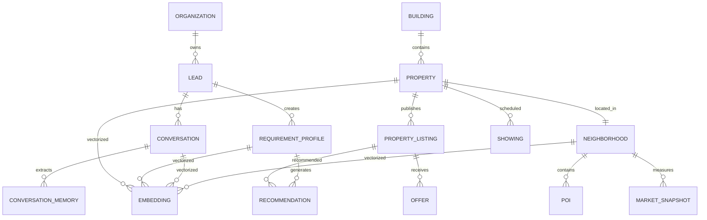

# AI Recommendation Domain Model

AI Broker Architecture Specification (Supabase + MCP)
Objetivo

Diseñar un modelo de datos para un AI Broker inmobiliario preparado para:

Compra
Alquiler residencial
Alquiler temporal
Propiedades comerciales
Recommendation Engine
AI Agents
RAG
pgvector
Supabase MCP

La arquitectura separa el dominio en Bounded Contexts (DDD), aunque puede implementarse en un único esquema físico o distribuirse en múltiples esquemas según las necesidades operativas.

Arquitectura del Dominio
                    Lead
                      │
                      ▼
            Requirement Profile
                      │
                      ▼
            Recommendation Engine
              │              │
              ▼              ▼
      Recommendation   Property Listing
                              │
                              ▼
                          Property
                              │
                              ▼
                      Building / Project
                              │
                              ▼
                     Neighborhood / POIs
Bounded Contexts
# CRM
Responsable de:
Lead
Conversation
Conversation Memory

# Inventory
Responsable de:
Building
Property
Property Listing

# Recommendation
Responsable de:
Requirement Profile
Recommendation
Feedback
Embeddings

# Market Intelligence
Responsable de:
Neighborhood
POI
Market Snapshot

#AI Memory
Responsable de:
Buyer Persona
Conversation Memory
Embeddings

# Modelo ERD

# Modelo de Datos (15 Tablas)
1. organization
    id uuid PK
    name text
    slug text
    country text
    timezone text
    settings jsonb
    created_at timestamptz
2. lead
    id uuid PK
    organization_id uuid FK
    external_id text
    full_name text
    phone text
    email text
    preferred_language text
    lead_source text
    status text
    assigned_user uuid
    buyer_persona jsonb
    created_at timestamptz
    updated_at timestamptz
3. conversation
id uuid PK
lead_id uuid FK
channel text
status text
started_at timestamptz
ended_at timestamptz
created_at timestamptz
4. conversation_memory
id uuid PK
conversation_id uuid FK
lead_id uuid FK
memory_type text
entity_name text
value jsonb
confidence numeric
created_at timestamptz
5. requirement_profile
id uuid PK
lead_id uuid FK

transaction_type text
goal text

min_budget numeric
max_budget numeric
currency text

property_category text
property_type text

location_preferences jsonb
feature_preferences jsonb
lifestyle_preferences jsonb
ai_profile jsonb

status text

created_at timestamptz
updated_at timestamptz

6. building
id uuid PK

organization_id uuid FK

name text

developer text

year_built integer

address text

district text

latitude numeric

longitude numeric

amenities jsonb

created_at timestamptz

7. property
id uuid PK

building_id uuid FK

organization_id uuid FK

external_id text

property_code text

category text

type text

subtype text

bedrooms integer

bathrooms numeric

parking integer

built_area numeric

land_area numeric

floor integer

orientation text

condition text

location jsonb

features jsonb

legal jsonb

media jsonb

created_at timestamptz

updated_at timestamptz

8. property_listing
id uuid PK

property_id uuid FK

transaction_type text

price numeric

currency text

maintenance numeric

deposit numeric

minimum_contract_months integer

available_from date

status text

created_at timestamptz

9. recommendation
id uuid PK

requirement_id uuid FK

property_listing_id uuid FK

hard_filter_score numeric

semantic_score numeric

location_score numeric

price_score numeric

lifestyle_score numeric

final_score numeric

rank integer

explanation text

feedback jsonb

generated_at timestamptz

10. neighborhood
id uuid PK

city text

district text

crime_index numeric

noise_index numeric

walkability numeric

air_quality numeric

market_score numeric

metadata jsonb

11. poi
id uuid PK

neighborhood_id uuid FK

category text

name text

latitude numeric

longitude numeric

rating numeric

metadata jsonb

12. market_snapshot
id uuid PK

neighborhood_id uuid FK

average_sale_price numeric

average_rent numeric

price_growth numeric

rental_yield numeric

vacancy numeric

captured_at timestamptz

13. showing
id uuid PK

lead_id uuid FK

property_listing_id uuid FK

broker_id uuid

scheduled_at timestamptz

status text

notes text

14. offer
id uuid PK

property_listing_id uuid FK

lead_id uuid FK

amount numeric

currency text

status text

created_at timestamptz

15. embedding
id uuid PK

entity_type text

entity_id uuid

embedding vector(3072)

model text

version text

metadata jsonb

updated_at timestamptz

# Uso de JSONB
buyer_persona
{
  "family_stage": "Young Couple",
  "communication": "WhatsApp",
  "budget_flexibility": 0.15
}
location_preferences
{
  "preferred": [
    "Miraflores",
    "Barranco"
  ],
  "avoid": [
    "Centro"
  ],
  "max_commute": 20
}
feature_preferences
{
  "bedrooms": 2,
  "bathrooms": 2,
  "parking": 1,
  "pool": true,
  "gym": true,
  "pet_friendly": true
}
lifestyle_preferences
{
  "restaurants": true,
  "parks": true,
  "walkability": true,
  "beach": false
}
ai_profile
{
  "modern_score": 0.91,
  "luxury_score": 0.22,
  "family_score": 0.80,
  "confidence": 0.94
}
property.features
{
  "gym": true,
  "pool": true,
  "security": true,
  "coworking": true,
  "pet_area": true
}
property.legal
{
  "title_verified": true,
  "pets_allowed": true,
  "short_rent_allowed": false
}
property.media
{
  "photos": [],
  "video": "",
  "virtual_tour": "",
  "floorplan": ""
}

# SQL para Supabase SQL Editor
Habilitar pgvector
create extension if not exists vector;

## Índices recomendados
### Relaciones

create index idx_property_building
on property(building_id);

create index idx_listing_property
on property_listing(property_id);

create index idx_requirement_lead
on requirement_profile(lead_id);

create index idx_recommendation_requirement
on recommendation(requirement_id);

create index idx_recommendation_listing
on recommendation(property_listing_id);

### JSONB
create index idx_property_features
on property
using gin(features);

create index idx_property_location
on property
using gin(location);

create index idx_requirement_features
on requirement_profile
using gin(feature_preferences);

create index idx_requirement_location
on requirement_profile
using gin(location_preferences);

### Embeddings (pgvector)
create index idx_embedding_vector
on embedding
using hnsw (embedding vector_cosine_ops);

Si la versión de PostgreSQL/pgvector no soporta HNSW, puede utilizarse ivfflat con el operador correspondiente.

### Trigger updated_at
create or replace function update_updated_at()
returns trigger
language plpgsql
as $$
begin
    new.updated_at = now();
    return new;
end;
$$;
create trigger trg_property_updated
before update
on property
for each row
execute procedure update_updated_at();

Crear triggers equivalentes para:

lead
requirement_profile

## Recommendation Engine

Conversation
      │
      ▼
Entity Extraction
      │
      ▼
Requirement Profile
      │
      ▼
Constraint Engine
      │
      ▼
Hard Filters
      │
      ▼
Hybrid Search
(PostgreSQL + JSONB + pgvector)
      │
      ▼
Ranking Model
      │
      ▼
Explainability
      │
      ▼
Top-N Recommendations
      │
      ▼
Showing
      │
      ▼
Offer
      │
      ▼
Feedback
      │
      ▼
Learning Loop

# Principios de diseño
Separar el activo físico (property) de su oferta comercial (property_listing).
Modelar el Requirement Profile como una necesidad específica del cliente, permitiendo múltiples búsquedas por lead.
Utilizar JSONB para atributos que evolucionan con frecuencia (preferencias, amenidades, perfiles inferidos), evitando cambios constantes del esquema.
Mantener los embeddings desacoplados en una tabla propia para facilitar la reindexación al cambiar de modelo.
Persistir las recomendaciones y el feedback para habilitar aprendizaje continuo, explicabilidad y evaluación del motor de recomendación.
Diseñar el modelo para búsquedas híbridas que combinen filtros estructurados, documentos JSONB y similitud semántica mediante pgvector.

-------------

En lugar de category, type y subtype, propondría una taxonomía de tres niveles, ya que permitirá que el AI Agent haga recomendaciones mucho más precisas y evita ambigüedades.

Property Category
        │
        ▼
Property Type
        │
        ▼
Property Subtype

Ejemplo:

| Category    | Type            | Subtype            |
| ----------- | --------------- | ------------------ |
| Residential | Multifamiliar   | Apartment          |
| Residential | Multifamiliar   | Duplex             |
| Residential | Unifamiliar     | Single-Family Home |
| Residential | Unifamiliar     | Townhouse          |
| Residential | Condominio      | Condo Unit         |
| Commercial  | Office          | Private Office     |
| Commercial  | Retail          | Local Comercial    |
| Commercial  | Warehouse       | Warehouse          |
| Land        | Residential Lot | Corner Lot         |

Así el Recommendation Engine puede filtrar por cualquiera de los tres niveles.

Ejemplo documentado

A continuación muestro el formato que recomiendo utilizar para todas las tablas: agregar una columna Descripción.

Property

Representa la unidad física del inmueble.

| Campo           | Tipo        | Descripción                                                                   |
| --------------- | ----------- | ----------------------------------------------------------------------------- |
| id              | uuid PK     | Identificador único de la propiedad.                                          |
| building_id     | uuid FK     | Proyecto o edificio al que pertenece (opcional para casas).                   |
| organization_id | uuid FK     | Agencia propietaria del registro.                                             |
| external_id     | text        | Identificador proveniente del CRM o MLS.                                      |
| property_code   | text        | Código interno de la propiedad.                                               |
| **category**    | text        | Categoría principal del inmueble (Residential, Commercial, Land, Industrial). |
| **type**        | text        | Tipo general de propiedad según la categoría.                                 |
| **subtype**     | text        | Subtipo específico utilizado para recomendaciones y filtros.                  |
| bedrooms        | integer     | Número de dormitorios.                                                        |
| bathrooms       | numeric     | Número de baños completos o medios baños.                                     |
| parking         | integer     | Número de estacionamientos.                                                   |
| built_area      | numeric     | Área construida en m².                                                        |
| land_area       | numeric     | Área del terreno en m².                                                       |
| floor           | integer     | Piso donde se encuentra la unidad.                                            |
| orientation     | text        | Orientación (Norte, Sur, Este, Oeste).                                        |
| condition       | text        | Estado físico (Nuevo, Usado, Remodelado, En construcción).                    |
| location        | jsonb       | Información geográfica y contexto enriquecido.                                |
| features        | jsonb       | Amenidades y características dinámicas.                                       |
| legal           | jsonb       | Información legal y regulatoria.                                              |
| media           | jsonb       | Fotos, videos, planos y recorridos virtuales.                                 |
| created_at      | timestamptz | Fecha de creación del registro.                                               |
| updated_at      | timestamptz | Fecha de última actualización.                                                |

Property Category (lista)
Residential

Commercial

Land

Industrial

Mixed Use
Residential → Property Type
Unifamiliar

Multifamiliar

Condominio
Residential → Property Subtype
Unifamiliar
Single-Family Home

Townhouse
Multifamiliar
Apartment

Duplex

Triplex

Fourplex
Condominio
Condo Unit

Loft

Studio

Penthouse
Commercial → Property Type
Office

Retail

Industrial

Hospitality

Medical

Mixed Commercial
Office
Private Office

Coworking

Office Floor

Corporate Building
Retail
Local Comercial

Shopping Center Unit

Restaurant Space

Showroom
Hospitality
Hotel

Hostel

Vacation Rental

Apart Hotel
Land → Type
Residential Lot

Commercial Lot

Industrial Lot

Agricultural Land
Industrial → Type
Warehouse

Factory

Distribution Center

Logistics Park
JSONB recomendados
location
{
  "country": "Peru",
  "city": "Lima",
  "district": "Miraflores",
  "latitude": -12.121,
  "longitude": -77.031,
  "walk_score": 92,
  "crime_index": 0.12,
  "closest_metro_minutes": 8
}
features
{
  "pool": true,
  "gym": true,
  "coworking": false,
  "security24h": true,
  "pet_friendly": true,
  "elevator": true,
  "balcony": true,
  "terrace": false,
  "garden": false,
  "fireplace": false
}
legal
{
  "title_verified": true,
  "mortgage": false,
  "hoa_fee": 280,
  "pets_allowed": true,
  "short_term_rental_allowed": false,
  "occupancy_status": "Vacant"
}
media
{
  "cover_photo": "...",
  "photos": [],
  "video_url": "...",
  "virtual_tour_url": "...",
  "floorplan_url": "...",
  "brochure_pdf": "..."
}
Recomendación para todo el documento

Aplicaría exactamente este mismo formato (tabla con Campo, Tipo y Descripción) a las 15 tablas del modelo. El resultado sería un documento cercano a 35–45 páginas, equivalente a un Data Dictionary de nivel empresarial. Además de servir como documentación, podría utilizarse como fuente para generar automáticamente migraciones, APIs y herramientas MCP, ya que cada atributo tendría un significado funcional claramente definido y una taxonomía consistente.