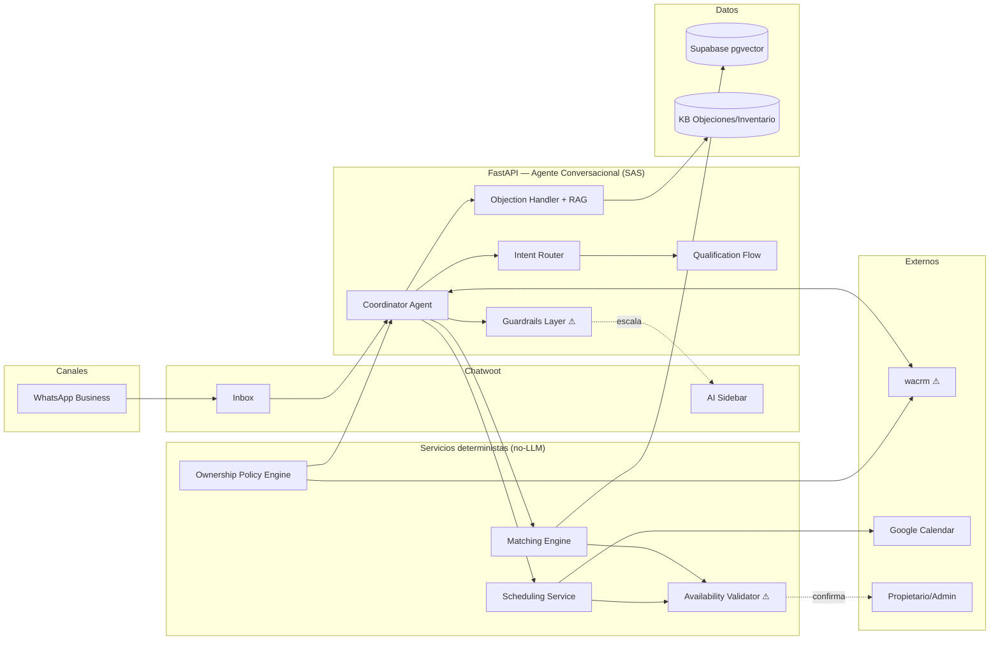

# Lead-to-Visit WhatsApp Agent — Agentic System Design

**Versión:** 1.0 · **Fecha:** 2026-07-04 · **Modo:** Diseño · **Veredicto ARSDA:** 🟡 **4.15 — Scale with Caution** (ver §9)

Sistema conversacional AI-first que convierte leads digitales de WhatsApp en visitas agendadas mediante conversación consultiva. Se diseña dentro de las constraints de ArchitecturalDrivers v0.2: Chatwoot (SoR conversaciones), wacrm (SoR leads), FastAPI + Supabase (dominio AI), monolito modular organization-ready.

## 0. Caso de Uso

**Objetivo de negocio:** convertir un lead digital en visita agendada en <24h, respondiendo en <30 segundos, con conversación consultiva personalizada. Usuarios: compradores potenciales (WhatsApp) y asesores/brokers (Chatwoot).

**Happy path:**
1. Recepción del lead (respuesta <30s, identificar anuncio, capturar nombre/propiedad/canal).
2. Identificación de intención (comprar principal/inversión/vacacional, preventa, vender, solo información).
3. Descubrimiento de necesidades (perfil familiar, ubicación, presupuesto, financiamiento, horizonte, decisores).
4. Calificación comercial (Hot/Warm/Cold + registro de objeciones).
5. Matching contra inventario (ideal / alternativas / replantear) + envío de materiales.
6. Resolución de objeciones (precio, gastos, crédito, zona, plusvalía...).
7. Invitación a visita con horarios concretos (validando asesor + propietario + estado de propiedad).
8. Confirmación + recordatorios 24h y 2h.

**Rutas alternativas** (mecanismo → sección donde se resuelve):

| # | Ruta | Mecanismo | Ref |
|---|------|-----------|-----|
| A1 | Lead frío | Nurturing con propiedades similares; reactivación pasa por Ownership Policy Engine | §2, §3 |
| A2 | Sin respuesta | Follow-ups 24h/72h → campañas; decae a `Dormant` | §3 |
| A3 | Propiedad no disponible | Availability Validator (servicio determinista) + alternativas del Matching | §2, §6 |
| A4 | Solicita descuento | Guardrail: registrar oferta, NUNCA prometer → humano (Regla 2) | §1.B, §6 |
| A5 | Crédito pendiente | Derivación a asesor financiero (handoff con contexto) | §2 |
| A6 | Quiere vender | Routing a flujo de captación independiente (fuera de alcance de este agente) | §2, §9 |
| A7 | No califica | Replanteo de presupuesto/zona/tipo con el Qualification loop | §2 |
| A8 | 2 fallos de comprensión | Escalado a humano obligatorio (Regla 3) | §1.B, §6 |
| A9 | Dinero o documentos | Escalado a humano obligatorio (Regla 4) | §1.B, §6 |
| A10 | Cancelación último minuto / reagenda | Exception handling del Appointment + re-nurturing | §2 |
| A11 | Lead reaparece semanas después | `Reactivated → OwnershipEvaluation` (matriz E14) | §3 |

**Supuestos a validar:** (a) inventario con disponibilidad consultable en tiempo real o con propietario/administrador contactable en <4h; (b) los 15 estados CRM existen en wacrm y son sincronizables; (c) volumen inicial ≤ ~50 conversaciones concurrentes por organización; (d) los casos QA 1–10 del journey se convierten en test set del eval pipeline (§7).

---

## 1. Decisión Arquitectónica: SAS vs MAS

| Factor | Evaluación del caso | Apunta a |
|--------|--------------------|----------|
| **Estructura de la tarea** | Fuertemente **secuencial con estados dependientes**: intención → descubrimiento → calificación → matching → objeciones → visita. Cada paso consume el contexto acumulado del anterior (el matching depende del perfil; las objeciones dependen de lo enviado). MAS degradaría 39–70%. Solo matching-enrichment y validación de disponibilidad son paralelizables. | **SAS** |
| **Regla del 45%** | Un agente único con buenas tools sobre conversación de calificación inmobiliaria supera con holgura el 45% de baseline (dominio acotado, patrones claros). Añadir agentes = retornos negativos por coordinación. | **SAS** |
| **Complejidad de tools** | Tool-heavy: WhatsApp/Chatwoot, CRM, inventario, disponibilidad, calendario, maps, materiales (~8–10 tools). En MAS el presupuesto de tokens por agente se fragmentaría. | **SAS** |
| **Tolerancia al error** | Baja tolerancia: el riesgo crítico (agendar visita a propiedad no disponible) y las reglas 1–4 exigen **cuello de botella de validación centralizado** (contiene amplificación a 4.4x vs 17.2x). | **Centralizada** |

**Veredicto: Híbrido — SAS conversacional + capacidades extraídas como servicios deterministas.** Un único agente conversacional (Coordinator) posee todo el diálogo del happy path; se extraen como servicios NO-LLM lo reutilizable e independiente: Availability Validator, Matching Engine (búsqueda estructurada + RAG), Scheduling Service y Ownership Policy Engine. El flujo "quiere vender" (A6) se enruta a un agente independiente futuro — es un dominio distinto, no una capacidad de este.

### 1.B Matriz de Autonomía (Riesgo × Complejidad)

| Decisión del sistema | Celda | Nivel de autonomía | Mecanismo |
|---|---|---|---|
| Responder saludo / FAQs del anuncio | Bajo × Baja | AI independiente | Autónomo, con trace |
| Clasificar intención (paso 2) | Bajo × Media | AI como ejecutor | Autónomo monitoreado; 2 fallos → humano (A8) |
| Hacer preguntas de descubrimiento | Bajo × Baja | AI independiente | Autónomo |
| Calificar Hot/Warm/Cold | Medio × Media | Autonomía condicional | Autónomo; humano revisa edge cases vía AI Sidebar |
| Enviar materiales de propiedad (fotos/plano/precio) | Medio × Baja | AI como asistente reforzado | Autónomo SOLO con precio validado contra inventario (caso QA-6) |
| Responder objeciones informativas (zona, gastos, plusvalía) | Medio × Media | Autonomía condicional | Autónomo con RAG sobre KB aprobada; sin cifras no verificadas |
| Prometer/negociar descuento (A4) | Alto × Alta | **Solo humano** | Guardrail duro: registra la oferta, transfiere (Regla 2) |
| Proponer horarios de visita | Medio × Media | Autonomía condicional | Solo horarios pre-validados por Availability Validator (Regla 1) |
| **Confirmar visita** | Alto × Media | AI como asistente | Requiere validación determinista de disponibilidad + confirmación 2–4h antes (riesgo crítico) |
| Derivar a asesor financiero (A5) | Bajo × Baja | AI independiente | Autónomo con handoff de contexto |
| Manejar dinero, separación, documentos (A9, QA-8) | Alto × Alta | **Solo humano** | Transferencia inmediata (Regla 4) |
| Transferir ownership (reactivaciones A1/A11) | Medio × Alta | AI override posible | Policy Engine decide; explicación visible; humano puede revertir |

Regla aplicada: **el riesgo manda sobre la complejidad** — confirmar una visita es conversacionalmente simple pero su fallo es el riesgo crítico del negocio, por eso nunca es "AI independiente".

---
## 2. Arquitectura y Patrones

⚠ = puntos de falla críticos: Availability Validator (riesgo de negocio), wacrm sync (decisiones sobre datos stale), Guardrails (última línea antes de acción irreversible).

**Fichas de agentes/servicios (Gate 2 — una oración):**

| Componente | Responsabilidad (una oración) | Inputs | Outputs | Tools | Contexto (Gate 7) | Fallo y contención |
|---|---|---|---|---|---|---|
| **Coordinator Agent** (LLM) | Conducir la conversación del lead desde recepción hasta visita confirmada, delegando toda decisión no conversacional | Mensajes, estado de conversación, BuyerProfile parcial | Respuestas, transiciones de estado, tool calls | send_message, get_lead, update_profile, search_properties, propose_slots, book_visit, handoff | 4/5 — solo estado actual + perfil + últimos N mensajes | Timeout/API caída → fallback "te confirmo en breve" + tarea; 2 fallos comprensión → humano (A8) |
| **Intent Router** (LLM, 1 llamada) | Clasificar la intención del lead en una de 6 categorías | Primeros mensajes + anuncio de origen | IntentType + confidence | — | 5/5 — solo mensajes iniciales | Confidence < umbral → pregunta de confirmación; ambigüedad persistente → humano |
| **Objection Handler** (LLM+RAG) | Responder una objeción con información verificada de la KB, o declarar que no sabe | Objeción detectada + BuyerProfile | Respuesta fundamentada + registro de objeción | rag_search | 4/5 — objeción + chunks recuperados | Sin evidencia en KB → no inventa: ofrece consultar al asesor |
| **Matching Engine** (determinista+RAG) | Devolver Top-3 propiedades disponibles que satisfacen el BuyerProfile | BuyerProfile completo | RecommendationItems con explicación | SQL filters + pgvector + Availability Validator | 5/5 — solo perfil estructurado | 0 resultados → señal "replantear búsqueda" (A7), nunca lista vacía silenciosa |
| **Availability Validator** (determinista) | Confirmar que una propiedad está disponible y visitable en un horario dado | propertyId, slot | AvailabilityStatus (confirmed/pending/unavailable) + fuente | Inventario + contacto propietario/admin | 5/5 | Estado `pending` bloquea confirmación al cliente; re-check 2–4h antes (mitigación del riesgo crítico) |
| **Scheduling Service** (determinista) | Materializar una visita validada en Google Calendar con recordatorios 24h/2h | Slot validado, asistentes, asesor | Evento + recordatorios programados | Google Calendar API | 5/5 | Fallo de API → retry con backoff; sin confirmación externa no se notifica al cliente |
| **Ownership Policy Engine** (reglas) | Decidir el mejor owner de toda conversación nueva o reactivada según la matriz E14 | Contexto: etapa CRM, historial, tiempo, fuente | OwnershipDecision con explicación | wacrm read, broker availability | 5/5 | Datos stale (>60s) → re-sync antes de decidir (QA-13) |

**Patrones aplicados** (catálogo Sección II del skill):

| # | Patrón | Justificación | Vive en |
|---|--------|---------------|---------|
| 2 | Routing | 6 intenciones + flujo vendedor (A6) requieren clasificar y dirigir | Intent Router |
| 1 | Prompt Chaining | Descubrimiento gradual (paso 3): sub-prompts por dimensión del perfil, verificables | Qualification Flow |
| 5 | Tool Use | Todo lo no conversacional es tool call tipada | Coordinator ↔ Servicios |
| 8 | Memory Management | BuyerProfile persistente + estado de conversación entre sesiones | Supabase (§3) |
| 12 | Exception Handling | A2/A3/A10: timeouts, no-respuesta, cancelaciones con retry/fallback/decay | Coordinator + Servicios |
| 13 | Human-in-the-Loop | Reglas 1–4 y celdas Alto-riesgo de la matriz I.B | Guardrails Layer → Sidebar |
| 14 | Knowledge Retrieval (RAG) | Objeciones e inventario con evidencia, no memoria del modelo | Objection Handler, Matching |
| 18 | Guardrails | Descuentos, precios, dinero/documentos, disponibilidad | Guardrails Layer |
| 19 | Evaluation & Monitoring | Casos QA 1–10 como eval set + trazas por decisión | §7 |

**Contratos de tools (habilidad 2 del playbook):**

| Tool | Input tipado | Output tipado | Riesgo | Control |
|---|---|---|---|---|
| get_lead | crmLeadId: str | Lead{stage, broker, syncedAt} | R | Audit log; isStale() check |
| update_profile | leadId, ProfilePatch (schema estricto) | BuyerProfile + completeness% | W | Versionado; validación de rangos (presupuesto>0) |
| search_properties | BuyerProfile (completo ≥ umbral) | List[RecommendationItem] ≤3 | R | Solo perfiles con completeness gate aprobado |
| check_availability | propertyId, slot: ISO8601 | Status ∈ {confirmed,pending,unavailable} + source + ts | R | Nunca cachear >TTL corto; caso QA-1 |
| propose_slots | leadId, n_slots | List[Slot] pre-validados | R | Solo slots con asesor+propiedad confirmados (Regla 1) |
| book_visit | slot confirmado, attendees: int | AppointmentId + reminders | **W alto** | Requiere Status=confirmed; intent validation: el agente registra por qué |
| send_property_pack | propertyId | MediaPack con precio del inventario | W | Precio SIEMPRE del sistema, nunca del contexto conversacional (QA-6) |
| handoff | reason ∈ enum, contextSummary | TransferResult | W | Empaqueta perfil + historial + objeciones; inmediato si Regla 3/4 |
| register_offer | leadId, amount, conditions | OfferId | W | Solo registra — jamás responde aceptación (Regla 2) |

## 3. Memoria y Estado

| Capa | Qué vive aquí |
|---|---|
| **Context window** | Últimos N mensajes + estado actual + BuyerProfile resumido. Nunca el historial completo (Gate 7). |
| **RAG (lectura)** | KB de objeciones aprobada por la agencia, fichas de inventario, información de zonas. Fuentes clasificadas (mitiga context-poisoning). |
| **Agentic Storage (lectura+escritura, Supabase)** | BuyerProfile, estado de conversación, OwnershipDecisions, AIDecisionTraces, ofertas registradas, motivos de pérdida (Regla 5). |

Capas de seguridad del storage: (1) **versionado inmutable** de perfil y decisiones — el agente nunca sobreescribe, agrega versiones; (2) **sandboxing** — el agente solo escribe en su organización y sus namespaces (Confused Deputy); (3) **validación de intento** en `book_visit` y `handoff`: el agente registra el porqué antes de ejecutar.

**Máquina de estados** (alineada a los 15 estados CRM del journey + modelo E14): Nuevo → Contactado → Identificado → Calificado → Matching → InfoEnviada → Interesado → VisitaPropuesta → VisitaAgendada → VisitaRealizada → Oferta → Negociación → Reserva → VentaCerrada → Postventa; con `Dormant` alcanzable desde cualquier estado activo (A1/A2) y `Reactivated → OwnershipEvaluation` como única re-entrada (A11). El agente AI opera de Nuevo a VisitaAgendada; de VisitaRealizada en adelante el owner es humano (matriz E14, escenarios 3–4).

## 4. Ingeniería (Playbook)

**Cobertura de las 7 habilidades:**

| Habilidad | Decisión concreta en este diseño |
|---|---|
| System Design | Diagrama §2 con 3 puntos de falla marcados; SAS + servicios deterministas |
| Tool & Contract Design | 9 contratos tipados (§2); precio solo del sistema; slots solo pre-validados |
| Retrieval Engineering | KB de objeciones con chunking por pregunta-respuesta; eval con precision@k sobre las 8 categorías de objeción |
| Reliability | Retry+backoff en Calendar/CRM; timeout con fallback conversacional; circuit breaker en wacrm sync |
| Security & Safety | Guardrails Layer (§6); least privilege por tool; injection: contenido del lead jamás es instrucción |
| Eval & Observability | Casos QA 1–10 = eval set inicial en CI/CD; trace por decisión (§7) |
| Product Thinking | Falla graciosa ("déjame confirmarlo"); expectativas: el bot se presenta como asistente del asesor; éxito en 1er intento como métrica norte |

**Error compounding de la cadena crítica:** el happy path tiene ~6 decisiones LLM encadenadas (recepción→intención→descubrimiento→calificación→matching-presentación→invitación). A 90% por paso: 0.9⁶ ≈ **53% de éxito end-to-end** — inaceptable. Mitigación estructural: (a) los pasos de mayor riesgo (matching, disponibilidad, agendamiento) son **deterministas**, sacándolos de la cadena probabilística; (b) checkpoint de completeness del perfil antes de matching (corta propagación de perfiles malos); (c) confirmación explícita del lead en intención y horario (el usuario como validador gratuito). Cadena LLM efectiva: ~4 pasos ≈ 66% → con confirmaciones del usuario y precisión objetivo 95% por paso ≈ **81–85% esperado**; el resto cae a A7/A8, nunca a visita mal agendada.

## 5. Framework

Criterios relevantes: máquina de estados persistente con 15+ estados y dormancia (crítico), HITL nativo (Reglas 1–4), contratos tipados, ajuste con FastAPI/Pydantic existente, observabilidad.

| Criterio (peso) | LangGraph | Pydantic AI | Google ADK | CrewAI | Agno |
|---|---|---|---|---|---|
| Máquina de estados + checkpoints (30%) | **5** | 3 | 4 | 2 | 3 |
| HITL nativo (20%) | **5** | 3 | 4 | 3 | 3 |
| Contratos tipados (15%) | 4 | **5** | 4 | 3 | 4 |
| Ajuste stack FastAPI/Supabase (15%) | 4 | **5** | 3 | 3 | 4 |
| Observabilidad (10%) | **5** | 4 | 4 | 3 | 3 |
| Madurez para evolución MAS (10%) | **5** | 3 | 4 | 4 | 3 |
| **Ponderado** | **4.65** | 3.80 | 3.85 | 2.80 | 3.30 |

**Recomendación: LangGraph** — el lifecycle Nuevo→…→Dormant→Reactivated exige checkpoints de estado persistentes y reanudables (conversaciones que duermen semanas, caso QA-10/A11), e interrupciones HITL de primera clase para las Reglas 1–4. **Runner-up: Pydantic AI**, natural con el stack FastAPI; se descarta como orquestador porque la orquestación de estados compleja habría que construirla a mano — pero sus modelos Pydantic definen los contratos de tools DENTRO de los nodos LangGraph (combinación, no exclusión). CrewAI se descarta: crews por roles no aportan a un SAS secuencial. ADK: sólido pero acopla a GCP sin necesidad actual. *(Perfiles a re-verificar con web search al momento de implementar.)*

## 6. Seguridad y Contención de Fallos

| Amenaza / riesgo | Control |
|---|---|
| Prompt injection vía mensajes del lead | Contenido del usuario tratado como datos; instrucciones solo del sistema; input filtering |
| Context poisoning vía KB/inventario | Solo fuentes aprobadas y clasificadas entran al RAG |
| Confused Deputy (agente actúa fuera de scope) | Sandboxing por organización y namespace; least privilege por tool |
| Precio incorrecto comunicado (QA-6) | Precio exclusivamente de `send_property_pack`/inventario; el LLM nunca redacta cifras de memoria |
| Promesa de descuento no autorizada (A4, Regla 2) | `register_offer` solo registra; respuesta de negociación bloqueada por guardrail → humano |
| **Visita a propiedad no disponible (riesgo crítico)** | Triple control: validación determinista pre-propuesta (Regla 1) + confirmación propietario/admin + re-validación automática 2–4h antes con cancelación proactiva |
| PII del lead en respuestas | Output redaction; datos del perfil solo hacia CRM/Sidebar, nunca a otros leads |
| Dinero/documentos/separación (A9, QA-8) | Handoff inmediato, sin intento de manejo |

**Human-in-the-loop — triggers de escalado:** 2 fallos de comprensión (A8) · mención de dinero/documentos (A9) · solicitud de descuento (A4) · cliente pide al asesor por nombre (bypass inmediato, guardrail del Coordinator) · confidence bajo sostenido del Router · pareja/multi-decisor con señales de conflicto (QA-3, criterio blando vía Sidebar). Todo handoff empaqueta perfil + objeciones + resumen.

**Resiliencia por dependencia:** wacrm (retry+backoff, circuit breaker, decisiones bloqueadas si staleness>60s) · Google Calendar (retry; sin éxito → slot en cola y aviso honesto al lead) · WhatsApp/Chatwoot (idempotencia por messageId — audio largo QA-2 se transcribe async con acuse inmediato).

## 7. Observabilidad y Evals

Por cada decisión se traza (Gate 9): agente/nodo · prompt version · contexto referenciado · tools invocadas con parámetros · costo · latencia · output · estado resultante. Almacenado como `AIDecisionTrace` (Supabase), visible en AI Sidebar (explicabilidad para el asesor).

**Eval pipeline (CI/CD):** los 10 casos QA del journey son el test set fundacional — propiedad reservada mid-chat, audio largo, pareja desde un número, visita <1h, cancelación último minuto, precio incorrecto, crédito no aprobado, separación inmediata, confusión de intención, reactivación semanas después. Se expande con transcripciones reales anonimizadas. Regresión en cualquier caso QA bloquea deploy.

**Métricas de negocio** (mapeadas del journey): tiempo primera respuesta (<30s) · % contacto efectivo · % identificados · % calificados · % matching exitoso · % visitas propuestas/agendadas · % asistencia · tiempo Lead→Visita · **éxito en 1er intento** (norte anti-slop) · costo por conversación.

## 8. Modelo de Costos

- **Costo marginal por decisión:** dominado por el Coordinator (~1 llamada LLM por turno de lead + 0–2 tool calls). Router = 1 llamada corta al inicio. Objection Handler = 1 llamada + retrieval por objeción. Matching/Availability/Scheduling = costo ~0 LLM (deterministas). Estimación: 8–15 llamadas LLM por lead hasta visita agendada — **crecimiento lineal con leads** (Gate 4 ✔).
- **Decision Density:** saludos y FAQs no deben consumir el pipeline completo → respuesta directa del Coordinator sin retrieval ni CRM (routing por costo).
- **Resource-aware:** Router y confirmaciones con modelo pequeño; descubrimiento y objeciones con modelo estándar. Presupuesto de tokens por conversación con alerta.
- **CEO Agent: no aplica ahora.** Un SAS con servicios deterministas no requiere coordinación adaptativa. Criterio de activación futuro: ≥4 agentes LLM especializados (p.ej. al sumar flujo vendedor A6, postventa y voz) con varianza alta de dificultad.

## 9. Scorecard ARSDA

**Árbol de decisión:** (1) PMF: NO validado aún — es MVP → la capacidad se construye para validar, no se escala volumen todavía. (2) Arquitectura acotada: SÍ (SAS + servicios). (3) Complejidad local: SÍ (nuevas capacidades = nuevo servicio o nodo). (4) Costo marginal: SÍ (lineal). (5) Errores contenidos: SÍ (validación determinista + guardrails). (6) Coordinación < beneficio: SÍ (coordinación mínima en SAS). → Construir; escalar volumen solo tras Gate 1.

| Gate | Peso | Score (predictivo) | Evidencia / Mitigación |
|---|---|---|---|
| 1 Product Validation | 10% | 3 | MVP pre-PMF; KPIs del journey definidos para validar. Mitigación: no invertir en escalado hasta % visitas agendadas y asistencia probados |
| 2 Responsabilidad Acotada | 15% | 5 | Cada componente en una oración (§2) |
| 3 Complejidad Local | 15% | 4 | Flujo vendedor (A6) correctamente excluido; riesgo: objeciones podría crecer dentro del Coordinator — mantenerlo como nodo separado |
| 4 Costo Marginal | 15% | 4 | Lineal; presupuesto por conversación con alerta |
| 5 Contención de Errores | 15% | 4 | Cascada máxima: Coordinator→tool→fallback (2 saltos); riesgo residual: dependencia wacrm — circuit breaker |
| 6 Coordinación | 10% | 5 | SAS: coordinación ≈ 0 entre agentes LLM |
| 7 Context Efficiency | 5% | 4 | Ventana acotada + perfil resumido; servicios con contexto 5/5 |
| 8 Decision Density | 5% | 4 | Routing por costo para tareas triviales |
| 9 Observability | 5% | 4 | Trace por decisión diseñado desde Sprint 0; pendiente implementarlo antes de cualquier capacidad nueva |
| 10 Evolution Cost | 10% | 4 | Nueva objeción = KB; nueva propiedad = dato; nuevo canal = adapter; nuevo dominio (vender) = nuevo agente (1–2 componentes por cambio) |

**Ponderado: 4.15 → 🟡 Scale with Caution.** Cuellos de botella a monitorear: Gate 1 (validar PMF con los KPIs antes de escalar volumen/capacidades) y disponibilidad de wacrm. Decisiones horizontal/vertical tomadas: Availability Validator y Matching **separados** (reutilizables e independientes — también servirán al flujo vendedor); ranking y filtrado de resultados **integrados** en Matching (contextuales); Objection Handler integrado como nodo del SAS (depende del contexto conversacional) pero con KB externa.

## 10. Deuda Técnica y KPIs

**Registro de deuda estratégica:**

| Qué | Por qué | Plan de salida | Fecha |
|---|---|---|---|
| Ownership por reglas estáticas (matriz E14 rule-based) | Sin datos de conversión aún | Optimización ML sobre OwnershipDecision+Outcome | Phase 3 |
| Disponibilidad "pending" con confirmación manual del propietario | No toda la cartera tiene estado en tiempo real | Integración de inventario en tiempo real; mientras tanto ventana 2–4h obligatoria | Sprint +4 |
| KB de objeciones curada manualmente | Volumen inicial bajo | Mining de conversaciones reales (E10) alimenta la KB | Sprint 7 |
| Eval set = solo 10 casos QA | Sin corpus real todavía | Expandir con transcripciones anonimizadas de producción | +60 días |

**MCP:** aplica (≥2 sistemas: WhatsApp MCP, Calendar, Maps, storage). Tools READ (get_lead, search, check_availability) → logging; WRITE (update_profile, book_visit, register_offer) → versionado + intent validation en book_visit; DELETE → no existe: archivado lógico únicamente.

**MaaS:** API pública justificada en MVP (volumen bajo, sin datos regulados tipo HIPAA; datos personales cubiertos por DPA del proveedor). Re-evaluar si volumen >X conversaciones/mes hace el pay-per-token peor que GPU dedicada, o si regulación local de datos lo exige.

**KPIs con umbral:** primera respuesta >30s → alerta · éxito 1er intento <90% por paso → revisar nodo · precisión de intención <95% en eval → bloquear deploy · hallucination en objeciones >2% → congelar Objection Handler · prompt injection rate >1% → revisar filtros · visitas a propiedad no disponible: **0 tolerancia** · MTTR incidentes >120 min → mejorar runbooks · deuda crítica >20 ítems → sprint de pago.

## 11. Roadmap 30/60/90

| Fase | Iniciativa | Resultado esperado | Responsable |
|---|---|---|---|
| **1–30 Cimientos** | Contratos de las 9 tools con schemas estrictos y ejemplos; Coordinator + Router en LangGraph con checkpoints; retry/timeout/logging en toda tool call; guardrails de descuento/dinero/precio; trace mínimo viable | Happy path 1–4 operativo con escalado a humano funcionando | Lead técnico |
| **31–60 Profundidad** | Matching + Availability Validator + Scheduling; KB de objeciones v1 con benchmark de retrieval (precision@k sobre 8 categorías); eval pipeline con los 10 casos QA en CI/CD; permission audit por tool; máquina de estados completa con Dormant | Happy path completo 1–8; regresiones bloquean deploy | ML + Backend |
| **61–90 Excelencia** | Ownership Policy Engine v1 (escenarios 1, 2, 8) + reactivaciones A11; dashboard de KPIs del journey; dog fooding semanal con backlog de paper cuts; circuit breakers wacrm/Calendar; re-validación automática 2–4h pre-visita; PRD v2 con datos reales | Sistema 🟡→🟢 en Gates 1 y 9; decisión informada de escalar | PM + equipo |
