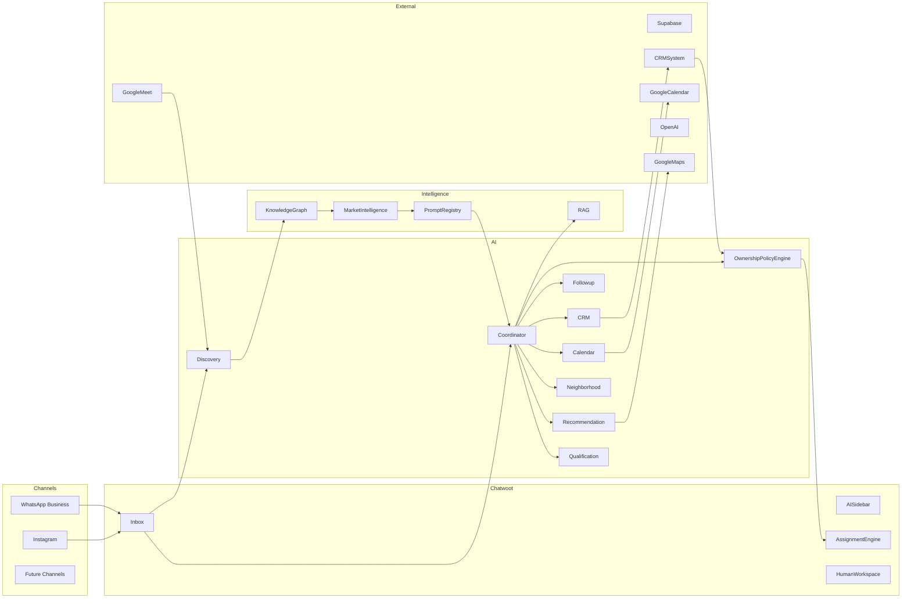
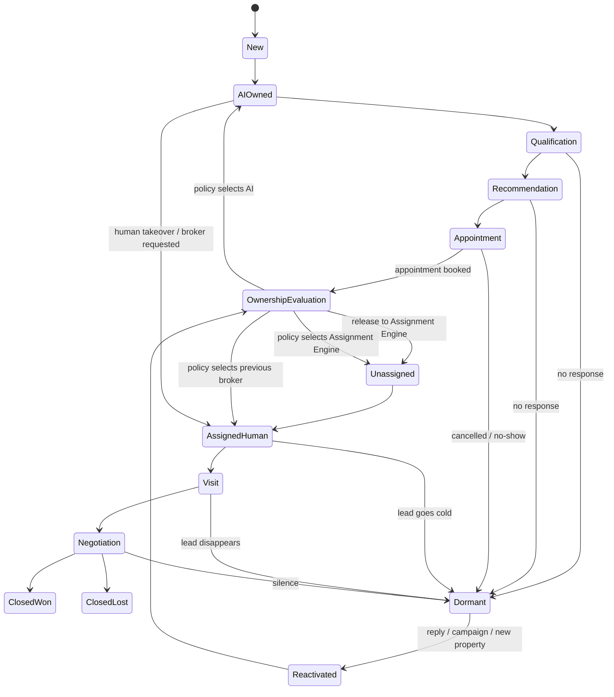
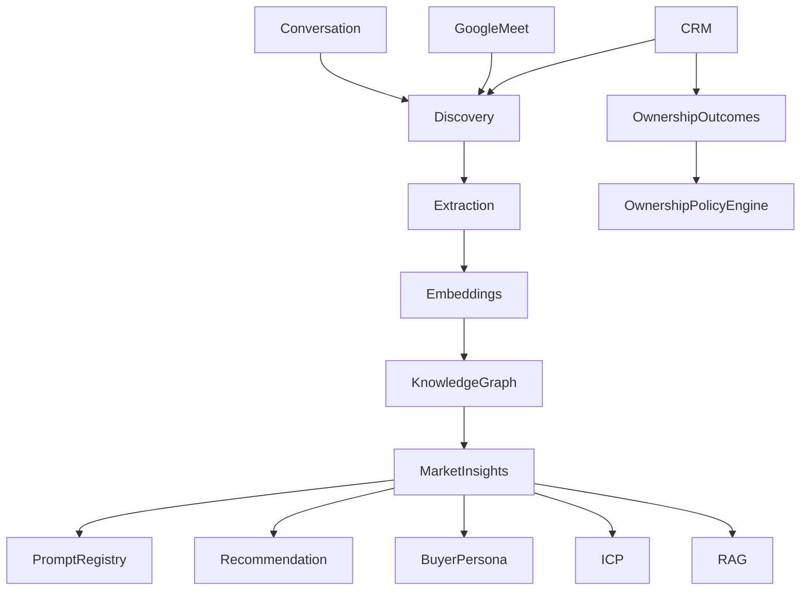
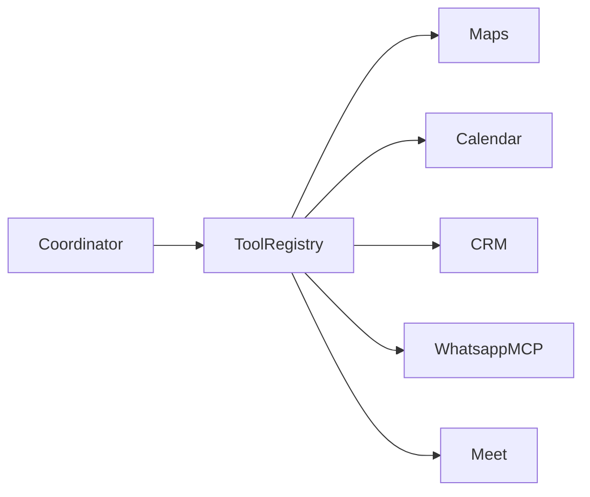

# ArchitecturalDrivers.md

# AI-Native Real Estate Lead Qualification Platform
## Architectural Drivers Document (DDD + DDIA + ADD)

**Version:** 0.2 (Living Document)

**Changelog v0.2:**
- Added Section 2: Data Ownership (System of Record per data category).
- Added Epic E14: Ownership Policy Engine, with decision matrix and re-entry scenarios.
- Redesigned Conversation Lifecycle to model dormancy, reactivation and contextual ownership evaluation (makes QA-09 verifiable).
- Rewrote QA-03 (organization-ready, not full multi-tenancy) and QA-09.
- Added QA scenarios for E3, E7 and E14.
- Split E13 into foundational observability (Sprint 0–1) and analytics dashboards (scheduled).
- Expanded Sprint 0 deliverables: `organization_id` isolation, per-organization configuration, minimal Prompt Registry, decision tracing.
- Split Sprint 3 into 3A (Recommendation core) and 3B (Neighborhood enrichment) to de-risk the highest-difficulty sprint.
- Documented the rationale for E10's roadmap position (data dependency, not priority).
- Escalated E7 from "synchronization" to critical runtime dependency of the Ownership Policy Engine.

---

# 1. Vision

Build an **AI-native omnichannel real estate sales platform** where AI Agents autonomously qualify, recommend, nurture and schedule appointments while human brokers focus only on high-value activities.

The system follows an **AI-first / Human-assisted** operating model.

Ownership of a conversation is never a binary AI-vs-Human decision. It is the output of a contextual **Ownership Policy Engine** that evaluates relationship history, pipeline stage, elapsed time and detected intent.

---

# 2. Data Ownership (System of Record)

Each system is the authoritative source for exactly one category of data. All other systems hold synchronized replicas or derived views.

| Data Category | System of Record | Consumers |
|---------------|------------------|-----------|
| Conversations, messages, inbox assignment | **Chatwoot** | AI modules (read via webhooks/API), Analytics |
| Leads, pipeline stage, broker assignment history, negotiation status | **wacrm** | Ownership Policy Engine, Follow-up, Analytics |
| AI domain: buyer profiles, embeddings, Knowledge Graph, Prompt Registry, tool configuration, decision traces | **Supabase (PostgreSQL + pgvector)** | Coordinator, Recommendation, Market Intelligence |

**Implications:**

- The AI domain never mutates lead stage directly in its own store; it emits events that update wacrm and consumes the confirmed state back.
- The Ownership Policy Engine (E14) reads *Current Pipeline Stage*, *Previous Broker*, *Visit History* and *Negotiation Status* from wacrm-synchronized data. CRM synchronization quality and latency therefore directly condition ownership decisions (see QA-13).
- Conflicts are resolved in favor of the System of Record; the AI domain reconciles asynchronously via idempotent event processing.

---

# High Level Architecture

**Note:** the former standalone "Ownership" agent is replaced by the **Ownership Policy Engine**, a first-class module (E14). The Coordinator additionally implements a **broker-request guardrail**: when the customer explicitly asks for a specific broker ("¿Está María?"), the Coordinator bypasses policy evaluation and transfers immediately. This is a conversational guardrail, not a policy rule, to guarantee zero-latency transfer.

---

# Conversation Lifecycle

The lifecycle models the full ownership space, including dormancy and re-entry. Any active state can decay to `Dormant`; every reactivation passes through `OwnershipEvaluation` (E14) instead of returning to a fixed owner.

**Rules encoded in this model:**

- A human can take over at any point during AI ownership (manual takeover or broker-request guardrail).
- `Dormant` is reachable from every active state; the trigger is organization-configurable (days without response per stage).
- Reactivation never hardcodes an owner. `OwnershipEvaluation` is the single gateway (see E14 decision matrix).
- `ClosedLost` leads may re-enter via `Dormant --> Reactivated` (e.g., new project campaigns).

---

# Continuous Learning Loop

**Note:** conversion outcomes per owner decision (AI vs previous broker vs new broker) are captured from day one so the Ownership Policy Engine can evolve from rule-based to data-driven optimization in Phase 3.

---

# Tool Calling Architecture

---

# 3. System Requirements

## Primary Functionality (Epics)

| Epic ID | Epic | Description |
|----------|------|-------------|
| E1 | Omnichannel Communication | Integrate Chatwoot with WhatsApp Business and Instagram. |
| E2 | AI Conversation Ownership | AI manages conversations from New until Appointment. |
| E3 | Lead Qualification | Capture buyer profile through conversational AI. |
| E4 | Recommendation Engine | Recommend Top-3 properties using structured filters, RAG and Google Maps. |
| E5 | Neighborhood Intelligence | Enrich recommendations with nearby places using Google Maps MCP/API. |
| E6 | Appointment Scheduling | Book appointments automatically in Google Calendar / Google Meet. |
| E7 | CRM Synchronization | Bidirectional, idempotent synchronization of leads, stages and activities with wacrm. **Critical runtime dependency of E14.** |
| E8 | Human Handoff Mechanics | Execute ownership transfer to Chatwoot Assignment Engine or a specific broker, with full context package (profile, recommendations, conversation summary). |
| E9 | Follow-up Automation | Automated reminders and nurturing workflows. Reactivations feed E14, never assign owners directly. |
| E10 | Conversation Intelligence | Mine conversations and meetings for continuous discovery. |
| E11 | Market Intelligence | Discover Buyer Personas, ICPs, JTBD, Value Propositions and Trends. |
| E12 | AI Administration | Prompt Registry administration UI, Tool Registry, Guardrails and AI configuration. (A minimal versioned Prompt Registry exists from Sprint 0; E12 delivers the administration layer on top.) |
| E13 | Analytics & Dashboards | Operational KPIs and Market Intelligence dashboards, built on decision traces instrumented since Sprint 0. |
| E14 | Ownership Policy Engine | Contextual, organization-configurable engine that decides the best owner for every new or reactivated conversation. Replaces fixed AI/Human transitions. |

---

## E14 — Ownership Policy Engine (Detail)

**Principle:** ownership is not "AI or Human" — it is `Re-entry → Context Evaluation → Best Owner`.

**Inputs:** days since last contact, previous broker, current pipeline stage (wacrm), meeting history, visit history, negotiation status, lead score, campaign source, intent score, broker availability, organization policy.

**Outputs:** Owner = AI | Previous Broker | Round Robin (Assignment Engine) | Specialized Team (e.g., Luxury, Mortgage).

**MVP Decision Matrix (rule-based, configurable per organization):**

| # | Scenario | Recommended Owner |
|---|----------|-------------------|
| 1 | Lead never handled by a human | AI |
| 2 | Broker assigned, appointment booked, but no visit occurred | AI (with memory) → same broker if high intent detected |
| 3 | Visit already occurred | Previous broker directly |
| 4 | Negotiation started | Previous broker, always. Owner never changes here. |
| 5 | Previous broker inactive | AI → requalification → Assignment Engine |
| 6 | More than 12 months elapsed | AI (full requalification; assume nothing) |
| 7 | Strong profile change detected (e.g., budget 250k → 600k) | AI → new broker if segment changed (e.g., luxury specialist) |
| 8 | Customer explicitly asks for a broker ("¿Está María?") | **Coordinator guardrail — immediate transfer, bypasses the engine** |
| 9 | Reactivation via mass campaign | AI → quick qualification → broker if score is high |
| 10 | Reactivation via new matching property | AI verifies interest → broker |

**Scenario 8 note:** this case is implemented as a Coordinator conversational guardrail, not a policy rule, so the transfer happens with zero evaluation latency.

**Evolution (Phase 3):** replace static rules with an optimization model trained on conversion outcomes per owner decision (e.g., AI 72%, previous broker 81%, new broker 64%). Outcome capture is instrumented from Sprint 4 so historical data exists when the model is built. This engine is a platform differentiator.

**Relationship with E8:** E14 decides *who* owns the conversation and *when*; E8 executes the transfer mechanics. They are separate modules.

---

# 4. Quality Attribute Scenarios

| ID | Quality Attribute | Scenario | Associated Epic |
|----|-------------------|----------|-----------------|
| QA-01 | Performance | Conversational acknowledgment in <5s after any message; full recommendation (RAG + Maps + ranking) delivered in <15s with progressive response. | E2, E4 |
| QA-02 | Availability | AI response pipeline available 99% on a 24/7 basis (WhatsApp leads arrive at any hour; off-hours response is a core differentiator). Human-dependent SLAs apply to business hours only. | E1, E2 |
| QA-03 | Scalability (Organization-ready) | A new agency is onboarded through configuration only (Chatwoot inbox, WhatsApp Business, Google Workspace, CRM credentials, prompts, agents) — no code changes, no redeploy. Logical isolation via `organization_id` on all business aggregates. Self-service onboarding, billing and tenant provisioning are explicitly out of scope until PMF. | E1, E12 |
| QA-04 | Extensibility | Add new channels (Telegram, Email, Voice) without changing domain logic. | E1 |
| QA-05 | Maintainability | AI modules evolve independently of Chatwoot. | E12 |
| QA-06 | Modifiability | New AI agents can be added without changing Coordinator. | E12 |
| QA-07 | Observability | Every AI decision (agent invocations, tool calls, ownership decisions, prompt versions used) emits a structured trace from Sprint 1. Dashboards over these traces are E13 deliverables. | E13, E14 |
| QA-08 | Security | CRM and customer data protected through RBAC, audit logs and per-organization isolation. | E7 |
| QA-09 | Reliability | Conversation ownership is always derivable from the state machine: every transition passes through OwnershipEvaluation or an explicit guardrail; no conversation can be simultaneously AI-owned and human-owned, and no reactivation bypasses policy evaluation. Verified by state-machine property tests. | E8, E14 |
| QA-10 | Evolvability | Recommendation engine can incorporate new ranking signals. | E4 |
| QA-11 | Explainability | Human agents understand why AI recommended a property and why the Policy Engine selected an owner (rule/score breakdown visible in AI Sidebar). | E4, E14 |
| QA-12 | Learnability | System continuously improves from conversations. | E10 |
| QA-13 | Data Consistency | Pipeline stage, broker assignment and negotiation status in the AI domain reflect wacrm with a maximum staleness of 60 seconds; ownership decisions taken on stale data are detected and re-evaluated. | E7, E14 |
| QA-14 | Qualification Quality | ≥90% of leads reaching the Recommendation stage have a complete buyer profile (budget, location, property type, timeline); incomplete profiles are blocked from recommendation with a targeted follow-up question. | E3 |

---

# 5. Constraints

## Technical

- Chatwoot remains System of Record **for conversations** (see Section 2 for full data ownership).
- No Chatwoot fork.
- FastAPI owns business logic.
- PostgreSQL + pgvector (hosted on Supabase).
- Modular Monolith.
- Event-driven internal architecture with idempotent consumers.
- Python ecosystem for AI.
- Single deployment, multi-organization: one FastAPI + Chatwoot + Supabase deployment; logical isolation via `organization_id`.

---

## Organizational

- Small engineering team.
- MVP first.
- Open-source preferred.
- Google Workspace available.
- Existing wacrm integration.
- No SaaS features (onboarding, billing, tenant provisioning) until Product-Market Fit is validated.

---

## Business

- Reduce broker operational workload.
- Increase appointment conversion.
- Improve lead qualification quality.
- Preserve broker visibility.
- Preserve existing broker–client relationships: once trust exists (visit or negotiation), AI assists but never replaces the broker.

---

# 6. Architectural Concerns

- AI/Human ownership transitions — addressed structurally by E14; residual concern is policy correctness and edge cases.
- Long-running workflows (dormancy spans months; state must survive restarts and deploys).
- Prompt versioning — minimal versioned registry required from Sprint 0, per organization.
- Recommendation explainability.
- Ownership decision explainability (QA-11).
- Tool orchestration.
- CRM consistency and synchronization latency (QA-13) — now a runtime dependency, not only a data-quality concern.
- Idempotent event processing.
- Knowledge extraction quality.
- Multi-agent coordination.
- Organization-level configuration sprawl (every integration is per-org; needs a coherent configuration model from Sprint 0).
- Future migration to microservices.

---

# 7. Epic Prioritization

| Epic | Importance | Difficulty |
|------|------------|------------|
| E1 Omnichannel | Critical | Medium |
| E2 AI Ownership | Critical | Medium |
| E3 Qualification | Critical | Medium |
| E4 Recommendation | Critical | High |
| E5 Neighborhood | High | Medium |
| E6 Calendar | Critical | Low |
| E7 CRM | Critical | Medium |
| E8 Handoff Mechanics | Critical | Low–Medium |
| E9 Follow-up | Medium | Medium |
| E10 Conversation Intelligence | High | High |
| E11 Market Intelligence | Medium | High |
| E12 AI Administration | Medium | Medium |
| E13 Analytics | Medium | Low |
| E14 Ownership Policy Engine | Critical | Medium–High |

**Note on E10:** its position in Sprint 7 despite High importance is a **data dependency, not a deprioritization** — conversation mining requires months of accumulated conversations, transcripts and outcomes. Archiving raw conversations starts in Sprint 1 so the corpus exists when E10 ships.

---

# 8. Recommended MVP Roadmap

## Sprint 0 — Foundation (Organization-Ready)

Goal:

Establish technical architecture, designed multi-organization from day one.

Deliverables:

- Modular Monolith
- FastAPI
- DDD modules
- Chatwoot integration
- Supabase
- Authentication
- Event Bus with idempotent consumers
- CI/CD
- `organization_id` on all business aggregates (logical isolation in queries and events)
- Per-organization configuration model (Chatwoot Inbox, WhatsApp Business, Google Workspace, CRM credentials, AI agents)
- Minimal versioned Prompt Registry (per organization; administration UI arrives in Sprint 6)
- Structured decision-trace instrumentation (foundation for QA-07 and E13)

Reason:

Everything else depends on this foundation, and retrofitting organization isolation later would require a redesign.

---

## Sprint 1 — AI Ownership

Deliver:

- AI Conversation Ownership
- Chatwoot Webhooks
- AI Sidebar
- Coordinator Agent (with broker-request guardrail from day one)
- Raw conversation archiving (feeds E10 later)

Reason:

Enables AI-first operation.

---

## Sprint 2 — Lead Qualification

Deliver:

- Qualification Agent
- Buyer Profile (completeness gate per QA-14)
- CRM synchronization (bidirectional, staleness monitoring per QA-13)
- Conversation State Machine (including Dormant states and decay triggers)

Reason:

Without structured data there is no recommendation, and without reliable CRM sync there is no Ownership Policy Engine in Sprint 4.

---

## Sprint 3A — Recommendation Core

Deliver:

- Property Search
- Recommendation Engine (structured filters + RAG)
- Recommendation explainability (QA-11)

Reason:

Core business differentiator. Isolated from Maps enrichment to de-risk the two highest-difficulty deliverables landing in a single sprint.

---

## Sprint 3B — Neighborhood Enrichment

Deliver:

- Google Maps integration
- Neighborhood Intelligence

Reason:

Enriches an already-working recommendation flow; can slip without blocking Sprint 4.

---

## Sprint 4 — Appointment & Ownership Policy Engine (MVP)

Deliver:

- Google Calendar
- Google Meet
- Appointment workflow
- Handoff mechanics (E8): context package to Assignment Engine / specific broker
- **Ownership Policy Engine v1 (E14):** scenarios 1, 2 and 8 of the decision matrix (never-human leads, appointment-without-visit, broker-request guardrail)
- Ownership outcome capture (feeds Phase 3 optimization)

Reason:

Completes the operational sales workflow. The policy engine starts here because this is the first moment conversations acquire human history.

---

## Sprint 5 — Follow-up & Full Re-entry Policy

Deliver:

- Reminder engine
- Automated nurturing
- Re-engagement flows
- **Ownership Policy Engine v2:** full decision matrix (inactive brokers, >12 months, profile change, campaigns, new-property reactivation), configurable per organization

Reason:

Follow-up generates the reactivations that exercise the full matrix; shipping them together keeps policy and triggers coherent.

---

## Sprint 6 — AI Administration

Deliver:

- Prompt Registry administration UI (over the registry existing since Sprint 0)
- Tool Registry
- AI Configuration per organization
- Guardrails administration
- Ownership policy configuration UI

Reason:

Makes AI and ownership policy configurable without code.

---

## Sprint 7 — Conversation Intelligence

Deliver:

- Conversation Archive processing (corpus accumulated since Sprint 1)
- Meeting transcripts
- WhatsApp MCP
- Google Meet transcript ingestion

Reason:

Begins organizational learning. Scheduled here by data dependency, not priority (see Section 7 note).

---

## Sprint 8 — Market Intelligence & Analytics

Deliver:

- Buyer Personas
- ICP Discovery
- Value Proposition Discovery
- Segmentation Dashboard
- Knowledge Graph
- **Operational KPI dashboards (E13)** over decision traces instrumented since Sprint 0

Reason:

Transforms operational conversations into strategic assets and closes the E13 scope that until now existed only as instrumentation.

---

# 9. Future Releases

Phase 2

- Voice AI
- Telegram
- Email
- Mortgage integrations

Phase 3

- Revenue Intelligence
- Predictive lead scoring
- **Ownership Policy Engine optimization: replace rules with a model trained on per-owner conversion outcomes**
- Multi-office routing
- Agent performance analytics

Phase 4

- Microservices extraction
- Multi-tenant SaaS (self-service onboarding, billing, tenant provisioning)
- Marketplace integrations
- Autonomous negotiation agents

---

# Final Architectural Principles

> **Chatwoot manages conversations. wacrm owns the lead. FastAPI owns intelligence. AI learns continuously from every customer interaction.**

> **Ownership is never AI-or-Human — it is a contextual policy decision. Once human trust exists, AI assists but never replaces the broker.**

These principles guide all architectural decisions and ensure a clear separation between communication, business logic, relationship ownership and continuous organizational learning.
