# Lead to Sales System — Architecture Document

## 1. Introduction

### 1.1 Propósito

Este documento describe la arquitectura del **Lead to Sales System**: una plataforma AI-native que califica leads de WhatsApp mediante agentes de IA y los convierte en visitas de propiedad agendadas, para agencias inmobiliarias. El objetivo de negocio es reducir la carga operativa de los brokers y aumentar la tasa de conversión de lead a visita, manteniendo visibilidad y control humano sobre las decisiones de mayor riesgo.

### 1.2 Alcance

Cubre el MVP dirigido a un volumen inicial de referencia de ~10 agencias, ~6 brokers por agencia (~9,000 leads/mes), diseñado para escalar x10 sin rediseño estructural. Quedan fuera de alcance en esta versión: multi-tenancy físico (instancia o base de datos por agencia), canales más allá de WhatsApp/Instagram vía Chatwoot, y el flujo independiente de captación de propiedades para vender (mencionado como ruta alternativa A6 en el customer journey, pero no diseñado aquí).

### 1.3 Documentos relacionados

- **ArchitecturalDrivers.md** (v0.2) — épicas, quality attribute scenarios, constraints y concerns que motivan cada decisión de este documento. Es la fuente de verdad de *qué* debe lograr el sistema; este documento describe *cómo*.
- **IterationPlan.md** — plan de 9 iteraciones ADD (Attribute-Driven Design) ejecutadas para producir este documento, con la meta y los drivers atendidos en cada una.

### 1.4 Cómo se construyó este documento

La arquitectura se desarrolló siguiendo el proceso **ADD** (ADD.md), en 9 iteraciones incrementales, cada una cerrando el ciclo completo de pasos: establecer meta desde IterationPlan.md → elegir elementos a refinar → elegir conceptos de diseño → instanciar elementos e interfaces → registrar decisiones → analizar cobertura de drivers. Resumen de las iteraciones:

| Iteración | Meta | Resultado en este documento |
|---|---|---|
| 1 | Estructurar el sistema (greenfield) | Container Diagram (§5), Configuration Store, Event Bus, Observability, RLS |
| 2 | Núcleo conversacional AI-first | Componentes de Conversation & Ownership (§6.1): FSM, Coordinator, Guardrail, OPE skeleton |
| 3 | Calificación y datos confiables | Componentes de Lead & Qualification (§6.2): sincronización con wacrm, Completeness Gate, Staleness Guard |
| 4 | Motor de recomendación explicable | Componentes de Recommendation (§6.3): Hybrid Retrieval, Ranking Engine, Explanation Generator |
| 5 | Cierre del flujo operativo de ventas | Componentes de Appointment (§6.4), Handoff, Ownership Policy Engine v1 |
| 6 | Engagement y re-entrada completa | Componentes de Engagement (§6.5), matriz completa del Ownership Policy Engine |
| 7 | Administración de AI y operabilidad | Componentes de AI Admin (§6.6): Prompt/Tool Registry, RBAC, dashboards operativos |
| 8 | Inteligencia continua | Extensión de AI Admin (§6.7): minería de conversaciones, Knowledge Graph, Market Intelligence |
| 9 | Deployment View | Topología de despliegue (§5.1), dimensionada para el volumen real del MVP |

Cada decisión de diseño queda registrada, con su alternativa descartada, en la §10 (Design Decision Records), organizada por iteración.

### 1.5 Cómo leer este documento

Las secciones 5–9 siguen el enfoque de vistas de arquitectura: Container Diagram y Deployment View (§5) para la vista física de más alto nivel; Component Diagrams (§6) para la descomposición interna de cada módulo, organizados por bounded context del modelo de dominio (§4); Sequence Diagrams (§7) para el comportamiento dinámico de los escenarios de calidad más críticos; Interfaces (§8) para los contratos entre componentes; y Event Definitions (§9) para el catálogo de eventos de dominio que atraviesan el Event Bus interno. La §10 es el registro histórico de decisiones, trazable a los drivers de ArchitecturalDrivers.md.

## 2. Context Diagram

El sistema como caja negra, sus actores humanos y los sistemas externos con los que integra. Cada relación indica quién es el System of Record cuando aplica (§4.2 detalla esta separación en el modelo de dominio).

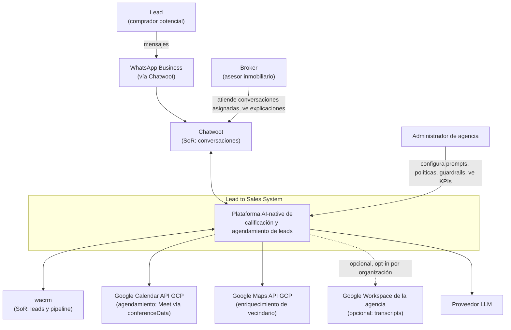

**Actores:**

| Actor | Interacción con el sistema |
|---|---|
| **Lead** | Envía y recibe mensajes por WhatsApp; nunca interactúa directamente con el sistema — todo pasa por Chatwoot |
| **Broker** | Recibe conversaciones transferidas con contexto completo (Handoff Package, §7.15); ve explicaciones de recomendación y de ownership en el AI Sidebar |
| **Administrador de agencia** | Configura prompts, políticas de ownership, guardrails y credenciales de integración por organización; consulta dashboards operativos y de mercado |

**Sistemas externos y su rol:**

| Sistema | Rol | SoR de |
|---|---|---|
| **Chatwoot** | Plataforma de conversaciones; el sistema nunca la reemplaza ni la bifurca (CON-1) | Conversaciones y mensajes |
| **wacrm** | CRM de la agencia | Leads y pipeline de ventas |
| **Google Calendar API (GCP)** | Agendamiento; el link de Meet se obtiene como efecto de `conferenceData.createRequest`, no por una integración separada | Eventos de calendario |
| **Google Maps API (GCP)** | Enriquecimiento de vecindario para el Top-3 de recomendaciones | — (solo consulta) |
| **Google Workspace de la agencia** | Fuente opcional de transcripts de Meet, alternativa a la cuenta madre de la plataforma (opt-in por organización, CON-8) | — (solo consulta, cuando aplica) |
| **Proveedor LLM** | Razonamiento conversacional del Coordinator Agent y redacción de explicaciones | — |

## 3. Architectural Drivers

See **ArchitecturalDrivers.md v0.2** (living document). Key constraints shaping the domain model below: Chatwoot is System of Record for conversations, wacrm for leads/pipeline, Supabase for the AI domain; single deployment, multi-organization (`organization_id` on all aggregates); ownership is decided by the Ownership Policy Engine (E14), never hardcoded.

## 4. Domain Model

### 4.1 Bounded Contexts

The domain is organized into seven bounded contexts inside the Modular Monolith. Every aggregate carries `organizationId` (logical isolation, QA-03).

| Bounded Context | Purpose | Epics |
|---|---|---|
| **Organization** | Multi-organization configuration and isolation | QA-03 |
| **Conversation & Ownership** (core) | Conversation lifecycle, AI/Human ownership, policy-based re-entry | E2, E8, E14 |
| **Lead & Qualification** | Buyer profile capture; synchronized replica of the wacrm lead | E3, E7 |
| **Recommendation** | Property search, Top-3 ranking, neighborhood enrichment, explainability | E4, E5 |
| **Appointment** | Scheduling with Google Calendar/Meet; broker availability | E6 |
| **Engagement** | Follow-up, nurturing, campaigns, reactivations | E9 |
| **Intelligence & AI Administration** | Conversation mining, market insights, prompt/tool registries, decision traces | E10–E13 |

### 4.2 Domain Model — Class Diagram

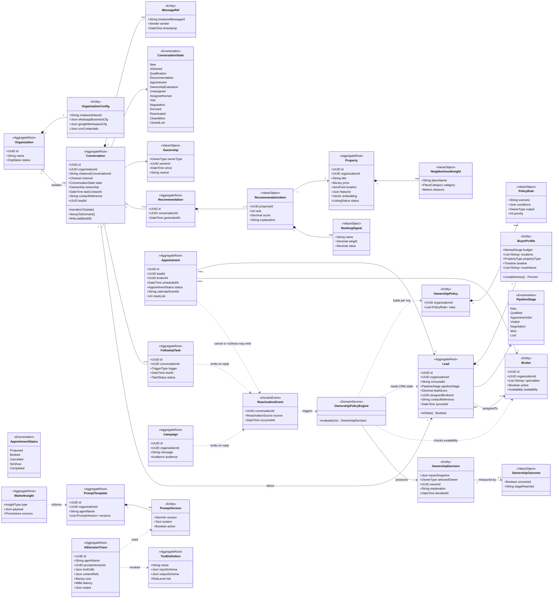

### 4.3 Domain Model Elements

| Element | DDD Type | Bounded Context | Description |
|---|---|---|---|
| **Organization** | Aggregate Root | Organization | Real estate agency operating on the shared deployment. Root of all logical isolation: every other aggregate references its `organizationId` (QA-03). |
| **OrganizationConfig** | Entity | Organization | Per-organization integration settings: Chatwoot inbox, WhatsApp Business, Google Workspace and CRM credentials. Enables onboarding by configuration, without redeploy. |
| **Conversation** | Aggregate Root | Conversation & Ownership | Local projection of a Chatwoot conversation plus the domain state Chatwoot doesn't model: lifecycle state, ownership and dormancy. Chatwoot remains SoR for messages; this aggregate owns the state machine (QA-09). `decayToDormant()` fires per-stage, org-configurable inactivity triggers. |
| **ConversationState** | Enumeration | Conversation & Ownership | The full lifecycle of ArchitecturalDrivers v0.2, including `Dormant`, `Reactivated` and `OwnershipEvaluation` — the single gateway every re-entry must pass through. |
| **Ownership** | Value Object | Conversation & Ownership | Immutable snapshot of who owns the conversation (AI, Human, Unassigned), since when, and why. Replaced — never mutated — on each transfer, giving an auditable ownership history. |
| **MessageRef** | Entity | Conversation & Ownership | Lightweight reference to a Chatwoot message (id, sender, timestamp) used for archiving (E10) and dormancy computation. Content stays in Chatwoot. |
| **OwnershipPolicyEngine** | Domain Service | Conversation & Ownership | E14. Evaluates context (time elapsed, pipeline stage, visit/negotiation history, broker availability, intent, reactivation source) against the organization's `OwnershipPolicy` and produces an `OwnershipDecision`. The broker-request guardrail ("¿Está María?") bypasses it at the Coordinator level. |
| **OwnershipPolicy** | Entity | Conversation & Ownership | The organization-configurable rule set implementing the decision matrix (10 scenarios in the MVP). |
| **PolicyRule** | Value Object | Conversation & Ownership | One scenario: conditions → owner output, with priority for conflict resolution. |
| **OwnershipDecision** | Entity | Conversation & Ownership | Persistent record of each evaluation: input snapshot, selected owner and human-readable explanation (QA-11). Auditable and replayable. |
| **OwnershipOutcome** | Value Object | Conversation & Ownership | Conversion result attached to a decision (converted?, stage reached). The training signal for the Phase 3 ML optimization of the engine. |
| **Lead** | Aggregate Root | Lead & Qualification | Synchronized replica of the wacrm lead (wacrm is SoR). Carries `syncedAt`; `isStale()` enforces the 60-second staleness bound (QA-13) — ownership decisions on stale data are re-evaluated. |
| **BuyerProfile** | Entity | Lead & Qualification | Structured output of conversational qualification (E3): budget, locations, property type, timeline, must-haves. `completeness()` implements the QA-14 gate: <100% of required fields blocks recommendation. |
| **PipelineStage** | Enumeration | Lead & Qualification | Mirror of wacrm's pipeline stages; consumed by the policy engine. |
| **Property** | Aggregate Root | Recommendation | Listable property with structured features, geolocation and pgvector embedding for RAG retrieval (E4). |
| **Recommendation** | Aggregate Root | Recommendation | A Top-3 recommendation event for a conversation, timestamped for traceability. |
| **RecommendationItem** | Value Object | Recommendation | One ranked property with score and natural-language explanation (QA-11). |
| **RankingSignal** | Value Object | Recommendation | Named, weighted signal contributing to a score (filter match, semantic similarity, neighborhood fit…). New signals extend the list without schema change (QA-10). |
| **NeighborhoodInsight** | Value Object | Recommendation | Nearby place (school, park, transit) from Google Maps enriching a property (E5). |
| **Appointment** | Aggregate Root | Appointment | Scheduled visit or meeting; holds Google Calendar event id and Meet link (E6). Cancellations/no-shows decay the conversation to `Dormant`. |
| **AppointmentStatus** | Enumeration | Appointment | Proposed → Booked → Completed, plus Cancelled and NoShow (the alternative routes). |
| **Broker** | Entity | Appointment | Human agent with specialties (e.g., luxury), availability and active flag — all inputs to the policy engine (scenarios 5 and 7). |
| **FollowUpTask** | Aggregate Root | Engagement | Scheduled reminder/nurturing action on a conversation (E9). Replies emit `ReactivationEvent`; the task never assigns an owner itself. |
| **Campaign** | Aggregate Root | Engagement | Mass reactivation initiative (new projects). Replies flow through the policy engine (scenario 9). |
| **ReactivationEvent** | Domain Event | Engagement | A dormant conversation shows life (reply, campaign response, new matching property). Sole trigger of `OwnershipEvaluation`. |
| **PromptTemplate / PromptVersion** | Aggregate Root / Entity | Intelligence & AI Admin | Versioned, per-organization prompts (minimal registry from Sprint 0; admin UI in Sprint 6). Every trace records the exact version used. |
| **ToolDefinition** | Aggregate Root | Intelligence & AI Admin | Tool contract: typed input/output schemas and risk level, feeding the Tool Registry and guardrails (E12). |
| **AIDecisionTrace** | Aggregate Root | Intelligence & AI Admin | One record per AI decision: agent, prompt version, tool calls, context references, cost, latency, output (QA-07 / ARSDA Gate 9). Foundation for E13 dashboards. |
| **MarketInsight** | Aggregate Root | Intelligence & AI Admin | Discovered knowledge (Buyer Persona, ICP, JTBD, trend) with provenance, produced by conversation mining (E10/E11); feeds prompts, RAG and recommendations. |

### 4.4 Design Notes

- **SoR discipline:** `Conversation` and `Lead` are projections, not masters. They never accept writes that bypass Chatwoot/wacrm events; reconciliation is event-driven and idempotent (QA-13).
- **Ownership as history:** because `Ownership` is a value object replaced on every transfer, and every transfer originates in an `OwnershipDecision`, QA-09 becomes property-testable: no conversation can hold two owners, and no reactivation path skips `OwnershipEvaluation`.
- **Explainability by construction:** `RecommendationItem.explanation` and `OwnershipDecision.explanation` are first-class fields, not derived logs — the AI Sidebar reads them directly (QA-11).
- **Evolution:** Phase 3's ML-based owner optimization consumes `OwnershipDecision` + `OwnershipOutcome` pairs already captured from Sprint 4; no model change required.
- **Stage-naming contract (wacrm onboarding, operator step):** wacrm's pipeline stage names are free text, user-defined per pipeline, while our `PipelineStage` is a **closed enum**. The wacrm pipeline used for CDC sync **must** name its stages exactly `New`, `Qualified`, `AppointmentSet`, `Visited`, `Negotiation`, `Won`, `Lost` (exact, case-sensitive) — this is the join contract between an open-schema CRM and our closed domain, configured when setting an organization's `CrmConfig` (`base_url`, `api_key`, `tenant_ref`). Neither codebase can enforce it structurally: wacrm's `PATCH /api/v1/deals/{id}` rejects an unknown `stage_name` with a clear 400, and our Lead Sync Adapter skips-and-logs (without advancing the CDC watermark) any lead whose stage doesn't parse, so one mistyped stage never takes down an organization's sync — but the fix is always renaming the stage in wacrm, not code.

## 5. Container Diagram

**Instanciado en Iteración 1** (goal: estructurar inicialmente el sistema). Modular Monolith desplegado como un único contenedor de aplicación, con los siete bounded contexts como módulos internos separados por Ports & Adapters, un único almacén de datos con aislamiento por `organization_id` + RLS, un event bus interno (Transactional Outbox/Inbox), y observabilidad transversal desde el día uno.

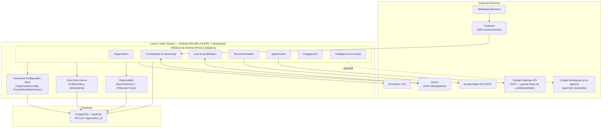

**Responsabilidades por elemento de infraestructura (nuevos en esta iteración):**

| Elemento | Responsabilidad |
|---|---|
| **Versioned Configuration Store** | Persistir y versionar `OrganizationConfig` (credenciales/flags por agencia, incl. `transcriptSource`) y `PromptTemplate/PromptVersion`, con rollback por versión activa |
| **Event Bus interno (Outbox/Inbox)** | Publicar y consumir eventos de dominio de forma idempotente dentro del mismo Postgres, sin infraestructura de broker externa |
| **Observability (OpenTelemetry + AIDecisionTrace)** | Trazar toda operación relevante (módulo, duración, resultado) y alimentar `AIDecisionTrace` desde el primer request, no solo desde que existan agentes AI |
| **RLS por `organization_id`** | Aplicar el aislamiento lógico multi-organización (QA-03) a nivel de motor de base de datos, como defensa en profundidad sobre el filtrado de aplicación |

### 5.1 Deployment View — Instanciada en Iteración 9

Dimensionada para el volumen real del MVP: 10 agencias × 6 brokers × 150 leads/mes ≈ 9,000 leads/mes (~0.4 msg/seg en pico), con camino de activación explícito para el checkpoint x10 (~90,000 leads/mes).

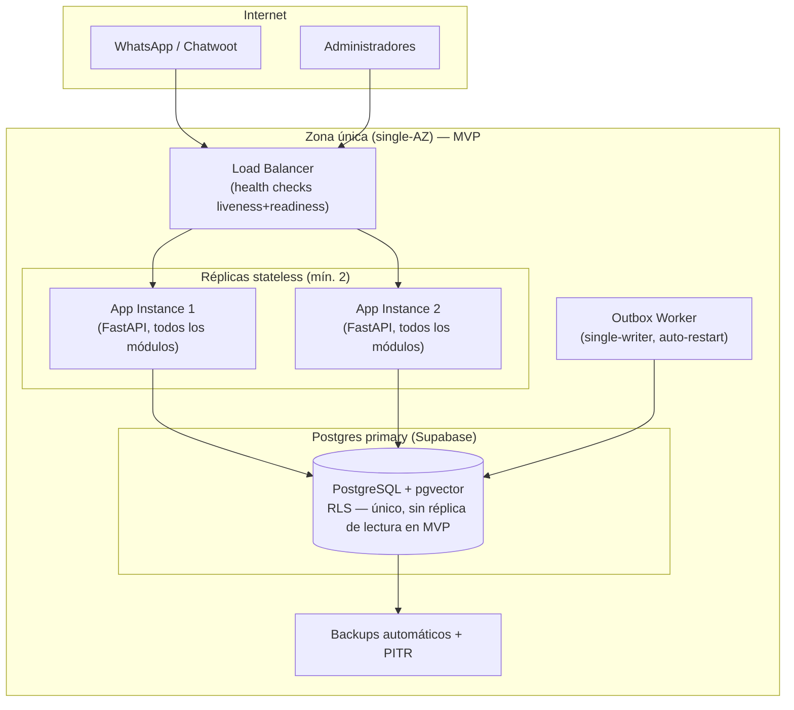

**Activación diferida (no instanciada en MVP; disparadores explícitos para el checkpoint x10 o antes si la evidencia lo justifica):**

| Concepto diferido | Disparador de activación |
|---|---|
| Postgres con réplica de lectura | Los queries del Dashboard Query Service/Segmentation Dashboard muestran contención medible sobre el camino crítico (métrica: p95 de escritura de negocio degradado por lecturas de dashboard) |
| Outbox Worker con lock distribuido (múltiples workers) | Un solo worker no da abasto con el volumen de eventos (métrica: lag de outbox > umbral) — no antes |
| Multi-AZ (app + base de datos) | Se alcanza el checkpoint x10, o un SLA contractual exige >99%, o se documenta un incidente real de caída de zona |

**Responsabilidades nuevas:**

| Elemento | Responsabilidad |
|---|---|
| **Load Balancer** | Distribuir tráfico entre réplicas sanas; retirar del pool cualquier instancia que falle `readyz`/`healthz` |
| **Réplicas stateless (mín. 2)** | Servir requests sin afinidad de sesión — todo estado vive en Postgres (decisión ya tomada en Iteración 2); permiten zero-downtime deploy |
| **Outbox Worker (single-writer)** | Procesar la tabla outbox con un único proceso activo a la vez, con auto-restart si cae, evitando procesamiento duplicado innecesario |
| **Backups automáticos + PITR** | Sustituir la necesidad de multi-AZ en el MVP como mitigación de continuidad ante fallos de infraestructura del proveedor |

## 6. Component Diagrams

### 6.1 Módulo Conversation & Ownership (M2) — Instanciado en Iteración 2

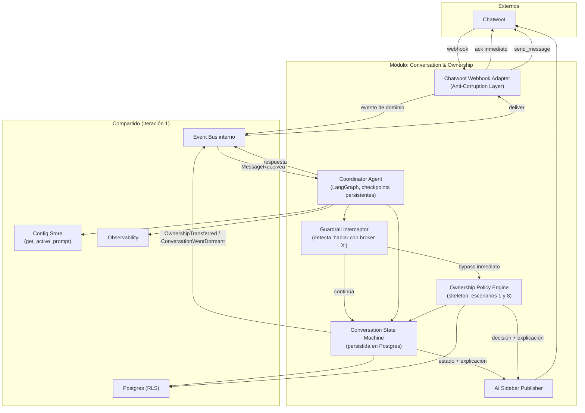

**Responsabilidades:**

| Componente | Responsabilidad (Gate 2 — una oración) |
|---|---|
| **Chatwoot Webhook Adapter** | Traducir eventos de Chatwoot a eventos de dominio propios y viceversa, aislando al resto del sistema de la API externa |
| **Guardrail Interceptor** | Detectar la solicitud explícita de un broker específico y transferir inmediatamente, sin pasar por el razonamiento del Coordinator |
| **Coordinator Agent** | Conducir la conversación del lead a través del happy path delegando toda decisión no conversacional a servicios/motores dedicados |
| **Conversation State Machine** | Garantizar que toda transición de estado de una conversación sea válida y persistida, incluyendo decaimiento a `Dormant` |
| **Ownership Policy Engine (skeleton)** | Evaluar quién debe poseer una conversación nueva o reactivada, con los escenarios 1 y 8 implementados y el resto como placeholders explícitos |
| **AI Sidebar Publisher** | Publicar en Chatwoot el estado, la ownership y las explicaciones para consumo del broker humano |

*(Los componentes de los demás módulos —M1, M4–M7— se detallan en sus iteraciones correspondientes.)*

### 6.2 Módulo Lead & Qualification (M3) — Instanciado en Iteración 3

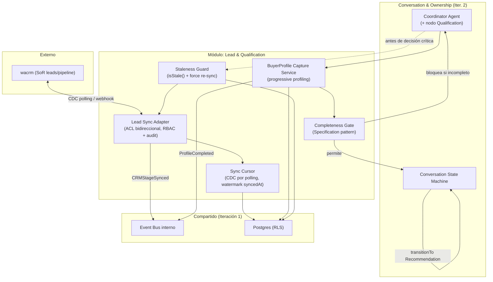

**Responsabilidades:**

| Componente | Responsabilidad (Gate 2 — una oración) |
|---|---|
| **Lead Sync Adapter** | Sincronizar bidireccionalmente el Lead con wacrm de forma idempotente, siendo el único punto con permiso de lectura/escritura al CRM (RBAC + audit, QA-08) |
| **Sync Cursor** | Mantener el watermark (`syncedAt`) que hace la sincronización reanudable tras cualquier caída |
| **BuyerProfile Capture Service** | Capturar el perfil del comprador de forma incremental, una dimensión a la vez, actualizando `BuyerProfile` |
| **Completeness Gate** | Decidir si un `BuyerProfile` tiene la completitud mínima (QA-14) para permitir avanzar a Recommendation |
| **Staleness Guard** | Verificar que el `Lead` no exceda el umbral de antigüedad (QA-13) antes de cualquier decisión de negocio crítica, forzando re-sync si es necesario |

### 6.3 Módulo Recommendation (M4) — Instanciado en Iteración 4

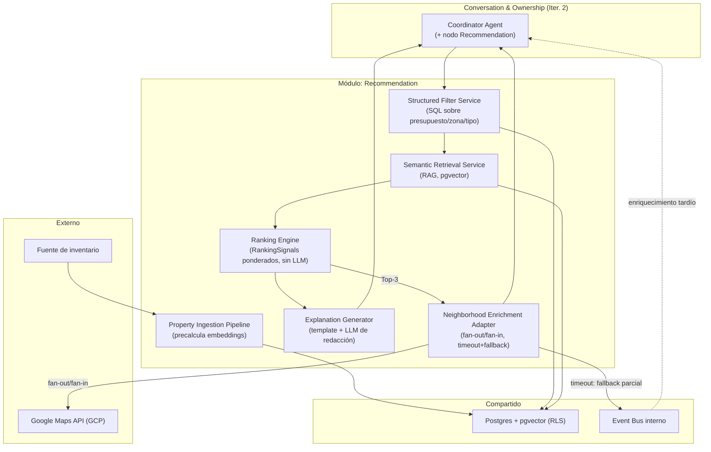

**Responsabilidades:**

| Componente | Responsabilidad (Gate 2 — una oración) |
|---|---|
| **Property Ingestion Pipeline** | Precalcular y actualizar el embedding de cada propiedad cuando sus features cambian, para que la búsqueda semántica nunca genere embeddings en tiempo real |
| **Structured Filter Service** | Descartar propiedades que no cumplen filtros duros del `BuyerProfile` (presupuesto, zona, tipo) antes de cualquier ranking |
| **Semantic Retrieval Service** | Recuperar candidatos por similitud semántica con pgvector sobre el subconjunto ya filtrado |
| **Ranking Engine** | Calcular un score determinista por propiedad combinando `RankingSignal`s ponderados, sin intervención de un LLM |
| **Explanation Generator** | Redactar en lenguaje natural la explicación de un ranking a partir de los signals reales que lo produjeron, nunca inventar una razón |
| **Neighborhood Enrichment Adapter** | Enriquecer el Top-3 con lugares cercanos vía Google Maps en paralelo, entregando un fallback parcial si el timeout se cumple |

### 6.1.1 Extensión del módulo Conversation & Ownership (M2) en Iteración 5

El componente diagram de M2 (§6.1) se extiende con dos elementos nuevos, sin modificar los ya instanciados en Iteración 2:

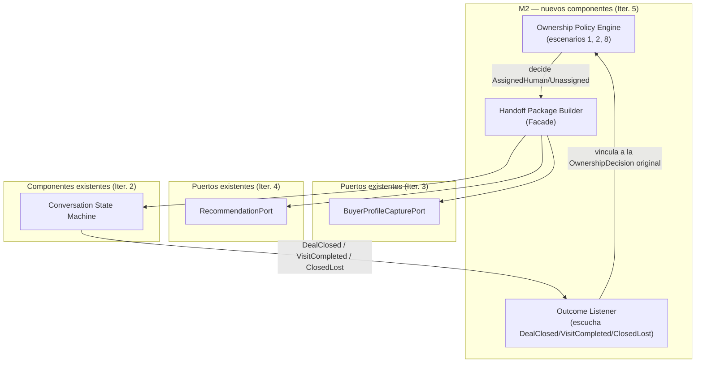

**Responsabilidades nuevas:**

| Componente | Responsabilidad (Gate 2) |
|---|---|
| **Ownership Policy Engine (extendido)** | Evaluar ahora también el escenario 2 (appointment sin visita → AI con memoria → mismo broker si detecta alta intención), sin cambiar su interfaz externa |
| **Handoff Package Builder** | Empaquetar perfil, recomendaciones y resumen de conversación en un único contexto antes de transferir la conversación a un humano |
| **Outcome Listener** | Capturar el resultado real de negocio (venta, visita, pérdida) y vincularlo a la `OwnershipDecision` que originó esa ownership, como training signal para Fase 3 |

### 6.4 Módulo Appointment (M5) — Instanciado en Iteración 5

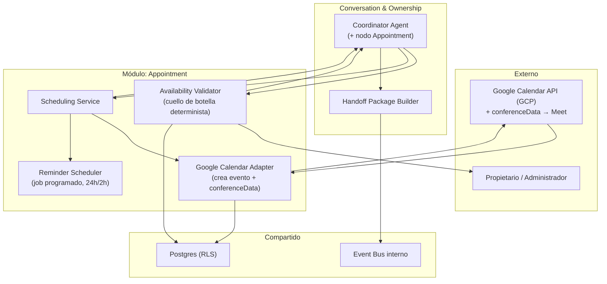

**Responsabilidades:**

| Componente | Responsabilidad (Gate 2) |
|---|---|
| **Availability Validator** | Confirmar de forma determinista que una propiedad está disponible en un horario dado, mitigando el riesgo crítico de negocio |
| **Google Calendar Adapter** | Crear el evento en Calendar con `conferenceData.createRequest`, obteniendo el link de Meet como efecto del mismo API call |
| **Scheduling Service** | Materializar una visita ya validada como `Appointment`, coordinando Calendar y recordatorios |
| **Reminder Scheduler** | Disparar recordatorios 24h y 2h antes de la visita como jobs independientes del flujo síncrono de booking |

### 6.1.2 Extensión del Ownership Policy Engine en Iteración 6 — matriz completa

El `Ownership Policy Engine` (skeleton en Iteración 2, +escenario 2 en Iteración 5) se completa con los 8 escenarios restantes, sin cambiar su interfaz externa:

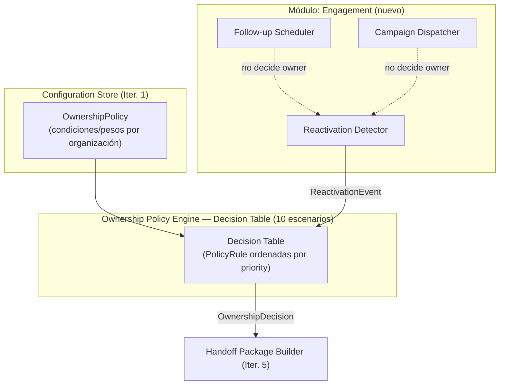

**Escenarios agregados (3–7, 9–10 de la matriz de ArchitecturalDrivers):** visita ya ocurrida → broker anterior directo; negociación iniciada → broker anterior, nunca cambia; broker inactivo → AI → requalificación → Assignment Engine; >12 meses → AI recalifica desde cero; cambio fuerte de perfil → AI → nuevo broker si aplica; reactivación por campaña masiva → AI → calificación rápida → broker si score alto; reactivación por nueva propiedad recomendada → AI verifica interés → broker.

### 6.5 Módulo Engagement (M6) — Instanciado en Iteración 6

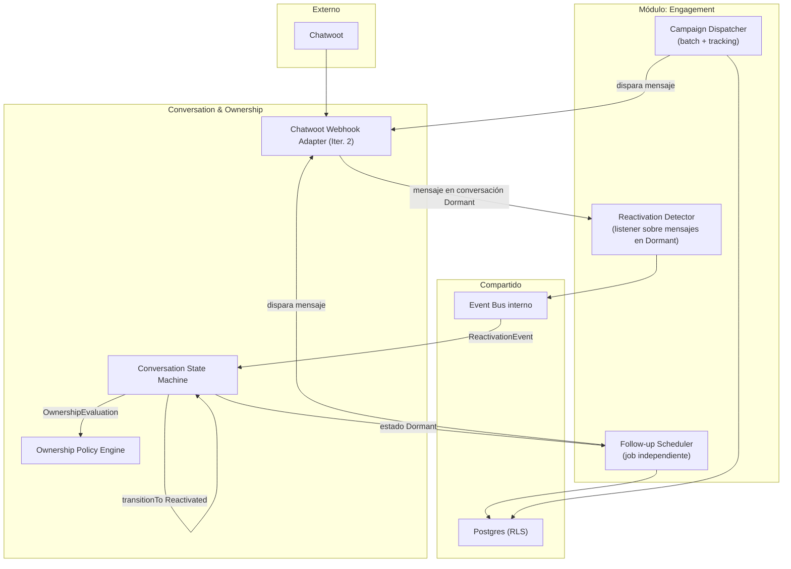

**Responsabilidades:**

| Componente | Responsabilidad (Gate 2) |
|---|---|
| **Follow-up Scheduler** | Disparar recordatorios/nurturing sobre conversaciones inactivas según el umbral configurado por organización, sin asignar owner |
| **Campaign Dispatcher** | Enviar campañas masivas a leads fríos y trackear qué lead respondió a cuál, sin asignar owner |
| **Reactivation Detector** | Detectar que una conversación `Dormant` recibió actividad y emitir `ReactivationEvent` como único disparador de `OwnershipEvaluation` |

### 6.1.3 Extensión del Guardrail Interceptor en Iteración 7

El `Guardrail Interceptor` (Iteración 2) deja de tener las Reglas 1–4 embebidas en código y las lee ahora desde M7:

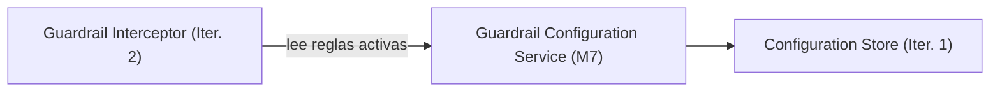

### 6.6 Módulo Intelligence & AI Admin (M7) — Instanciado en Iteración 7

Primera instanciación de este módulo (alcance de esta iteración: administración; Market Intelligence/E10-E11 quedan para Iteración 8).

```mermaid
flowchart TB

actor Admin["Admin de la organización"]

subgraph M7["Módulo: Intelligence & AI Admin"]
  Gateway["Admin Gateway\n(CRUD versionado)"]
  RBAC["RBAC Check\n(roles por organización)"]
  ToolReg["Tool Registry\n(catálogo + validación de contrato)"]
  GuardCfg2["Guardrail Configuration Service"]
  Dashboard["Dashboard Query Service\n(CQRS lectura)"]
end

subgraph SHARED7["Compartido"]
  CFG4["Configuration Store (Iter. 1)"]
  DB7["Postgres (RLS)"]
  Trace7["AIDecisionTrace (Iter. 1)"]
end

Admin --> Gateway
Gateway --> RBAC
RBAC --> DB7
Gateway -- prompts / org config / policies --> CFG4
Gateway -- registra tool --> ToolReg
ToolReg --> DB7
Gateway -- configura reglas --> GuardCfg2
GuardCfg2 --> CFG4
Admin --> Dashboard
Dashboard --> Trace7
Dashboard -- vistas agregadas --> Admin
```

**Responsabilidades:**

| Componente | Responsabilidad (Gate 2) |
|---|---|
| **Admin Gateway** | Exponer CRUD versionado con rollback sobre prompts, configuración de organización y políticas de ownership, validando el esquema correspondiente antes de escribir |
| **RBAC Check** | Verificar que el rol del usuario dentro de su organización autorice la operación de administración solicitada |
| **Tool Registry** | Catalogar cada `ToolDefinition` con su contrato tipado y `riskLevel`, validado una vez al registro |
| **Guardrail Configuration Service** | Persistir qué acciones requieren aprobación humana por organización, reemplazando reglas hardcodeadas del Guardrail Interceptor |
| **Dashboard Query Service** | Agregar `AIDecisionTrace` en vistas materializadas para KPIs operativos (costo por agente, latencia p95, decisiones por hora) |

### 6.7 Módulo Intelligence & AI Admin (M7) — Extensión en Iteración 8: Inteligencia Continua

Segunda pasada sobre M7 (administración instanciada en Iteración 7); se agregan los componentes de minería y aprendizaje continuo, cerrando CON-8 (transcripts) y el Continuous Learning Loop del modelo de dominio.

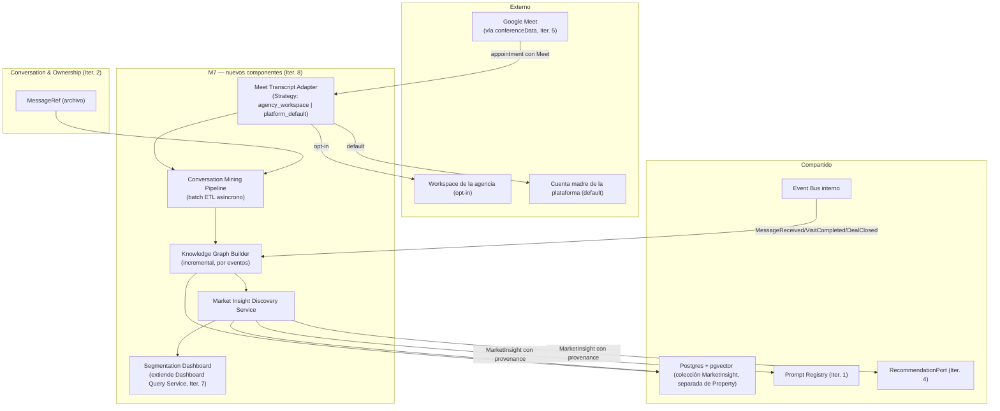

**Responsabilidades:**

| Componente | Responsabilidad (Gate 2) |
|---|---|
| **Meet Transcript Adapter** | Extraer transcripts de Google Meet usando el Workspace de la agencia si está conectado, o la cuenta madre de la plataforma por defecto, según `transcriptSource` |
| **Conversation Mining Pipeline** | Procesar en batch asíncrono el archivo de conversaciones y transcripts acumulado, sin competir con el camino crítico conversacional |
| **Knowledge Graph Builder** | Mantener el Knowledge Graph actualizado incrementalmente, suscrito a eventos de dominio ya existentes |
| **Market Insight Discovery Service** | Producir `MarketInsight` (Buyer Persona, ICP, tendencias) con provenance obligatoria hacia sus fuentes de origen |
| **Segmentation Dashboard** | Exponer vistas de segmentación de mercado como extensión del Dashboard Query Service ya instanciado |

## 7. Sequence Diagrams

Diagramas de secuencia de los mecanismos fundacionales instanciados en Iteración 1, del núcleo conversacional de Iteración 2, y de calificación/sincronización de Iteración 3.

### 7.1 Resolución de contexto de organización con aislamiento RLS (QA-03)

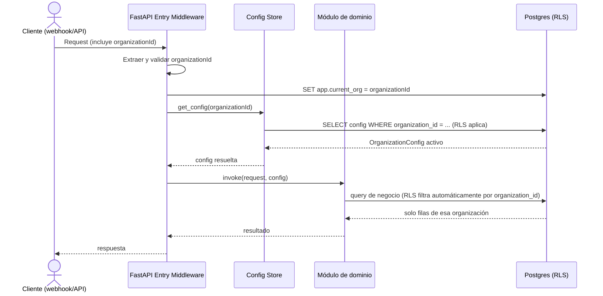

### 7.2 Publicación y consumo idempotente de eventos (CON-5, Outbox/Inbox)

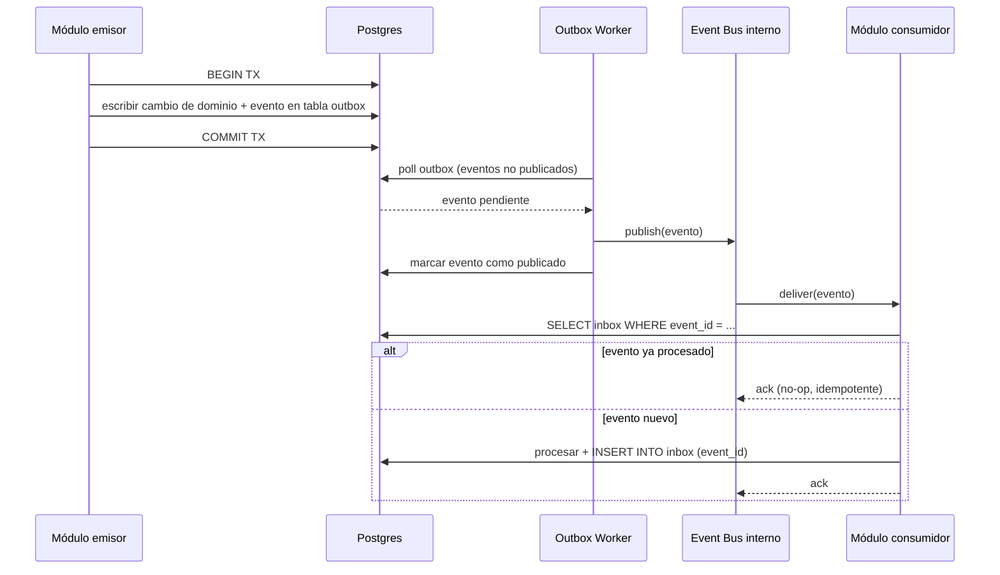

### 7.3 Captura de traza de decisión (QA-07)

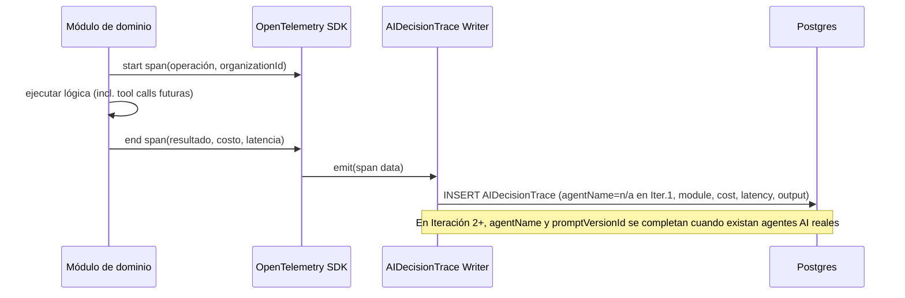

### 7.4 Recepción de mensaje con ack inmediato + procesamiento asíncrono (QA-01)

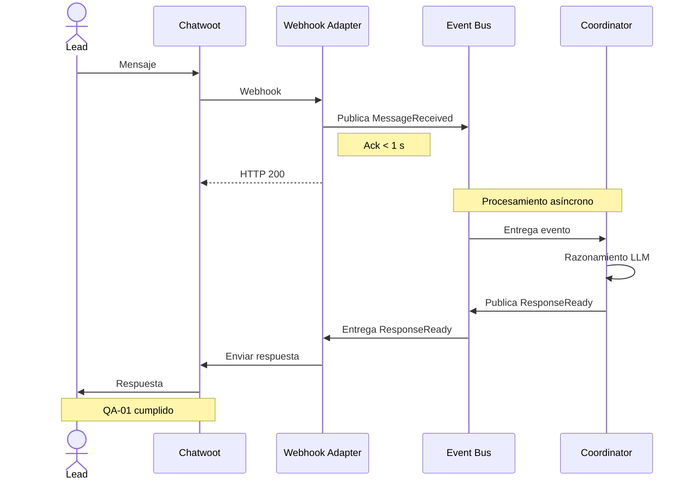

### 7.5 Guardrail de solicitud de broker — bypass inmediato (QA-09, CRN-1)

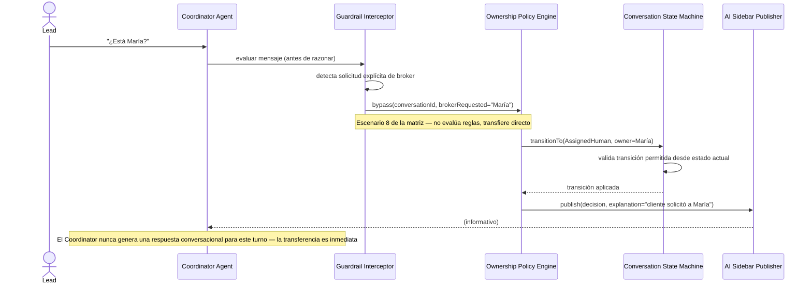

### 7.6 Transición de estado inválida rechazada por la FSM (QA-09 verificable)

```mermaid
sequenceDiagram
    participant Coord as Coordinator Agent
    participant FSM as Conversation State Machine
    participant DB as Postgres

    Coord->>FSM: transitionTo(ClosedWon)
    Note over Coord,FSM: Estado actual = New (nunca pasó por Negotiation)

    FSM->>FSM: validar transiciones permitidas

    alt transición inválida
        FSM-->>Coord: InvalidTransitionError
        FSM->>FSM: No persiste cambios
    else transición válida
        FSM->>DB: UPDATE conversation
        FSM-->>Coord: transición aplicada
    end
    
  ```

### 7.7 Sincronización bidireccional idempotente Lead ↔ wacrm (CON-5, CRN-6)

```mermaid
sequenceDiagram
    participant WACRM as wacrm
    participant Sync as Lead Sync Adapter
    participant Cursor as Sync Cursor
    participant DB as Postgres
    participant Bus as Event Bus interno

    loop Polling periódico
        Sync->>Cursor: get_watermark(organizationId)
        Cursor->>DB: SELECT syncedAt
        DB-->>Cursor: último watermark
        Sync->>WACRM: GET leads WHERE updatedAt > watermark
        WACRM-->>Sync: leads modificados
        Sync->>DB: UPSERT Lead (idempotente por crmLeadId)
        Sync->>Cursor: advance_watermark(nuevo syncedAt)
        Sync->>Bus: publish(CRMStageSynced)
    end
    Note over Sync,WACRM: Dirección inversa: ProfileCompleted publicado por M3 se consume aquí y se escribe en wacrm vía outbox/inbox (patrón de Iteración 1)
```

### 7.8 Completeness Gate bloqueando transición a Recommendation (QA-14)

```mermaid
sequenceDiagram
    actor Lead
    participant Coord as Coordinator Agent
    participant Capture as BuyerProfile Capture Service
    participant Gate as Completeness Gate
    participant FSM as Conversation State Machine

    Lead->>Coord: responde pregunta de descubrimiento
    Coord->>Capture: update_profile(dimensión respondida)
    Capture->>Capture: BuyerProfile.completeness()
    Capture-->>Coord: completeness = 70%
    Coord->>Gate: canAdvanceToRecommendation(profile)
    alt completeness < umbral (90%)
        Gate-->>Coord: false + dimensión faltante
        Coord->>Lead: pregunta dirigida a la dimensión faltante
    else completeness >= umbral
        Gate-->>Coord: true
        Coord->>FSM: transitionTo(Recommendation)
        FSM-->>Coord: transición aplicada
    end
```

### 7.9 Staleness Guard forzando re-sync antes de decisión crítica (QA-13)

```mermaid
sequenceDiagram
    participant Coord as Coordinator Agent
    participant Guard as Staleness Guard
    participant Sync as Lead Sync Adapter
    participant DB as Postgres

    Coord->>Guard: check_before_decision(leadId)
    Guard->>DB: SELECT syncedAt FROM Lead
    Guard->>Guard: isStale() = (now - syncedAt) > 60s
    alt Lead stale
        Guard->>Sync: force_resync(leadId)
        Sync->>Sync: GET lead directo (fuera del ciclo de polling)
        Sync->>DB: UPSERT Lead (syncedAt actualizado)
        Sync-->>Guard: resync completado
        Guard-->>Coord: proceder con datos frescos
    else Lead fresco
        Guard-->>Coord: proceder (dato dentro del umbral)
    end
```

### 7.10 Recomendación completa: Hybrid Retrieval + Ranking + enriquecimiento en paralelo (QA-01 <15s)

```mermaid
sequenceDiagram
    participant Coord as Coordinator Agent
    participant Filter as Structured Filter Service
    participant Semantic as Semantic Retrieval Service
    participant Rank as Ranking Engine
    participant Enrich as Neighborhood Enrichment Adapter
    participant GMaps as Google Maps API

    Coord->>Filter: search(BuyerProfile completo)
    Filter->>Filter: SQL: presupuesto/zona/tipo
    Filter-->>Semantic: candidatos filtrados
    Semantic->>Semantic: similitud pgvector sobre candidatos
    Semantic-->>Rank: top-N candidatos
    Rank->>Rank: score = Σ(RankingSignal.peso × valor)
    Rank-->>Coord: Top-3 con scores (sin vecindario aún)
    par Enriquecimiento en paralelo (fan-out/fan-in)
        Enrich->>GMaps: nearby(property1)
    and
        Enrich->>GMaps: nearby(property2)
    and
        Enrich->>GMaps: nearby(property3)
    end
    GMaps-->>Enrich: NeighborhoodInsights (o timeout)
    Enrich-->>Coord: Top-3 enriquecido
    Note over Coord: Presupuesto total: <15s desde el pedido de búsqueda
```

### 7.11 Explanation Generator: explicación construida desde RankingSignals reales (QA-11)

```mermaid
sequenceDiagram
    participant Rank as Ranking Engine
    participant Explain as Explanation Generator
    participant LLM as Proveedor LLM (solo redacción)
    participant Coord as Coordinator Agent

    Rank->>Explain: property, List~RankingSignal~ ganadores
    Explain->>Explain: seleccionar los 2-3 signals de mayor peso efectivo
    Explain->>LLM: redactar(signals seleccionados) — sin decidir contenido, solo fraseo
    LLM-->>Explain: texto natural
    Explain-->>Coord: RecommendationItem.explanation
    Note over Explain,LLM: El LLM nunca recibe la lista completa de propiedades ni decide el ranking — solo traduce signals ya calculados a lenguaje natural (evita explicaciones alucinadas)
```

### 7.12 Timeout de Maps con fallback parcial y enriquecimiento asíncrono posterior (resiliencia de QA-01)

```mermaid
sequenceDiagram
    participant Enrich as Neighborhood Enrichment Adapter
    participant GMaps as Google Maps API
    participant Coord as Coordinator Agent
    participant Bus as Event Bus interno
    actor Lead

    Enrich->>GMaps: nearby(property) [timeout=X ms]
    Note over Enrich,GMaps: GMaps no responde a tiempo
    Enrich-->>Coord: Top-3 sin NeighborhoodInsight para esa propiedad
    Coord->>Lead: envía Top-3 (sin vecindario en esa propiedad)
    Enrich->>GMaps: retry en background (fuera del camino crítico)
    GMaps-->>Enrich: NeighborhoodInsight (tardío)
    Enrich->>Bus: publish(NeighborhoodEnriched)
    Bus->>Coord: deliver(NeighborhoodEnriched)
    Coord->>Lead: mensaje de seguimiento con el dato de vecindario
```

### 7.13 Booking con Availability Validator + conferenceData (mitigación del riesgo crítico)

```mermaid
sequenceDiagram
    participant Coord as Coordinator Agent
    participant Avail as Availability Validator
    participant Owner as Propietario/Administrador
    participant Sched as Scheduling Service
    participant CalAdapter as Google Calendar Adapter
    participant GCal as Google Calendar API

    Coord->>Avail: check_availability(propertyId, slot)
    Avail->>Owner: confirmar disponibilidad (si no hay estado en tiempo real)
    Owner-->>Avail: confirmed / pending / unavailable
    alt unavailable
        Avail-->>Coord: rechazado — ofrecer alternativas del Matching
    else confirmed
        Avail-->>Coord: slot validado
        Coord->>Sched: book_visit(slot validado)
        Sched->>CalAdapter: create_event(+ conferenceData.createRequest)
        CalAdapter->>GCal: crea evento con conferenceData
        GCal-->>CalAdapter: evento + hangoutLink (Meet, generado automáticamente)
        CalAdapter-->>Sched: Appointment{calendarEventId, meetLink}
        Sched-->>Coord: AppointmentId
    end
    Note over Avail,Owner: Re-validación automática 2-4h antes de la visita (mitigación adicional del riesgo crítico)
```

### 7.14 Reminder Scheduler independiente del flujo de booking

```mermaid
sequenceDiagram
    participant Sched as Scheduling Service
    participant Reminder as Reminder Scheduler
    participant DB as Postgres
    participant Bus as Event Bus interno
    actor Lead

    Sched->>Reminder: schedule_reminders(appointmentId, scheduledAt)
    Reminder->>DB: INSERT reminder_jobs (24h_before, 2h_before)
    Note over Reminder,DB: Persistido — sobrevive reinicios del proceso
    loop Job programado (independiente del proceso original)
        Reminder->>DB: poll reminder_jobs WHERE due
        DB-->>Reminder: job vencido
        Reminder->>Bus: publish(ReminderDue)
        Bus->>Lead: notificación (24h o 2h antes)
    end
```

### 7.15 Handoff Package Builder armando el paquete de contexto (E8)

```mermaid
sequenceDiagram
    participant Coord as Coordinator Agent
    participant Handoff as Handoff Package Builder
    participant Profile as BuyerProfileCapturePort
    participant Reco as RecommendationPort
    participant FSM as Conversation State Machine
    participant Broker as Broker (Chatwoot)

    Coord->>Handoff: build_package(conversationId)
    Handoff->>Profile: get_profile(leadId)
    Profile-->>Handoff: BuyerProfile completo
    Handoff->>Reco: get_last_recommendation(conversationId)
    Reco-->>Handoff: Top-3 con explicaciones
    Handoff->>FSM: get_conversation_summary(conversationId)
    FSM-->>Handoff: resumen + historial relevante
    Handoff->>Handoff: ensamblar paquete de contexto
    Handoff->>Broker: entregar paquete (perfil + recomendaciones + resumen)
    Note over Handoff,Broker: El broker nunca recibe una conversación "en blanco"
```

### 7.16 Ownership Policy Engine — escenario 2 y captura de OwnershipOutcome

```mermaid
sequenceDiagram
    actor Lead
    participant Coord as Coordinator Agent
    participant OPE as Ownership Policy Engine
    participant FSM as Conversation State Machine
    participant Outcome as Outcome Listener

    Note over Lead,Coord: Reactivación: appointment sin visita, 3 meses después
    Lead->>Coord: responde tras silencio prolongado
    Coord->>OPE: evaluate(context: broker_asignado, sin_visita, tiempo_transcurrido)
    OPE->>OPE: escenario 2 → AI con memoria, evalúa intención
    alt alta intención detectada
        OPE->>FSM: transitionTo(AssignedHuman, owner=broker_anterior)
    else intención baja/media
        OPE->>FSM: transitionTo(AIOwned)
        Note over OPE,FSM: AI continúa calificando antes de decidir
    end
    FSM-->>OPE: OwnershipDecision persistida (con explanation)

    Note over FSM,Outcome: Semanas después — el lead cierra o se pierde
    FSM->>Outcome: DealClosed / ClosedLost
    Outcome->>Outcome: vincular con la OwnershipDecision original
    Outcome->>OPE: OwnershipOutcome{converted, stageReached}
    Note over Outcome,OPE: Training signal acumulado para Fase 3 (ML), sin cambio de esquema futuro
```

### 7.17 Reactivación detectada en conversación Dormant → ReactivationEvent → OwnershipEvaluation

```mermaid
sequenceDiagram
    actor Lead
    participant Chatwoot as Chatwoot
    participant ACL as Chatwoot Webhook Adapter
    participant Detector as Reactivation Detector
    participant Bus as Event Bus interno
    participant FSM as Conversation State Machine
    participant OPE as Ownership Policy Engine (Decision Table)

    Note over Lead,Chatwoot: Conversación en estado Dormant hace semanas
    Lead->>Chatwoot: responde (reaparece)
    Chatwoot->>ACL: webhook(message)
    ACL->>Detector: verificar estado actual de la conversación
    Detector->>Detector: estado == Dormant → es una reactivación
    Detector->>Bus: publish(ReactivationEvent{source=reply})
    Bus->>FSM: deliver(ReactivationEvent)
    FSM->>FSM: transitionTo(Reactivated)
    FSM->>OPE: OwnershipEvaluation(context completo)
    OPE->>OPE: Decision Table evalúa las 10 reglas por prioridad
    OPE-->>FSM: OwnershipDecision (con explanation)
    Note over Detector,OPE: Ningún componente asignó un owner antes de pasar por la Decision Table
```

### 7.18 Campaign Dispatcher — nunca decide owner, solo genera la señal

```mermaid
sequenceDiagram
    participant Campaign as Campaign Dispatcher
    participant Chatwoot as Chatwoot
    actor Lead
    participant Detector as Reactivation Detector
    participant Bus as Event Bus interno

    Campaign->>Campaign: batch: seleccionar leads fríos elegibles
    Campaign->>Chatwoot: enviar mensaje de campaña (tracking por lead)
    Chatwoot->>Lead: entrega mensaje
    Lead->>Chatwoot: responde "me interesa"
    Chatwoot->>Detector: webhook(message) [vía ACL]
    Detector->>Detector: correlacionar con campaña activa
    Detector->>Bus: publish(ReactivationEvent{source=campaign})
    Note over Campaign,Bus: El Campaign Dispatcher nunca invoca al Ownership Policy Engine directamente — solo el Reactivation Detector lo hace, siempre a través de ReactivationEvent
```

### 7.19 Decision Table — resolución por prioridad ante reglas que podrían solaparse (QA-09)

```mermaid
sequenceDiagram
    participant OPE as Ownership Policy Engine
    participant DT as Decision Table
    participant Rules

    OPE->>DT: Evaluar contexto
    Note over DT: Coinciden escenarios 4 y 6

    DT->>Rules: Evaluar por prioridad
    Rules->>Rules: Escenario 4 coincide primero
    Rules-->>DT: Seleccionar escenario 4

    DT-->>OPE: Broker anterior
```

### 7.20 Administrador actualiza un PromptVersion vía Admin Gateway con RBAC (QA-08 cierre)

```mermaid
sequenceDiagram
    actor Admin
    participant Gateway as Admin Gateway
    participant RBAC as RBAC Check
    participant DB as Postgres
    participant CFG as Configuration Store

    Admin->>Gateway: update_prompt(organizationId, agentName, newContent)
    Gateway->>RBAC: check(userId, organizationId, action=WRITE_PROMPT)
    RBAC->>DB: SELECT role WHERE user AND organization_id
    alt rol insuficiente (p. ej. "broker")
        RBAC-->>Gateway: denied
        Gateway-->>Admin: 403 Forbidden
    else rol autorizado (p. ej. "admin")
        RBAC-->>Gateway: allowed
        Gateway->>Gateway: validar esquema del prompt
        Gateway->>CFG: crear nueva PromptVersion (versionado inmutable)
        CFG->>DB: INSERT + marcar como active
        CFG-->>Gateway: version creada
        Gateway-->>Admin: confirmación + posibilidad de rollback
    end
```

### 7.21 Guardrail Interceptor consultando reglas configurables (reemplaza lógica hardcodeada)

```mermaid
sequenceDiagram
    participant Coord as Coordinator Agent
    participant Guard as Guardrail Interceptor
    participant GuardCfg as Guardrail Configuration Service
    participant CFG as Configuration Store

    Coord->>Guard: evaluar mensaje (p. ej. "quiero un descuento")
    Guard->>GuardCfg: get_active_rules(organizationId)
    GuardCfg->>CFG: get_config(organizationId, type=guardrails)
    CFG-->>GuardCfg: reglas activas (Regla 2: descuento→humano, etc.)
    GuardCfg-->>Guard: reglas
    Guard->>Guard: matchea "solicitud de descuento" contra Regla 2
    Guard-->>Coord: bypass hacia humano (registrar oferta, no negociar)
    Note over Guard,GuardCfg: Las mismas 4 reglas del journey ahora son datos por organización, no código embebido
```

### 7.22 Dashboard Query Service agregando AIDecisionTrace para KPIs operativos (CQRS lectura)

```mermaid
sequenceDiagram
    actor Admin
    participant Dashboard as Dashboard Query Service
    participant Trace as AIDecisionTrace store

    Admin->>Dashboard: get_kpis(organizationId, period)
    Dashboard->>Trace: query traces WHERE organization_id AND periodo
    Trace-->>Dashboard: trazas crudas
    Dashboard->>Dashboard: agregar (costo/agente, latencia p95, decisiones/hora)
    Dashboard-->>Admin: vista de KPIs operativos
    Note over Dashboard,Trace: Lectura desacoplada de la escritura de trazas (Iter. 1) — nunca compite con el camino crítico de negocio
```

### 7.23 Meet Transcript Adapter — extracción opt-in por organización (cierre de CON-8)

```mermaid
sequenceDiagram
    participant Sched as Scheduling Service (Iter. 5)
    participant Transcript as Meet Transcript Adapter
    participant CFG as OrganizationConfig
    participant Workspace as Workspace de la agencia
    participant Mother as Cuenta madre de la plataforma

    Sched->>Transcript: appointment completado (meetLink)
    Transcript->>CFG: get_config(organizationId).transcriptSource
    alt transcriptSource = agency_workspace
        Transcript->>Workspace: extraer transcript (credenciales de la agencia)
        Workspace-->>Transcript: transcript
        Note over Transcript,Workspace: Gobernanza de datos bajo perímetro de la agencia
    else transcriptSource = platform_default
        Transcript->>Mother: extraer transcript (cuenta madre)
        Mother-->>Transcript: transcript
        Note over Transcript,Mother: Gobernanza de datos bajo perímetro de la plataforma
    end
    Transcript->>Transcript: adjuntar a MessageRef / archivo de conversación
```

### 7.24 Conversation Mining Pipeline (batch) + Knowledge Graph Builder (incremental)

```mermaid
sequenceDiagram
    participant Mining as Conversation Mining Pipeline
    participant MsgRef as MessageRef (archivo, Iter. 2)
    participant Bus as Event Bus interno
    participant KG as Knowledge Graph Builder
    participant PGVec as Postgres+pgvector

    Note over Mining: Job batch asíncrono, fuera del camino crítico
    Mining->>MsgRef: leer corpus acumulado (conversaciones + transcripts)
    Mining->>Mining: extracción de entidades/temas
    Mining->>KG: entidades extraídas (batch inicial / reprocesamiento)

    Note over Bus,KG: En paralelo, actualización incremental por eventos ya existentes
    Bus->>KG: MessageReceived / VisitCompleted / DealClosed
    KG->>KG: actualizar grafo incrementalmente (sin reprocesar todo)
    KG->>PGVec: persistir nodos/relaciones actualizados
```

### 7.25 MarketInsight retroalimenta Prompt Registry y Recommendation (cierre del Continuous Learning Loop)

```mermaid
sequenceDiagram
    participant KG as Knowledge Graph Builder
    participant Discovery as Market Insight Discovery Service
    participant PGVec as pgvector (colección MarketInsight)
    participant Prompt as Prompt Registry (Iter. 1)
    participant Reco as RecommendationPort (Iter. 4)

    KG-->>Discovery: grafo actualizado
    Discovery->>Discovery: derivar Buyer Persona / ICP / tendencia
    Discovery->>Discovery: adjuntar provenance (fuentes de origen, obligatorio — CRN-7)
    Discovery->>PGVec: persistir MarketInsight
    Discovery->>Prompt: sugerir ajuste de PromptVersion (requiere aprobación)
    Discovery->>Reco: nueva señal candidata para RankingSignal

    Note over Discovery,Reco: Ningún insight se aplica automáticamente sin provenance verificable. Ambos consumidores citan la fuente durante la auditoría.
```

### 7.26 Health check y failover ante caída de una réplica (QA-02)

```mermaid
sequenceDiagram
    actor Lead
    participant LB as Load Balancer
    participant R1 as App Instance 1
    participant R2 as App Instance 2
    participant PG as Postgres

    loop cada N segundos
        LB->>R1: GET /healthz, /readyz
        LB->>R2: GET /healthz, /readyz
    end
    Note over R1: R1 falla (proceso caído o degradado)
    R1--xLB: timeout / 5xx en healthz
    LB->>LB: retirar R1 del pool
    Lead->>LB: request
    LB->>R2: enrutar (única instancia sana)
    R2->>PG: procesar (todo el estado vive aquí, no en R1)
    R2-->>Lead: respuesta
    Note over LB,R1: R1 se reintegra automáticamente al pool cuando vuelve a responder healthz
```

### 7.27 Zero-downtime deploy (rolling replace de réplicas)

```mermaid
sequenceDiagram
    participant LB as Load Balancer
    participant R1 as App Instance 1 (v1)
    participant R1n as App Instance 1 (v2)
    participant R2 as App Instance 2 (v1)

    Note over LB,R2: Ambas réplicas sirven v1
    LB->>R1: retirar del pool (drain)
    R1->>R1: terminar requests en curso
    R1n->>LB: nueva instancia v2 lista (readyz OK)
    LB->>R1n: agregar al pool
    Note over LB,R2: Tráfico servido por R2 (v1) + R1n (v2) durante la transición
    LB->>R2: repetir drain/replace para R2
    Note over LB,R1n: Deploy completo sin downtime — ninguna conversación se pierde porque el estado vive en Postgres, no en el proceso
```

### 7.28 Conversation↔Lead identity matching (`LeadLinker`) y entrega del Top-3 al Coordinator

Chatwoot y wacrm son dos sistemas externos sin identificador propio en común. `contact_reference` (el número de WhatsApp del lead) es el único valor que ambos exponen, y pasa a ser la clave de emparejamiento — ver Iteración 4 en la tabla de decisiones de la Sección 10.

```mermaid
sequenceDiagram
    actor Lead
    participant Webhook as Chatwoot Webhook Adapter
    participant Linker as LeadLinker
    participant LeadRepo as Lead Repository (mirror local)
    participant Conv as Conversation

    Lead->>Webhook: mensaje entrante (WhatsApp)
    Webhook->>Webhook: extrae contact_reference (sender.phone_number)
    Webhook->>Conv: get_or_create(chatwoot_conversation_id)
    alt Conversation.lead_id aún no resuelto
        Webhook->>Linker: link_if_possible(conversation)
        Linker->>LeadRepo: get_by_contact_reference(org_id, contact_reference)
        alt Lead ya sincronizado localmente (§7.7 CDC)
            LeadRepo-->>Linker: Lead
            Linker->>Conv: link_lead(lead.id)
        else Lead aún no sincronizado
            LeadRepo-->>Linker: None
            Note over Linker,Conv: lead_id queda en None — reintento en el próximo mensaje, no es un error
        end
    end
    Webhook->>Conv: save()
```

Una vez resuelto el link, `recommendation.wiring.handle_profile_completed` (§7.10) puede resolver la `Conversation` a partir de un `lead_id` — el único dato que trae el evento `ProfileCompleted` — y entregarle el Top-3 sin que el Coordinator necesite un mecanismo de entrega nuevo:

```mermaid
sequenceDiagram
    participant Bus
    participant RecoWiring
    participant Reco
    participant ConvRepo
    participant Chatwoot
    actor Lead

    Bus->>RecoWiring: ProfileCompleted
    RecoWiring->>Reco: search
    Reco-->>RecoWiring: Top 3
    RecoWiring->>ConvRepo: get_by_lead_id

    alt Conversation existe
        ConvRepo-->>RecoWiring: Conversation
        RecoWiring->>Bus: ResponseReady
        Bus->>Chatwoot: deliver
        Chatwoot->>Lead: Top 3
    else Conversation no existe
        RecoWiring->>RecoWiring: Mantener recomendación sin enviar
    end
```

**Decisión de diseño clave:** `recommendation.wiring` reutiliza el evento `ResponseReady` y el handler `conversation_ownership.wiring.handle_response_ready` que ya existen para las respuestas conversacionales normales — no se creó un segundo canal de entrega a Chatwoot. Esto mantiene un único punto de salida hacia el lead, consistente con CON-1.

### 7.29 FSM: AIOwned→Qualification (momentáneo) y Qualification→Recommendation (gateada por QA-14)

Dos transiciones de la FSM de `Conversation` (§6.1) que estaban definidas en `ALLOWED_TRANSITIONS` desde la Iteración 2 pero nunca se disparaban en código hasta el cierre de Sprint 3:

```mermaid
sequenceDiagram
    actor Lead
    participant Coord as Coordinator Agent
    participant FSM as Conversation FSM
    participant OPE as Ownership Policy Engine
    participant RecoWiring as Recommendation Wiring
    participant Gate as Completeness Gate

    Lead->>Coord: Primer mensaje
    Coord->>OPE: Evaluar contexto
    OPE-->>Coord: OwnershipDecision AI

    Coord->>FSM: transitionTo(AIOwned)
    Note over Coord,FSM: Estado temporal

    Coord->>FSM: transitionTo(Qualification)
    Coord-->>Lead: Respuesta

    Note over Lead,Gate: Turnos posteriores de calificación

    Gate->>Gate: Profile completo
    Gate-->>RecoWiring: ProfileCompleted
    RecoWiring->>FSM: transitionTo(Recommendation)

    Note over RecoWiring,FSM: La transición solo ocurre cuando el Gate emite ProfileCompleted.
```

**Por qué `AIOwned -> Qualification` se dispara en el mismo turno que `New -> AIOwned`:** `AIOwned` es el estado que resulta de la decisión de ownership (quién es dueño de la conversación), no una fase de trabajo en sí misma — la fase de trabajo que sigue inmediatamente es calificar al lead. Separar ambas transiciones en el mismo método de `CoordinatorAgent` evita un estado intermedio sin sentido de negocio.

**Por qué `Qualification -> Recommendation` se dispara desde `recommendation.wiring`, no desde el Coordinator ni desde la FSM:** el Completeness Gate es explícitamente un Specification pattern externo a la FSM (Iteración 3, ADR "QA-14 completitud ≥90%") — la FSM permanece genérica y el único punto de verdad para "¿puede avanzar?" vive en el Gate. El evento `ProfileCompleted` es, por construcción, el momento exacto en que el Gate cruzó el umbral, así que es el disparador natural de este edge sin duplicar la evaluación en otro lugar.

**Alcance explícitamente fuera de esta iteración:** ninguna transición hacia `Recommendation` ocurre si la `Conversation` ya avanzó a un estado posterior (`AssignedHuman`, `Appointment`, etc.) — en ese caso `recommendation.wiring` sigue entregando el mensaje con el Top-3 recalculado, pero no fuerza un retroceso de estado. Progressive Profiling (extraer `ProfilePatch` de texto libre) tampoco quedó conectado al turno conversacional del Coordinator en esta iteración — sigue siendo el gap documentado en la Iteración 3 (E3, nodo LangGraph de Qualification nunca implementado).

## 8. Interfaces

Puertos expuestos por los elementos de infraestructura instanciados en esta iteración (contratos internos; los puertos de cada bounded context se definen en su iteración correspondiente):

| Puerto | Definido por | Consumido por | Contrato (resumen) |
|---|---|---|---|
| `ConfigStorePort.get_config(organizationId) -> OrganizationConfig` | Configuration Store | Todos los módulos | Devuelve la versión activa; lanza `ConfigNotFound` si la organización no existe |
| `ConfigStorePort.get_active_prompt(organizationId, agentName) -> PromptVersion` | Configuration Store | Módulos con agentes AI (Iter. 2+) | Devuelve la versión activa; nunca una versión archivada |
| `EventBusPort.publish(event: DomainEvent) -> void` | Event Bus interno | Todos los módulos (emisores) | Escribe en outbox dentro de la misma transacción del caller |
| `EventBusPort.subscribe(eventType, handler)` | Event Bus interno | Todos los módulos (consumidores) | Entrega at-least-once; el handler debe ser idempotente (verificación vía inbox) |
| `TracePort.record(span) -> void` | Observability | Todos los módulos | No bloqueante (fire-and-forget con buffer); no debe fallar la operación de negocio si el trace falla |

**Instanciados en Iteración 2 (módulo Conversation & Ownership):**

| Puerto | Definido por | Consumido por | Contrato (resumen) |
|---|---|---|---|
| `ChatwootWebhookPort.receive(payload) -> DomainEvent` | Chatwoot Webhook Adapter | Coordinator Agent (vía Event Bus) | Traduce el payload de Chatwoot a `MessageReceived`; responde <1s con ack, nunca espera al Coordinator |
| `ChatwootWebhookPort.send(conversationId, message) -> void` | Chatwoot Webhook Adapter | Coordinator Agent | Envía la respuesta generada de vuelta a Chatwoot; falla con retry/backoff, no bloquea la conversación |
| `ConversationStateMachinePort.transitionTo(conversationId, targetState, reason) -> Ownership` | Conversation State Machine | Coordinator Agent, Ownership Policy Engine | Valida contra la tabla de transiciones permitidas; lanza `InvalidTransitionError` sin escribir si la transición no es válida (QA-09) |
| `ConversationStateMachinePort.decayToDormant()` | Conversation State Machine | Job programado (worker) | Evalúa inactividad por conversación contra el umbral configurado por organización y transiciona a `Dormant` |
| `OwnershipPolicyEnginePort.evaluate(context) -> OwnershipDecision` | Ownership Policy Engine (skeleton) | Coordinator Agent, Guardrail Interceptor, futuros consumidores de reactivación (Iter. 5–6) | En esta iteración solo resuelve escenarios 1 (nunca hubo humano) y 8 (bypass de guardrail); otros escenarios devuelven `NotImplementedPlaceholder` explícito, nunca un default silencioso |
| `GuardrailPort.check(message) -> BypassDecision | None` | Guardrail Interceptor | Coordinator Agent | Se ejecuta ANTES del razonamiento del Coordinator; si detecta bypass, el Coordinator no genera respuesta conversacional ese turno |

**Instanciados en Iteración 3 (módulo Lead & Qualification):**

| Puerto | Definido por | Consumido por | Contrato (resumen) |
|---|---|---|---|
| `LeadSyncPort.get_lead(crmLeadId) -> Lead` | Lead Sync Adapter | Coordinator Agent, Ownership Policy Engine | Único punto de lectura/escritura al CRM (RBAC + audit, QA-08); nunca se accede a wacrm fuera de este puerto |
| `LeadSyncPort.push_profile_update(leadId, patch)` | Lead Sync Adapter | BuyerProfile Capture Service | Escribe hacia wacrm vía outbox; idempotente por `crmLeadId` + timestamp |
| `SyncCursorPort.get_watermark(organizationId) / advance_watermark(ts)` | Sync Cursor | Lead Sync Adapter | Hace el polling reanudable tras cualquier caída, sin reprocesar ni perder cambios |
| `BuyerProfileCapturePort.update_profile(leadId, ProfilePatch) -> completeness%` | BuyerProfile Capture Service | Coordinator Agent | Valida rangos (p. ej. presupuesto>0) antes de persistir; devuelve completitud actualizada |
| `CompletenessGatePort.canAdvanceToRecommendation(profile) -> bool, missingDimension?` | Completeness Gate | Coordinator Agent | Precondición explícita de la transición `Qualification → Recommendation`; nunca se evalúa dentro de la FSM directamente |
| `StalenessGuardPort.check_before_decision(leadId) -> void` (fuerza re-sync si excede umbral) | Staleness Guard | Coordinator Agent, Ownership Policy Engine (Iter. 5+) | Bloquea la decisión hasta confirmar datos frescos (≤60s); nunca deja pasar una decisión crítica sobre datos stale silenciosamente |

**Instanciados en Iteración 4 (módulo Recommendation):**

| Puerto | Definido por | Consumido por | Contrato (resumen) |
|---|---|---|---|
| `RecommendationPort.search(BuyerProfile) -> Top3[RecommendationItem]` | Structured Filter + Semantic Retrieval + Ranking (orquestados internamente) | Coordinator Agent | Solo se invoca con `BuyerProfile` que pasó el Completeness Gate (Iteración 3); nunca busca sobre perfiles incompletos |
| `PropertyIngestionPort.upsert_property(Property) -> void` | Property Ingestion Pipeline | Fuente de inventario (batch o evento) | Recalcula el embedding solo si los features relevantes cambiaron; idempotente por `propertyId` |
| `RankingEnginePort.score(candidates, profile) -> List[RecommendationItem]` | Ranking Engine | Semantic Retrieval Service | Determinista y auditable; agregar un `RankingSignal` nuevo no requiere cambiar la firma (QA-10) |
| `ExplanationPort.explain(property, signals) -> String` | Explanation Generator | Ranking Engine | Nunca recibe la lista completa de propiedades ni decide contenido — solo redacta los signals ya calculados (QA-11) |
| `NeighborhoodEnrichmentPort.enrich(Top3) -> Top3Enriched` (fan-out/fan-in, timeout configurable) | Neighborhood Enrichment Adapter | Coordinator Agent | Si excede el timeout, devuelve el Top-3 sin enriquecer esa propiedad y publica `NeighborhoodEnriched` de forma asíncrona cuando llega |

**Instanciados en Iteración 5 (módulo Appointment + extensión de Conversation & Ownership):**

| Puerto | Definido por | Consumido por | Contrato (resumen) |
|---|---|---|---|
| `AvailabilityValidatorPort.check(propertyId, slot) -> confirmed \| pending \| unavailable` | Availability Validator | Coordinator Agent | Nunca cachea más allá de un TTL corto; es el cuello de botella de validación obligatorio antes de proponer o confirmar cualquier horario |
| `SchedulingPort.book_visit(slot validado, attendees) -> Appointment` | Scheduling Service | Coordinator Agent | Requiere `AvailabilityValidatorPort` en estado `confirmed`; internamente invoca al Calendar Adapter con `conferenceData.createRequest` |
| `GoogleCalendarPort.create_event(details, conferenceData=true) -> {calendarEventId, meetLink}` | Google Calendar Adapter | Scheduling Service | Un solo API call obtiene evento + link de Meet; no existe un puerto separado para Meet |
| `ReminderSchedulerPort.schedule_reminders(appointmentId, scheduledAt)` | Reminder Scheduler | Scheduling Service | Persiste los jobs en Postgres; sobrevive reinicios del proceso que hizo el booking original |
| `HandoffPackagePort.build_package(conversationId) -> HandoffPackage` | Handoff Package Builder | Ownership Policy Engine, Coordinator Agent | Compone el paquete solo a través de puertos existentes (`BuyerProfileCapturePort`, `RecommendationPort`, FSM) — nunca accede directo a tablas de otros módulos |
| `OwnershipPolicyEnginePort.evaluate(context) -> OwnershipDecision` (extendido) | Ownership Policy Engine | Coordinator Agent, Reactivation flows | Misma firma de Iteración 2; ahora resuelve también el escenario 2 (AI con memoria → mismo broker si alta intención) |
| `OutcomeListenerPort.on(DealClosed \| VisitCompleted \| ClosedLost)` | Outcome Listener | Conversation State Machine (emisor de eventos) | Vincula el resultado real de negocio, semanas después, a la `OwnershipDecision` original — nunca escrito por el Coordinator en el momento de decidir |

**Instanciados en Iteración 6 (módulo Engagement + extensión del Ownership Policy Engine):**

| Puerto | Definido por | Consumido por | Contrato (resumen) |
|---|---|---|---|
| `FollowUpSchedulerPort.schedule(conversationId, trigger, dueAt)` | Follow-up Scheduler | Conversation State Machine (al entrar en `Dormant`) | Job independiente del flujo síncrono; nunca asigna owner, solo dispara el mensaje de nurturing |
| `CampaignDispatcherPort.dispatch(campaignId, audience)` | Campaign Dispatcher | Job batch programado por organización | Trackea qué lead respondió a qué campaña; nunca invoca al Ownership Policy Engine directamente |
| `ReactivationDetectorPort.check(conversationId, incomingMessage) -> ReactivationEvent \| None` | Reactivation Detector | Chatwoot Webhook Adapter (Iter. 2) | Único componente autorizado a emitir `ReactivationEvent`; verifica que el estado actual sea `Dormant` antes de emitir |
| `OwnershipPolicyEnginePort.evaluate(context) -> OwnershipDecision` (matriz completa) | Ownership Policy Engine (Decision Table) | Coordinator Agent, Reactivation Detector (vía FSM) | Misma firma desde Iteración 2; ahora resuelve los 10 escenarios con resolución de conflictos por `priority` — exactamente una regla gana por evaluación |
| `OwnershipPolicyConfigPort.get_policy(organizationId) -> OwnershipPolicy` | Configuration Store (extendido) | Ownership Policy Engine | Condiciones y pesos de cada `PolicyRule` editables por organización sin deploy de código (CRN-9) |

**Instanciados en Iteración 7 (módulo Intelligence & AI Admin):**

| Puerto | Definido por | Consumido por | Contrato (resumen) |
|---|---|---|---|
| `AdminGatewayPort.update_prompt / update_org_config / update_policy(organizationId, payload) -> Version` | Admin Gateway | Administradores (vía UI/API) | CRUD versionado con rollback; valida el esquema del tipo correspondiente antes de escribir; nunca escribe sin pasar por `RBACPort` |
| `RBACPort.check(userId, organizationId, action) -> allowed \| denied` | RBAC Check | Admin Gateway | Verifica rol (`owner`, `admin`, `broker`, `viewer`) dentro de la organización del usuario; nunca cruza `organization_id` (se apoya en RLS de Iteración 1) |
| `ToolRegistryPort.register(ToolDefinition) -> void` / `get(name) -> ToolDefinition` | Tool Registry | Coordinator Agent (consulta), Admin Gateway (registro) | Valida `inputSchema`/`outputSchema` una vez al registro, no en cada invocación |
| `GuardrailConfigPort.get_active_rules(organizationId) -> List[GuardrailRule]` | Guardrail Configuration Service | Guardrail Interceptor (Iter. 2) | Reemplaza las reglas hardcodeadas de Iteración 2 por datos configurables; mismo Configuration Store de Iteración 1 |
| `DashboardQueryPort.get_kpis(organizationId, period) -> KPIView` | Dashboard Query Service | Administradores (vía UI) | Solo lectura agregada sobre `AIDecisionTrace`; nunca compite con el camino crítico de escritura de trazas (QA-07, decisión de Iteración 1) |

**Instanciados en Iteración 8 (extensión de Intelligence & AI Admin):**

| Puerto | Definido por | Consumido por | Contrato (resumen) |
|---|---|---|---|
| `MeetTranscriptPort.extract(appointmentId) -> Transcript` | Meet Transcript Adapter | Conversation Mining Pipeline | Resuelve `transcriptSource` de `OrganizationConfig` (agency_workspace \| platform_default) antes de extraer; nunca mezcla ambos modos para una misma organización |
| `ConversationMiningPort.run(organizationId, period)` | Conversation Mining Pipeline | Job batch programado | Corre asíncrono, fuera del camino crítico; puede reprocesar el corpus completo sin afectar producción |
| `KnowledgeGraphPort.update(entities \| event) -> void` | Knowledge Graph Builder | Conversation Mining Pipeline (batch), Event Bus (incremental) | Tolera actualizaciones parciales; nunca requiere reconstrucción completa del grafo para reflejar un evento nuevo |
| `MarketInsightPort.discover() -> MarketInsight` (con `provenance` obligatorio) | Market Insight Discovery Service | Prompt Registry, RecommendationPort | Ningún insight se aplica automáticamente — todo ajuste de prompt o señal de ranking requiere provenance verificable y aprobación vía Admin Gateway (Iter. 7) |
| `SegmentationDashboardPort.get_segments(organizationId) -> SegmentView` | Segmentation Dashboard (extiende Dashboard Query Service) | Administradores (vía UI) | Mismo componente CQRS de Iteración 7, ahora también consulta `MarketInsight` junto a `AIDecisionTrace` |

**Instanciados en Iteración 9 (interfaces operativas de la Deployment View):**

| Puerto | Definido por | Consumido por | Contrato (resumen) |
|---|---|---|---|
| `GET /healthz` | Cada réplica de la aplicación | Load Balancer | Verifica que el proceso responde; falla rápido si el proceso está bloqueado o degradado |
| `GET /readyz` | Cada réplica de la aplicación | Load Balancer | Verifica dependencias críticas (conexión a Postgres, LLM alcanzable) antes de aceptar tráfico; una réplica recién iniciada no recibe tráfico hasta pasar este check |

## 9. Event Definitions

Todos los eventos de dominio publicados vía el Event Bus interno (Outbox/Inbox, Iteración 1). Consumidores idempotentes por `eventId` (CON-5).

| Evento | Emisor | Payload (resumen) | Consumidores |
|---|---|---|---|
| `MessageReceived` | Chatwoot Webhook Adapter (Iter. 2) | conversationId, sender, text, timestamp | Coordinator Agent, Knowledge Graph Builder |
| `ResponseReady` | Coordinator Agent (Iter. 2) | conversationId, response | Chatwoot Webhook Adapter |
| `ProfileCompleted` | BuyerProfile Capture Service (Iter. 3) | leadId, completeness%, profile | Lead Sync Adapter (→ wacrm), Recommendation (`recommendation.wiring`, §7.28-7.29: dispara `Qualification -> Recommendation` y publica el Top-3) |
| `CRMStageSynced` | Lead Sync Adapter (Iter. 3) | leadId, pipelineStage, syncedAt | Ownership Policy Engine, Staleness Guard |
| ~~`RecommendationGenerated`~~ | — | — | **Superado en la implementación (§7.28):** `recommendation.wiring` publica directamente `ResponseReady` con el Top-3 ya formateado, reutilizando el canal de entrega existente del Coordinator en vez de un evento intermedio nuevo — un `RecommendationGenerated` separado no aportaba un consumidor adicional real |
| `NeighborhoodEnriched` | Neighborhood Enrichment Adapter (Iter. 4) | propertyId, insights | Coordinator Agent (mensaje de seguimiento) |
| `AppointmentBooked` | Scheduling Service (Iter. 5) | appointmentId, calendarEventId, meetLink | Reminder Scheduler, Handoff Package Builder |
| `ReminderDue` | Reminder Scheduler (Iter. 5) | appointmentId, leadTime (24h\|2h) | Notificación al lead |
| `OwnershipTransferred` | Handoff Package Builder / FSM (Iter. 2, 5) | conversationId, fromOwner, toOwner, explanation | AI Sidebar, Outcome Listener |
| `ConversationWentDormant` | Conversation State Machine (Iter. 2) | conversationId, lastContactAt | Follow-up Scheduler |
| `ReactivationEvent` | Reactivation Detector (Iter. 6) | conversationId, source (reply\|campaign\|new_property) | Conversation State Machine (→ OwnershipEvaluation) |
| `VisitCompleted` | Conversation State Machine (Iter. 2, poblado en Iter. 5) | conversationId, appointmentId | Outcome Listener, Conversation Mining Pipeline |
| `DealClosed` | Conversation State Machine | conversationId, outcome (won\|lost) | Outcome Listener, Conversation Mining Pipeline |
| `AIDecisionRecorded` | TracePort (Iter. 1) | agentName, promptVersionId, toolCalls, cost, latency | Dashboard Query Service |

## 10. Design Decision Records

### Iteración 1 — Estructurar inicialmente el sistema

| Driver | Decision | Rationale | Discarded alternatives |
|---|---|---|---|
| CON-1, CON-2, CON-3 | Modular Monolith en FastAPI, un único despliegue, organizado por los 7 bounded contexts de §4.1 como módulos internos con Ports & Adapters | Un solo servicio simplifica operación para equipo pequeño (CON-7); los límites de dominio explícitos evitan que Chatwoot/wacrm se traten como maestros propios (CON-1, CON-2 se respetan en el código, no solo en el diagrama) | Microservicios desde el día 1 (over-engineering, viola CON-7); monolito en capas sin límites de dominio (dificulta QA-05 y CRN-10 más adelante) |
| CON-4, CON-6 | Supabase (PostgreSQL + pgvector) como único almacén, con **Row-Level Security** filtrando por `organization_id` en cada tabla | Aislamiento aplicado por el motor de datos, no solo por código de aplicación — defensa en profundidad para QA-03; un solo despliegue de datos mantiene el costo operativo bajo (CON-7) | Schema-per-tenant (overhead de migraciones no justificado en MVP); Database-per-tenant (viola CON-6 explícitamente — es la arquitectura de Phase 4, no de MVP) |
| CON-5 | **Transactional Outbox + Inbox** sobre el mismo Postgres, con worker de publicación y deduplicación por `event_id` en el consumidor | Garantiza idempotencia sin infraestructura de broker externa; el evento se escribe en la misma transacción que el cambio de dominio — no hay ventana de inconsistencia | Broker externo (Kafka/RabbitMQ) desde el día 1 (overhead operativo no justificado para el volumen de MVP); dual-write ingenuo sin outbox (rompe CON-5, riesgo real de inconsistencia con wacrm) |
| CON-7 | Todas las decisiones de esta iteración priorizan componentes ya incluidos en el stack (Postgres, FastAPI, OpenTelemetry) sobre servicios de terceros nuevos | Minimiza superficie operativa y costo para un equipo pequeño en fase MVP | Servicios gestionados de terceros para cada concern (feature-flag service, broker gestionado, APM comercial) — todos técnicamente superiores pero no justificados todavía |
| CON-8 | `OrganizationConfig` incluye desde ya el campo `transcriptSource ∈ {agency_workspace, platform_default}` y credenciales opcionales de Workspace de la agencia, aunque Calendar/Meet se instancien recién en Iteración 5 | Evita un segundo diseño de schema cuando la integración de Calendar llegue; la decisión de gobernanza de datos (transcripts bajo perímetro de la agencia vs. de la plataforma) es organizacional y debe existir en el modelo de configuración desde el inicio | Diseñar el campo recién en Iteración 5/8 (hubiera forzado una migración de `OrganizationConfig` ya en uso) |
| QA-03 | Middleware de entrada resuelve `organizationId` del request y ejecuta `SET app.current_org` antes de cualquier query de módulo | Hace el aislamiento transparente para el código de cada módulo — imposible "olvidar" el filtro por disciplina individual | Filtrado manual de `organization_id` en cada query de cada módulo (frágil, un error humano rompe el aislamiento) |
| QA-05 | Ports & Adapters estrictos entre módulos: ningún módulo accede directo a tablas de otro | Es la precondición para que los módulos evolucionen independientemente y para que CRN-10 sea viable más adelante | Modelos de datos compartidos entre módulos ("big ball of mud") — más rápido ahora, bloquea QA-05 y CRN-10 después |
| QA-07 | OpenTelemetry instrumentado desde el primer request, alimentando `AIDecisionTrace` con campos genéricos (módulo, costo, latencia, resultado) aunque `agentName`/`promptVersionId` queden vacíos hasta Iteración 2 | Evita el retrofitting costoso de observabilidad que el propio driver QA-07 advierte; el esquema no cambiará cuando existan agentes reales | Logging ad-hoc sin tracing estructurado (barato ahora, carísimo de reconstruir cuando el sistema deba responder "quién decidió, por qué, con qué costo") |
| CRN-3 | Prompt Registry mínimo implementado como **Versioned Configuration Store** (mismo patrón de datos que `OrganizationConfig`): tabla versionada con flag `active`, por organización | Un solo patrón resuelve versionado de prompts y configuración organizacional; simple de auditar y hacer rollback por versión | Prompts hardcoded en código (bloquea CRN-3, viola QA-06 modificabilidad); servicio de feature-flags de terceros (over-engineering, costo externo no justificado en MVP) |
| CRN-9 | Configuración por organización centralizada en el mismo Versioned Configuration Store, expuesta vía `ConfigStorePort.get_config(organizationId)` | Un único punto de resolución de configuración evita que cada módulo implemente su propia lógica de "qué organización, qué config" | Configuración distribuida por módulo (cada uno con su propia tabla de settings) — multiplica el sprawl de configuración que CRN-9 busca evitar |
| CRN-10 | Límites de módulo impuestos por Ports & Adapters, de forma que extraer un bounded context a microservicio en Phase 4 sea reemplazar su adapter interno por uno remoto, sin tocar el resto del sistema | Reduce directamente el costo de evolución (Gate 10 de ARSDA): si una funcionalidad futura obligara a modificar 5+ módulos, sería señal de arquitectura incorrecta — este patrón lo previene desde el diseño | Extracción "cuando haga falta" sin límites previos (el costo de romper acoplamientos retroactivamente es mucho mayor que definir el puerto desde el inicio) |

### Iteración 2 — Núcleo conversacional AI-first

| Driver | Decision | Rationale | Discarded alternatives |
|---|---|---|---|
| E1 (Omnichannel) | Chatwoot Webhook Adapter como Anti-Corruption Layer: todo evento de Chatwoot se traduce a un evento de dominio propio antes de tocar cualquier módulo interno | Protege CON-1 (Chatwoot sigue siendo SoR externo, nunca moldea el modelo interno); si Chatwoot cambia su API o se agrega un canal futuro (Telegram, QA-04), solo se toca el adapter | Consumir el payload de Chatwoot directamente en los módulos de dominio (acopla el modelo interno a la API externa, viola QA-05 y QA-04) |
| E2 (AI Conversation Ownership) | Finite State Machine explícita y persistida en Postgres para `Conversation`, con `Dormant`/`Reactivated`/`OwnershipEvaluation` como estados de primera clase | Hace QA-09 verificable por construcción (transición inválida = excepción, sin escritura); el estado persistido sobrevive reinicios (CRN-2) | Flags booleanos ad-hoc (combinaciones inválidas posibles); FSM solo-en-memoria (se pierde al reiniciar, viola CRN-2) |
| E2, QA-06 | LangGraph como framework de orquestación del Coordinator Agent, con checkpoints persistentes | Checkpoints nativos alinean con la FSM persistida; agregar un nuevo nodo/agente no requiere tocar el grafo existente (QA-06); HITL de primera clase, útil ya para el guardrail | Router hecho a mano con if/else (viola QA-06 en cuanto se agregue el 2º agente); CrewAI (orientado a roles/crews, no aporta a un Coordinator secuencial) |
| E14 (esqueleto), CRN-1 | Guardrail Interceptor como capa de máxima prioridad, ejecutado ANTES del razonamiento del Coordinator, con bypass directo al Ownership Policy Engine | Garantiza latencia cero y determinismo para "¿Está María?" (escenario 8); separa una regla de negocio dura de la lógica probabilística del LLM | Dejar que el LLM decida el bypass dentro de su propio razonamiento (no determinista, inaceptable para una regla dura) |
| E14 (esqueleto), QA-06 | Ownership Policy Engine implementado como Strategy/Rules skeleton (`evaluate(context) -> OwnershipDecision`) con solo escenarios 1 y 8 resueltos; el resto devuelve `NotImplementedPlaceholder` explícito | Permite construir el flujo AIOwned→Appointment sin bloquear por la matriz completa (Iteraciones 5–6); la interfaz no cambia cuando se agreguen más reglas; un placeholder visible evita defaults silenciosos incorrectos | Implementar la matriz completa ya (adelanta trabajo fuera de secuencia); hardcodear "siempre AI" (bloquea CRN-1, no extensible) |
| QA-01 | Ack inmediato (<1s) del Webhook Adapter + procesamiento asíncrono del Coordinator vía Event Bus, correlacionando la respuesta cuando está lista | Desacopla la latencia del proveedor LLM del timeout del webhook; Chatwoot nunca reintenta por timeout | Respuesta síncrona esperando al LLM (viola QA-01 en la primera llamada lenta; bloquea el worker del webhook) |
| QA-02 | Coordinator implementado como workers stateless con retry/backoff; el estado de conversación vive en Postgres, no en memoria del proceso | Un worker caído no pierde conversaciones en curso; permite escalar horizontalmente sin session affinity, soportando disponibilidad 24/7 | Afinidad de sesión (una conversación siempre en el mismo proceso) — punto único de falla por conversación, inaceptable para QA-02 |
| CRN-3 (cierre) | Coordinator Agent consume su primer `PromptVersion` real vía `ConfigStorePort.get_active_prompt()`, cerrando el driver que quedó *Partially satisfied* en Iteración 1 | El mecanismo genérico ya existía; esta iteración lo puebla con contenido real, sin cambios de esquema | — (no aplica alternativa; es cierre de un driver ya decidido) |

### Iteración 3 — Calificación y datos confiables

| Driver | Decision | Rationale | Discarded alternatives |
|---|---|---|---|
| CON-2 (wacrm SoR) | Lead Sync Adapter como Anti-Corruption Layer bidireccional, único punto de lectura/escritura al CRM, reutilizando el patrón ACL de Iteración 2 | Protege CON-2: wacrm sigue siendo SoR, el dominio nunca le impone su propio modelo; consistencia de patrón con el ACL de Chatwoot reduce curva de aprendizaje | Cliente directo del API de wacrm dentro de `Lead` (acopla el agregado al esquema externo, viola QA-05) |
| CON-5, CRN-6 | Change Data Capture vía **polling con cursor** (`syncedAt` watermark), con publicación hacia wacrm por el mismo patrón Outbox/Inbox de Iteración 1 | Reanudable tras cualquier caída sin reprocesar ni perder cambios; funciona aunque wacrm no garantice entrega confiable de webhooks; reutiliza la garantía transaccional ya probada | Solo webhooks de wacrm sin fallback (un webhook perdido desincroniza el dato silenciosamente, inaceptable para QA-13) |
| QA-13 (staleness ≤60s) | **Staleness Guard** invocado explícitamente antes de cada decisión crítica; fuerza re-sync síncrono si `isStale()` excede el umbral, bloqueando la decisión hasta confirmar datos frescos | Materializa QA-13 como comportamiento verificable, no como documentación; advertir y continuar igual sería insuficiente para garantizar el driver | Confiar en que el polling periódico siempre corre a tiempo sin verificación puntual (frágil: un worker caído rompe QA-13 silenciosamente) |
| QA-14 (completitud ≥90%) | **Completeness Gate** como Specification pattern externo a la FSM: precondición explícita de la transición `Qualification → Recommendation` | Mantiene la FSM genérica (Iteración 2 no se modifica) y la regla de negocio vive en su propio módulo; un único punto de verdad para "¿puede avanzar?" | Validación de completitud dispersa en cada punto donde podría iniciarse una recomendación (duplicación, riesgo de omitir un caso) |
| QA-08 (RBAC/audit) | RBAC + Audit Log centralizado en el Lead Sync Adapter, no en cada módulo consumidor de datos de Lead | Un único punto controla y audita el acceso al CRM, satisfaciendo QA-08 sin duplicar lógica de permisos en M2/M4/M5 | Controles de acceso distribuidos por módulo consumidor (multiplica superficie de auditoría, más difícil de certificar) |
| E3 (Qualification) | Progressive Profiling implementado como nodo adicional del mismo grafo LangGraph del Coordinator (Prompt Chaining), actualizando `BuyerProfile` una dimensión a la vez | Cada sub-pregunta es simple y verificable (menor error compuesto); valida QA-06 en la práctica: se agregó el flujo sin tocar los nodos de Guardrail/FSM existentes | Formulario único de captura (más rápido de implementar, peor UX conversacional y mayor abandono — contradice el enfoque consultivo del journey) |

### Iteración 4 — Motor de recomendación explicable

| Driver | Decision | Rationale | Discarded alternatives |
|---|---|---|---|
| E4 (Recommendation Engine) | **Hybrid Retrieval**: filtros estructurados SQL (presupuesto/zona/tipo) seguidos de búsqueda semántica pgvector sobre el subconjunto ya filtrado | Los filtros duros descartan candidatos imposibles barato; la búsqueda semántica captura intención cualitativa del perfil; mejor precisión que cualquiera de los dos solos | Solo RAG semántico (podría devolver propiedades fuera de presupuesto); solo filtros SQL (pierde matching por intención no estructurada) |
| E4, QA-10 | **Ranking Engine determinista** (Strategy pattern) sobre `RankingSignal`s ponderados, sin intervención de un LLM | Agregar una señal nueva no requiere cambiar la firma del motor ni reescribir lógica existente; determinista y auditable | Ranking vía LLM directo sobre la lista de propiedades (no determinista, dificulta QA-10 y la auditabilidad de QA-11) |
| QA-11 (explicabilidad) | **Explanation Generator** separado del ranking: recibe solo los `RankingSignal`s ya calculados y usa el LLM únicamente para redactar, nunca para decidir contenido | Garantiza que la explicación sea siempre trazable a un signal real — nunca una razón inventada por el modelo | Dejar que el Coordinator explique "de memoria" por qué recomendó algo (alucinable, no auditable) |
| QA-01 (recomendación completa <15s) | **Parallelization (fan-out/fan-in)** del enriquecimiento de vecindario sobre el Top-3 ya rankeado, con **embeddings precalculados** en la ingesta de inventario | El enriquecimiento concurrente evita 3x la latencia de consultar Maps secuencialmente; embeddings precalculados eliminan el costo/latencia de generarlos en cada búsqueda | Enriquecer secuencialmente cada propiedad (arriesga el presupuesto de 15s); generar embeddings on-the-fly en cada búsqueda (latencia y costo repetidos innecesarios) |
| QA-01 (resiliencia) | **Timeout con fallback parcial** en Neighborhood Enrichment: si Maps no responde a tiempo, se entrega el Top-3 sin ese enriquecimiento y se completa asíncronamente vía el Event Bus | Prioriza cumplir el presupuesto de latencia sobre la completitud del mensaje; el lead recibe la recomendación a tiempo y el detalle de vecindario llega después si aplica | Bloquear toda la respuesta hasta que Maps responda (viola el límite duro de 15s si Maps está lento o caído) |
| E5 (Neighborhood Intelligence) | Neighborhood Enrichment Adapter como componente separado del Ranking Engine, consumido solo después de tener el Top-3 final | Minimiza llamadas a Google Maps (solo 3 propiedades, no todos los candidatos filtrados), manteniendo el costo y la latencia acotados | Enriquecer todos los candidatos antes de rankear (multiplica llamadas a Maps innecesariamente, sin beneficio en el resultado final) |
| CON-1, CON-2 (identidad entre sistemas) | `contact_reference` (teléfono de WhatsApp) como identificador compartido entre `Lead` (wacrm) y `Conversation` (Chatwoot), resuelto por `LeadLinker` de forma best-effort y reintentada en cada mensaje (§7.28) | Es el único valor que ambos sistemas externos ya exponen — no requiere que ninguno de los dos invente un id para el otro; un link no resuelto es un estado normal y temporal (CDC eventualmente consistente, §7.7), nunca un error | Generar un `crm_lead_id` propio en la app al crear la Conversation (viola CON-2: wacrm dejaría de ser el único origen del id de Lead; genera leads fantasma si el CDC luego trae el lead real con otro id) |
| E4 (orquestación Coordinator↔Recommendation) | `RecommendationService` (facade `RecommendationPort`) invocado desde `recommendation.wiring` al consumir `ProfileCompleted`, entregando el Top-3 reutilizando `ResponseReady` — el mismo evento que ya usa el Coordinator para respuestas conversacionales | Un único canal de salida hacia Chatwoot (consistente con CON-1); no se duplica lógica de envío ni se agrega un nuevo tipo de evento solo para este flujo | Un `ChatwootClient` propio dentro de `recommendation` para enviar el mensaje directamente (duplica la lógica de entrega ya resuelta en `conversation_ownership`, dos puntos de salida hacia el mismo lead) |
| E2, E4 (FSM `Qualification -> Recommendation`) | La transición se dispara desde `recommendation.wiring.handle_profile_completed`, no desde el Coordinator ni dentro de la FSM — el evento `ProfileCompleted` ES el momento en que el Completeness Gate (Iteración 3, QA-14) cruzó el umbral (§7.29) | Reutiliza el único punto de verdad ya existente para "¿puede avanzar?" sin duplicar la evaluación del Gate en un segundo lugar; la FSM sigue sin conocer la regla de negocio de completitud | Que el Coordinator re-evalúe el Gate en cada turno para decidir la transición (duplica la evaluación que `ProfileCompleted` ya garantiza que ocurrió exactamente una vez) |

### Iteración 5 — Cierre del flujo operativo de ventas

| Driver | Decision | Rationale | Discarded alternatives |
|---|---|---|---|
| E6 (Appointment Scheduling), Riesgo crítico | **Availability Validator** como servicio determinista, cuello de botella de validación invocado antes de proponer y de confirmar cualquier horario, con re-validación 2-4h antes de la visita | Es la mitigación directa del riesgo crítico de negocio (visita a propiedad no disponible); determinista y auditable, no depende de que el LLM "recuerde" verificar | Confiar en que el Coordinator verifique disponibilidad como parte de su razonamiento (no determinista, inaceptable para el riesgo crítico) |
| CON-8 (Calendar/Meet vía GCP) | `GoogleCalendarPort.create_event()` como único puerto, con `conferenceData.createRequest` embebido — no existe un puerto ni adapter separado para Meet | Refleja el mecanismo real: el link de Meet se obtiene como efecto del mismo API call de creación del evento | Modelar Meet como integración independiente (arquitectura duplicada sobre un mecanismo que es una sola llamada) |
| E6 (recordatorios) | **Reminder Scheduler** como job programado independiente del flujo síncrono de booking, persistido en la misma transacción | Mismo patrón que `decayToDormant()` de Iteración 2: un recordatorio no se pierde si el proceso que hizo el booking se reinicia | Que el Coordinator dispare el recordatorio "recordando" hacerlo en el momento correcto (frágil ante reinicios) |
| E8 (Handoff Mechanics) | **Handoff Package Builder** como Facade que ensambla el paquete de contexto exclusivamente a través de puertos ya existentes (`BuyerProfileCapturePort`, `RecommendationPort`, FSM) | Reutiliza Ports & Adapters sin excepción (QA-05); ningún módulo nuevo accede directo a tablas de otro | Que Appointment lea directamente las tablas de M3/M4 para armar el paquete (rompe el patrón instanciado desde Iteración 1) |
| E14 v1, QA-06 | Extensión del Ownership Policy Engine (skeleton de Iteración 2) con el escenario 2 de la matriz, sin cambiar la firma de `evaluate(context)` | Valida QA-06 por tercera vez consecutiva: el motor de reglas es extensible sin romper contrato ni tocar el guardrail/escenario 1 ya instanciados | Hardcodear el escenario 2 como caso especial fuera del OPE (reintroduce lógica dispersa que el skeleton evitó) |
| QA-11, CRN-4 (Fase 3 ML) | **Outcome Listener** captura `OwnershipOutcome` escuchando eventos de negocio (`DealClosed`/`VisitCompleted`/`ClosedLost`) y lo vincula a la `OwnershipDecision` original, en vez de que el Coordinator lo escriba en el momento de decidir | El resultado de conversión se conoce semanas después; el listener tolera ese delay y acumula el training signal para Fase 3 sin cambio de esquema futuro | Que el Coordinator escriba el outcome en el momento de la decisión (imposible: el resultado no existe todavía) |
| CRN-5 (cierre) | El nodo de Appointment se agrega al mismo grafo LangGraph del Coordinator, cerrando la orquestación de tools iniciada en Iteraciones 3 (CRM) y 4 (recomendación) | Con Calendar/Scheduling ya instanciados, el Coordinator orquesta el conjunto completo de tools del happy path sin haber requerido cambios a los nodos previos | — (cierre de driver ya en progreso, no hay alternativa nueva a evaluar) |

### Iteración 6 — Engagement y re-entrada completa

| Driver | Decision | Rationale | Discarded alternatives |
|---|---|---|---|
| E14 v2, QA-06 | Ownership Policy Engine completado con **Decision Table** de 10 escenarios, `PolicyRule` ordenadas por `priority`, sin cambiar la firma `evaluate(context)` | Cada escenario es una fila independiente; agregar los 8 restantes no rompió la interfaz (QA-06 validado por cuarta vez consecutiva); prioridad explícita resuelve conflictos entre reglas que matchean simultáneamente | Cadena de if/elif en código (inmantenible con 10 reglas, no configurable por organización); motor de reglas completo tipo Drools (over-engineering para reglas conocidas y estables) |
| CRN-9 (sprawl de configuración) | `OwnershipPolicy` almacenada en el mismo Versioned Configuration Store de Iteración 1, haciendo condiciones/pesos editables por organización sin deploy | Tercera reutilización consecutiva del mismo patrón de datos (prompts, `OrganizationConfig`, ahora reglas de ownership); versionado y rollback gratis | Configuración de políticas embebida en código de cada regla (bloquea CRN-9, requiere deploy para cualquier ajuste de una agencia) |
| E9 (Follow-up Automation) | Follow-up Scheduler como job independiente del flujo síncrono, disparado por transición a `Dormant`, reutilizando el patrón ya validado en `decayToDormant()` (Iter. 2) y Reminder Scheduler (Iter. 5) | Tercer uso consecutivo del mismo patrón arquitectónico de scheduling; reduce superficie de código nuevo y riesgo de mecanismos inconsistentes | Mecanismo de scheduling ad-hoc distinto para follow-ups (fragmentaría un patrón ya probado sin beneficio) |
| CRN-1 (transiciones AI/Humano) | **Reactivation Detector** como único componente autorizado a emitir `ReactivationEvent`; Follow-up Scheduler y Campaign Dispatcher nunca invocan al Ownership Policy Engine directamente | Refuerza la regla del modelo de dominio (§4.4): ningún generador de la señal decide el owner — solo el OPE, siempre a través del mismo gateway | Que el Campaign Dispatcher decida el owner al detectar respuesta (viola la regla explícita del dominio, reabre el riesgo que motivó `ReactivationEvent` como único gatillo) |
| QA-09 (ownership consistente, verificación de conflictos) | **Property-based testing** sobre la Decision Table completa: para cada combinación relevante de inputs, exactamente una regla gana y el resultado es determinista | Detecta solapamientos de prioridad entre las 10 reglas antes de producción (p. ej. negociación vs. >12 meses, §7.19), no solo caso por caso | Solo tests unitarios manuales por escenario (no garantiza ausencia de conflictos al combinar las 10 reglas simultáneamente) |

### Iteración 7 — Administración de AI y operabilidad

| Driver | Decision | Rationale | Discarded alternatives |
|---|---|---|---|
| E12 (AI Administration) | **Admin Gateway** como capa delgada sobre los puertos ya existentes (`ConfigStorePort`, `OwnershipPolicyConfigPort`); CRUD versionado con rollback, sin nuevo modelo de datos | No duplica el patrón versionado ya construido desde Iteración 1; la UI administra exactamente lo que el Configuration Store ya persiste | Un servicio de administración con almacén paralelo propio (duplica el patrón versionado, viola CRN-9 justo cuando se busca resolverlo) |
| QA-08 (cierre) | **RBAC basado en 4 roles por organización** (`owner`, `admin`, `broker`, `viewer`), verificado en el Admin Gateway antes de cualquier escritura, apoyado en el RLS ya instanciado en Iteración 1 | Cierra el driver que quedó *Partially satisfied* desde Iteración 3 con un modelo concreto y acotado; el rol nunca cruza `organization_id` porque se apoya en el aislamiento ya existente | Modelo de permisos granular por-recurso (ACLs finas) — over-engineering para un equipo pequeño (CON-7) y 4 roles conocidos |
| E12 (Tool Registry) | **Tool Registry como catálogo pasivo**, validando `inputSchema`/`outputSchema` una sola vez al registrar la tool, no en cada invocación | No agrega latencia al camino crítico; el `riskLevel` ya definido en el modelo de dominio alimenta directamente los guardrails | Validación de esquema en cada tool call en tiempo real (latencia innecesaria cuando el contrato ya se conoce desde el registro) |
| E12, CRN-9 (guardrails) | **Guardrail Configuration Service** como extensión del Configuration Store; el Guardrail Interceptor de Iteración 2 pasa de tener las Reglas 1–4 hardcodeadas a leerlas configuradas por organización | Las reglas del journey dejan de requerir deploy para ajustarse por agencia; es la primera vez que se modifica el comportamiento de un componente de una iteración anterior, documentado explícitamente como extensión | Mantener las reglas hardcodeadas en código (bloquea CRN-9 y QA-06 para esta capa específica, aunque el resto del sistema ya sea configurable) |
| QA-07 (consulta de trazas), E13 parcial | **Dashboard Query Service** como componente de solo lectura (CQRS de lectura) sobre `AIDecisionTrace`, con vistas materializadas para KPIs operativos | Separa la escritura de trazas (no debe fallar la operación de negocio, decisión de Iteración 1) de su consulta; no modifica el `TracePort` existente | Consultar `AIDecisionTrace` directamente con queries ad-hoc sin vistas agregadas (se degrada cuando el volumen de trazas crece) |
| E13 (alcance) | Alcance de esta iteración limitado explícitamente a KPIs operativos; Market Intelligence dashboards (segmentación, Buyer Persona) se posponen a Iteración 8 | Respeta la secuenciación ya definida en IterationPlan: esos dashboards dependen del corpus de conversaciones que produce E10, que no existe todavía | Incluir también los dashboards de Market Intelligence aquí (violaría la dependencia de datos ya documentada desde Iteración 1) |

### Iteración 8 — Inteligencia continua

| Driver | Decision | Rationale | Discarded alternatives |
|---|---|---|---|
| CON-8 (cierre — transcripts) | **Meet Transcript Adapter** con Strategy pattern sobre `transcriptSource` (agency_workspace \| platform_default), reutilizando el campo reservado en `OrganizationConfig` desde Iteración 1 | Cierra el driver sin ninguna migración de esquema; encapsula la diferencia de gobernanza de datos entre ambos modos en un único componente | Forzar un único modo (solo cuenta madre) — viola el opt-in de gobernanza de datos acordado al corregir CON-8 |
| E10 (Conversation Intelligence) | **Conversation Mining Pipeline** como batch ETL asíncrono sobre `MessageRef` + transcripts acumulados, fuera del camino crítico conversacional | Mismo principio que Follow-up/Reminder/Dormancy: minería nunca compite con la latencia de QA-01; puede reprocesar el corpus completo sin afectar producción | Extracción en tiempo real por conversación (agregaría latencia sin beneficio — los insights son agregados, no por-conversación) |
| E10, Gate 4 (skill agentic) | **Knowledge Graph Builder** como consumidor de eventos (`MessageReceived`/`VisitCompleted`/`DealClosed`), actualizando el grafo incrementalmente en vez de reconstruirlo completo | Reutiliza el Event Bus de Iteración 1; el grafo se mantiene actualizado sin reprocesamiento masivo periódico que se encarecería con el crecimiento del corpus | Reconstrucción completa del grafo en batch periódico (cada vez más costosa a medida que el corpus crece — no escala) |
| CON-4, E11 | `MarketInsight` persistido en el mismo Postgres+pgvector que `Property`, en una colección/namespace separado | Un solo motor vectorial sirve ambos dominios sin duplicar infraestructura | Vector store separado para Market Intelligence (duplica infraestructura sin necesidad) |
| E13 (cierre), CRN-9 | **Segmentation Dashboard** como extensión del Dashboard Query Service (Iteración 7), no un servicio nuevo | Reutiliza el mismo componente CQRS de lectura; evita fragmentar el punto único de consulta consolidado en la iteración anterior | Un Market Intelligence Dashboard separado (fragmenta el punto único de consulta) |
| QA-12 (learnability), CRN-7 (calidad de extracción) | **Provenance obligatoria** en `MarketInsight`; ningún insight se aplica automáticamente a un prompt o señal de ranking sin fuente verificable y aprobación vía Admin Gateway (Iter. 7) | Mismo principio de explicabilidad ya aplicado a `OwnershipDecision` y `RecommendationItem`; un insight sin fuente rastreable no es confiable para modificar el comportamiento del sistema | Insights sin provenance verificable (rompe la cadena de confianza — un insight incorrecto no podría auditarse ni corregirse en su origen) |

### Iteración 9 — Deployment View

| Driver | Decision | Rationale | Discarded alternatives |
|---|---|---|---|
| QA-02 (disponibilidad 99% 24/7) | **Mínimo 2 réplicas stateless** detrás de un Load Balancer con health checks (`liveness`+`readiness`), single-AZ para el volumen de MVP (10 agencias, ~9,000 leads/mes) | El cálculo de carga real (~0.4 msg/seg en pico) no justifica multi-AZ; 2 réplicas ya dan zero-downtime deploy y tolerancia a caída de proceso individual, aprovechando que el estado ya vive en Postgres desde Iteración 2 | Instancia única con auto-restart (implica downtime, inaceptable para 24/7); multi-AZ desde el día 1 (costo/complejidad no justificados por el volumen actual — deuda por adelantado) |
| QA-02 (detección de fallos) | `readyz` verifica dependencias críticas (Postgres, LLM) además de que el proceso responda; `healthz` solo verifica el proceso vivo | Evita que una réplica recién iniciada reciba tráfico antes de poder atenderlo correctamente | Un solo endpoint de health check sin distinguir "vivo" de "listo" (el balanceador podría enrutar tráfico a una instancia aún inicializando) |
| CON-5 (idempotencia, a nivel de despliegue) | Outbox Worker desplegado como **single-writer con auto-restart**, sin lock distribuido ni múltiples workers en el MVP | A ~0.07 eventos/seg no hay contención; el lock distribuido resuelve un problema de coordinación entre múltiples workers que no existe a este volumen | Múltiples workers compitiendo sin coordinación (desperdicia recursos procesando el mismo evento innecesariamente, sin beneficio al volumen actual) |
| CON-7 (equipo pequeño, costo) | Postgres **sin** réplica de lectura en el MVP; **backups automáticos + PITR** como mitigación de continuidad en vez de multi-AZ | Los queries de dashboards son minúsculos a este volumen; el costo/complejidad de réplica de lectura y multi-AZ no se justifica todavía | Réplica de lectura y multi-AZ desde el día 1 (mismo argumento de deuda por adelantado que motivó diferir el lock distribuido) |
| CON-6 (single deployment multi-organización, a nivel de infraestructura) | Sin namespace ni instancia por organización; las réplicas horizontales sirven a todas las agencias por igual, con aislamiento lógico (RLS, Iter. 1) | Preserva CON-6 explícitamente: agregar una organización no agrega infraestructura, solo una fila de configuración | Instancia dedicada por organización (viola CON-6 explícitamente — es la arquitectura de Phase 4, no de MVP) |
| Todos los conceptos diferidos | Cada ítem diferido (réplica de lectura, lock distribuido, multi-AZ) queda documentado con un **disparador de activación medible** (lag de outbox, p95 degradado, checkpoint x10), no una fecha de calendario | Evita que "cuándo escalar infraestructura" sea una decisión arbitraria; aplica el mismo principio de Gate 1/Gate 4 de la skill agentic (no escalar sin evidencia) | Definir un plazo fijo para activarlos (desalineado con el principio de escalar por evidencia, no por calendario) |
