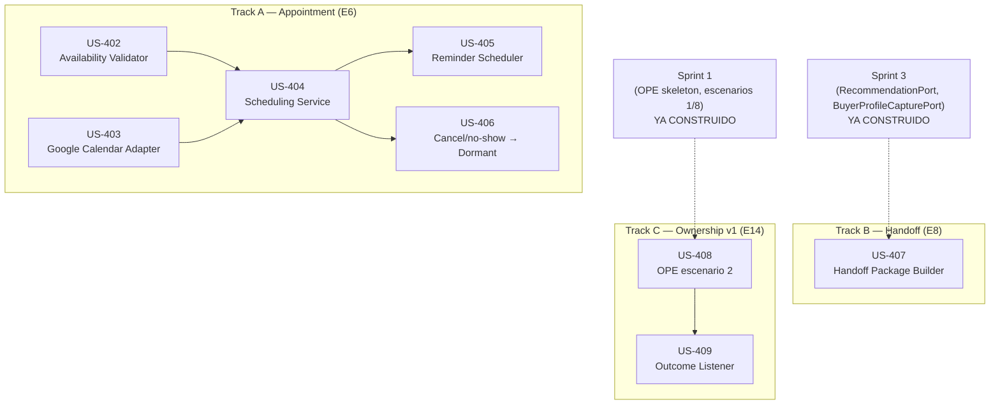

# Historias de Usuario — Appointment, Handoff & Ownership Policy Engine v1

Fuente: `Architecture.md` §6.1.1, §6.4, §7.13–§7.16, §8 (puertos Iteración 5), §9 (eventos), §10 (Iteración 5
— Cierre del flujo operativo de ventas), `ImplementationPlan.md` (Sprint 4), `ArchitecturalDrivers.md`
(E6, E8, E14, QA-01/09/11/13, CRN-2/4/5), `Backlog.md` (Epic 4, US-401), `Maquina_Estados.md` (Conversation
FSM y Appointment FSM), `Customer_Journey_Residencial_WhatsApp_Detallado.md` (§7 Invitación a visita, §8
Confirmación), `Agentic_System.md` (catálogo de servicios deterministas, estado de implementación),
código en `app/modules/appointment/`, `app/modules/conversation_ownership/`.

## Contexto y alcance

Este documento descompone **Iteración 5 de Architecture.md** ("Cierre del flujo operativo de ventas") /
**Sprint 4 de ImplementationPlan.md**, que cubre tres épicas de ArchitecturalDrivers.md al mismo tiempo
porque así fue instanciada la arquitectura (Architecture.md §1.4, meta de Iteración 5): **E6 —
Appointment Scheduling**, **E8 — Human Handoff Mechanics** y **E14 v1 — Ownership Policy Engine
(escenario 2)**. Se investigó el mismo método que `HU_Calificacion_Recomendacion.md`: lectura completa de
Architecture.md §6.1.1/§6.4/§7.13-16/§8/§9/§10 (Iter. 5), ImplementationPlan.md Sprint 4, y verificación
contra el código real:

- `app/modules/appointment/` y `app/modules/engagement/` existen como directorios de módulo pero **solo
  contienen `__init__.py`** — ninguno de los 4 componentes de Appointment (§6.4) tiene código.
- `app/modules/conversation_ownership/application/ownership_policy.py` implementa el skeleton de
  Iteración 2: **solo escenarios 1 y 8** de la matriz E14; el resto lanza `NotImplementedPlaceholder`
  explícito (confirmado en el propio docstring del archivo).
- `app/modules/conversation_ownership/infrastructure/db_models.py::OwnershipDecisionORM` ya persiste
  cada evaluación (tabla `ownership_decisions`, reutilizada desde Sprint 1) y su docstring ya anuncia:
  *"OwnershipOutcome attaches to it from Sprint 4"* — confirma que el Outcome Listener es trabajo nuevo,
  no una tabla nueva sin plan.
- `ConversationState` (dominio) ya modela `APPOINTMENT`, `OWNERSHIP_EVALUATION`, `UNASSIGNED`,
  `ASSIGNED_HUMAN`, `VISIT`, `NEGOTIATION`, `CLOSED_WON`, `CLOSED_LOST` desde Iteración 2 — la FSM no
  necesita cambios de esquema para Sprint 4, solo nuevos disparadores de transición.
- No existe una entidad `Broker` en ningún módulo (grep sin resultados) — es una adición nueva de Sprint 4
  (Architecture §4.2/§4.3: inputs del Availability Validator y de los escenarios 5/7 de la matriz).
- **Conclusión:** las 3 épicas de esta iteración están **100% sin implementar** en código; a diferencia de
  `HU_Calificacion_Recomendacion.md` (que documentaba trabajo ya hecho + gaps), este documento es
  íntegramente el plan de construcción de Sprint 4.

### Por qué una sola numeración US-4xx para 3 épicas

`Backlog.md` numera epics por journey (Epic 4 = Appointment Scheduling, con **US-401** como caja única
Gherkin), pero no tiene una épica propia para Handoff (E8) ni para Ownership Policy Engine (E14) — ambas
viven conceptualmente en el bounded context **Conversation & Ownership** (Architecture.md §4.1), no en
Appointment. En vez de inventar una segunda numeración por driver ID (`E8-xxx`, `E14-xxx`), que no tiene
precedente en ningún documento existente, este catálogo **continúa la secuencia US-4xx** iniciada por
`US-401`, exactamente como `ImplementationPlan.md` agrupa las 3 épicas bajo un solo Sprint 4 con una sola
Definition of Done. Cada HU declara su Epic driver (E6/E8/E14) explícitamente en su encabezado y en la
tabla resumen — no hace falta una numeración separada para eso.

### Notas globales de inconsistencia de nombres (no se repiten por HU)

1. **Conversation FSM:** `Maquina_Estados.md` usa "Scheduling" y "Handoff"; el código
   (`ConversationState`) usa `APPOINTMENT` para el primero y `ASSIGNED_HUMAN`/`OWNERSHIP_EVALUATION` para
   el segundo (no hay un estado `HANDOFF` literal — el handoff es una transición, no un estado propio).
   "Waiting Response" y "Follow-up" del documento no tienen estado dedicado en el código: se resuelven
   como `APPOINTMENT` (mientras se espera la visita) y `DORMANT` (tras decaimiento) respectivamente.
2. **Appointment FSM:** Architecture.md §4.2 define `AppointmentStatus` como `Proposed, Booked, Cancelled,
   NoShow, Completed` (5 valores). `Maquina_Estados.md` describe `Requested, Pending Confirmation,
   Confirmed, Rescheduled, Completed, Cancelled, No Show` (7 valores, incluye `Rescheduled` que
   Architecture.md no modela como estado propio — se trata como un nuevo `Proposed` tras cancelar el
   anterior). Las HUs de abajo usan los nombres de Architecture.md (`AppointmentStatus`) por ser la fuente
   de verdad para *cómo construir*.
3. **Opportunity Stage tras agendar:** `Backlog.md` US-401 dice `Opportunity Stage = Visit`; el dominio
   real (`PipelineStage` enum, Architecture §4.2) tiene `AppointmentSet` (no `Visit` — `Visited` es un
   valor *distinto*, para cuando la visita ya ocurrió). Las HUs usan `AppointmentSet`, consistente con
   `PipelineStage` y con el contrato de nombres de wacrm ya documentado en Architecture.md §4.4.

---

## Epic 4 — Appointment Scheduling (E6)

> `Backlog.md` describe el happy path completo como caja única `US-401`. Se descompone en 5 HUs siguiendo
> los 4 componentes reales de Architecture.md §6.4 (Availability Validator, Google Calendar Adapter,
> Scheduling Service, Reminder Scheduler) más 1 HU de cierre de ciclo (cancelación/no-show → Dormant),
> que Architecture.md §4.3 menciona como comportamiento esperado del agregado `Appointment` pero no tiene
> secuencia dedicada.

### US-402 — Validar disponibilidad de propiedad y asesor antes de proponer o confirmar un horario

Como AI Agent quiero confirmar de forma determinista que una propiedad y su asesor están disponibles en
un horario propuesto, para mitigar el riesgo crítico de negocio de agendar una visita imposible
(ImplementationPlan.md Sprint 4: *"ningún test de agendamiento pasa si Avail devuelve unavailable"*).

```gherkin
Feature: Validación de disponibilidad
Scenario: Horario propuesto está disponible
  Given una propiedad del Top-3 recomendado y un slot propuesto por el lead
  When AvailabilityValidatorPort.check(propertyId, slot) se ejecuta
  Then retorna confirmed, pending o unavailable
  And ningún horario se propone o confirma al lead sin pasar por esta validación primero

Scenario: Re-validación automática antes de la visita
  Given un Appointment con status = Booked
  When faltan entre 2 y 4 horas para scheduledAt
  Then AvailabilityValidatorPort.check se re-ejecuta automáticamente
  And si el resultado cambia a unavailable, el Appointment queda marcado para reprogramación
```

**Alineación**
- (a) Estado FSM: Recommendation → Scheduling (`APPOINTMENT`); Appointment FSM: — → `Proposed`.
- (b) Capa agentic: Availability Validator — servicio determinista fuera del SAS, cuello de botella de
  validación obligatorio (Agentic_System.md confirma: *"No implementado. No existe módulo de
  disponibilidad/citas"*).
- (c) Tablas nuevas: `brokers` (id, organization_id, specialties, active, availability — Architecture
  §4.2, entidad sin equivalente hoy en ningún módulo), y `availability_checks` (auditoría append-only
  por `(property_id, slot)`, distingue `source = initial | revalidation_2_4h`).
- (d) Implementado (`openspec/changes/availability-validator-us-402`: `AvailabilityValidatorService` en
  `app/modules/appointment/application/availability_validator.py`, migración `0016`, RLS por
  `organization_id`, `tests/test_availability_validator.py` — incluye la prueba de aceptación crítica de
  Sprint 4: ningún `confirmed` se produce sin un `AvailabilityCheck` explícito previo). Re-validación
  automática 2-4h (segundo escenario Gherkin) queda con el *disparador* de scheduling pendiente de
  US-404/US-405 (`check()` es re-invocable, pero nada lo dispara todavía sin un `Appointment` real).

### US-403 — Crear evento en Google Calendar con Meet vía `conferenceData`

Como Scheduling Service quiero crear el evento de Calendar con `conferenceData.createRequest` en una sola
llamada, para obtener el link de Meet sin una integración separada (no existe un puerto ni adapter propio
para Meet — Architecture.md §10 Iter. 5).

```gherkin
Feature: Creación de evento con Meet automático
Scenario: Evento creado con link de Meet incluido
  Given un slot ya validado por AvailabilityValidatorPort (confirmed)
  When GoogleCalendarPort.create_event(details, conferenceData=true) se invoca
  Then se crea el evento en Google Calendar API
  And la respuesta incluye hangoutLink (Meet) generado automáticamente, sin una segunda llamada de API
  And Appointment.calendarEventId y Appointment.meetLink quedan poblados con esa única respuesta
```

**Alineación**
- (a) No transiciona la Conversation FSM por sí sola; es un paso interno de US-404.
- (b) Capa agentic: Google Calendar Adapter — servicio determinista de integración GCP. `CON-8`
  (`OrganizationConfig.transcriptSource`) ya reservó el campo desde Sprint 0; el adapter en sí es nuevo.
- (c) `appointments.calendar_event_id`, `appointments.meet_link`.
- (d) `[GAP]` No implementado. No depende de US-402 (integración pura con GCP), pero US-404 sí necesita
  ambas para poder ejecutar el booking.

### US-404 — Materializar la visita validada como `Appointment` (Scheduling Service)

Como Coordinator Agent quiero delegar a Scheduling Service la creación de un `Appointment` ya validado,
coordinando Calendar y disparando los recordatorios, cerrando la orquestación de tools del happy path
(CRN-5, Architecture §10 Iter. 5).

```gherkin
Feature: Materialización de la visita
Scenario: Booking exitoso tras validación
  Given AvailabilityValidatorPort en confirmed y attendees definidos (lead + broker)
  When SchedulingPort.book_visit(slot validado, attendees) se ejecuta
  Then internamente se invoca GoogleCalendarPort.create_event
  And se persiste un Appointment con status = Booked (calendarEventId, meetLink poblados)
  And se publica AppointmentBooked{appointmentId, calendarEventId, meetLink}
  And Scheduling Service dispara ReminderSchedulerPort.schedule_reminders
  And Lead.pipeline_stage sincroniza a AppointmentSet en wacrm (reutiliza el patrón de US-207)
```

**Alineación**
- (a) Scheduling (`APPOINTMENT`) → Waiting Response (sin estado dedicado; se modela como `APPOINTMENT`
  mientras se espera la fecha); Opportunity FSM: `Qualified → AppointmentSet` (ver nota global #3).
- (b) Capa agentic: Scheduling Service — nodo nuevo del mismo grafo LangGraph del Coordinator, cerrando
  CRN-5.
- (c) Tabla nueva `appointments` (id, organization_id, lead_id, broker_id, scheduled_at, status,
  calendar_event_id, meet_link) + `leads.pipeline_stage`.
- (d) `[GAP]` Depende de US-402 (`confirmed` requerido, Architecture §8) y US-403 (invoca el Calendar
  Adapter internamente).

### US-405 — Programar recordatorios 24h/2h persistidos, independientes del booking

Como lead quiero recibir recordatorios automáticos 24h y 2h antes de mi visita, para no olvidarla, sin
que dependan de que el proceso que hizo el booking siga vivo (mismo patrón que `decayToDormant()` de
Iteración 2, CRN-2).

```gherkin
Feature: Recordatorios de visita
Scenario: Recordatorios sobreviven un reinicio del proceso
  Given un Appointment recién creado con scheduledAt definido
  When ReminderSchedulerPort.schedule_reminders(appointmentId, scheduledAt) se ejecuta
  Then se insertan 2 filas en reminder_jobs (24h_before, 2h_before)
  And un job programado independiente (loop propio, no el request original) las procesa cuando due
  And publica ReminderDue{appointmentId, leadTime} para notificar al lead
  And un reinicio del proceso que hizo el booking no pierde los jobs pendientes (persistidos en Postgres)
```

**Alineación**
- (a) Waiting Response (`APPOINTMENT`).
- (b) Capa agentic: Reminder Scheduler — job programado, mismo patrón de `decayToDormant()`.
- (c) Tabla nueva `reminder_jobs` (id, appointment_id, lead_time, due_at, sent_at).
- (d) `[GAP]` Depende de US-404 (necesita un `Appointment` con `scheduledAt` ya persistido).

### US-406 — Cancelación o no-show decae la conversación a `Dormant`

Como sistema quiero que una visita cancelada o con no-show decaiga la conversación a `Dormant`
automáticamente, para que el ciclo de re-entrada existente (`ReactivationEvent` → `OwnershipEvaluation`,
Sprint 5) se dispare por el mecanismo ya construido en Iteración 2, en vez de dejar la conversación varada
en Waiting Response indefinidamente (Architecture §4.3: *"Cancellations/no-shows decay the conversation to
Dormant"*).

```gherkin
Feature: Decaimiento por cancelación o no-show
Scenario: Broker marca la visita como cancelada o no-show
  Given un Appointment con status = Booked
  When el broker marca la visita como Cancelled o NoShow
  Then Appointment.status se actualiza en consecuencia
  And Conversation.decayToDormant() se invoca con reason = "appointment_cancelled_or_noshow"
  And se publica ConversationWentDormant (mismo evento de Iteración 2, sin tipo nuevo)
```

**Alineación**
- (a) Waiting Response → Follow-up (`DORMANT` en código).
- (b) Extiende la Conversation State Machine ya existente (`decayToDormant()`, Iteración 2) — no requiere
  lógica nueva de FSM, solo el disparador desde Appointment.
- (c) `appointments.status`; reutiliza `conversations` sin cambio de esquema.
- (d) `[GAP]` `decayToDormant()` existe desde Sprint 1; nada dispara este trigger nuevo todavía. Depende
  de US-404 (necesita `AppointmentStatus` persistido).

---

## Epic 8 — Human Handoff Mechanics (E8)

> Sin caja única previa en `Backlog.md` (no hay Epic dedicada a Handoff) — HU nueva, alineada directo con
> Architecture.md §7.15 y §10 Iter. 5.

### US-407 — Ensamblar el Handoff Package antes de transferir a un broker

Como broker quiero recibir el perfil completo, las últimas recomendaciones enviadas y un resumen de la
conversación al recibir una transferencia, para nunca partir de una conversación en blanco (Architecture
§7.15: *"El broker nunca recibe una conversación 'en blanco'"*).

```gherkin
Feature: Paquete de contexto para el broker
Scenario: Transferencia con contexto completo
  Given una conversación a transferir a un humano (guardrail, escenario 2 del OPE, o cualquier decisión)
  When HandoffPackagePort.build_package(conversationId) se ejecuta
  Then se obtiene BuyerProfile completo vía BuyerProfileCapturePort (puerto de Sprint 2, sin tocar
       tablas de Lead & Qualification directamente)
  And se obtiene el último Top-3 con explicaciones vía RecommendationPort (puerto de Sprint 3)
  And se obtiene un resumen + historial relevante vía la Conversation State Machine
  And el paquete ensamblado se entrega al broker en Chatwoot junto con el evento OwnershipTransferred
```

**Alineación**
- (a) Handoff (`ASSIGNED_HUMAN` / `OWNERSHIP_EVALUATION`).
- (b) Capa agentic: Handoff Package Builder — Facade que compone **solo** a través de puertos ya
  existentes (`BuyerProfileCapturePort`, `RecommendationPort`, FSM), sin acceso directo a tablas de otro
  módulo (QA-05).
- (c) Sin tabla propia; lee `buyer_profiles`, `recommendations`, `conversations`, `archived_messages`.
- (d) `[GAP]` No implementado. **Independiente de US-402 a US-406** — no requiere que exista ningún
  `Appointment`, solo puertos de Sprint 2/3 ya construidos.

---

## Epic 14 — Ownership Policy Engine v1 (E14)

> Extiende `app/modules/conversation_ownership/application/ownership_policy.py` (skeleton de Sprint 1,
> escenarios 1 y 8 ya implementados), sin cambiar la firma `evaluate(context) -> OwnershipDecision`.

### US-408 — Extender el Ownership Policy Engine con el escenario 2 de la matriz

Como sistema quiero que, cuando un lead con appointment pero sin visita responde tras un silencio
prolongado, el Ownership Policy Engine decida si retoma la AI con memoria o transfiere directamente al
broker anterior según la intención detectada, sin cambiar la interfaz `evaluate(context)` (valida QA-06
por tercera vez consecutiva, Architecture §10 Iter. 5).

```gherkin
Feature: Escenario 2 — appointment sin visita
Scenario: Alta intención detectada tras reactivación
  Given OwnershipContext con appointment_booked = true, visit_occurred = false, broker_anterior conocido
  When OwnershipPolicyEngine.evaluate(context) se ejecuta y el contexto no matchea escenario 1 ni 8
  Then si se detecta alta intención, retorna selected_owner = HUMAN, owner_id = broker_anterior
       (scenario = "scenario_2_appointment_no_visit_high_intent")
  And si la intención es baja o media, retorna selected_owner = AI
       (scenario = "scenario_2_appointment_no_visit_ai_memory"), y la AI continúa calificando
  And NotImplementedPlaceholder deja de lanzarse solo para este contexto — escenarios 3-7, 9-10 lo siguen
       lanzando (quedan para Sprint 5)
```

**Alineación**
- (a) Transversal — se evalúa típicamente al reingresar desde Follow-up/Dormant hacia
  `OwnershipEvaluation`.
- (b) Capa agentic: Ownership Policy Engine — extensión del skeleton de Sprint 1
  (`ownership_policy.py::OwnershipPolicyEngine.evaluate`); misma firma, mismo `NotImplementedPlaceholder`
  para lo no cubierto.
- (c) `ownership_decisions` (ya existe desde Sprint 1, sin cambio de esquema — solo un nuevo valor de
  `scenario`).
- (d) Parcial: escenarios 1 y 8 implementados desde Sprint 1 (`ownership_policy.py:59-94`); este HU agrega
  el 2do de 10. **Independiente de US-402 a US-407** — solo necesita el skeleton de Sprint 1 ya construido.

### US-409 — Outcome Listener: capturar `OwnershipOutcome` y vincularlo a la decisión original

Como Product Owner quiero que el resultado real de negocio (venta, visita, pérdida) quede vinculado a la
`OwnershipDecision` que originó esa asignación de owner, para acumular el training signal de la
optimización ML de Fase 3 sin requerir cambio de esquema futuro (CRN-4, QA-11).

```gherkin
Feature: Captura de OwnershipOutcome
Scenario: Resultado de negocio conocido semanas después
  Given una OwnershipDecision persistida para una conversación (cualquier escenario, no solo el 2)
  When se publica DealClosed, VisitCompleted o ClosedLost para esa misma conversación
  Then Outcome Listener vincula el evento a la OwnershipDecision más reciente de esa conversación
  And se persiste OwnershipOutcome{converted, stageReached} asociado
  And ninguna escritura de outcome ocurre en el momento de la decisión original — el Coordinator nunca
       escribe un resultado que todavía no existe
```

**Alineación**
- (a) Transversal — escucha eventos que la FSM emite en estados avanzados/terminales, sin importar el
  estado desde el que se originó la `OwnershipDecision`.
- (b) Capa agentic: Outcome Listener — nuevo listener suscrito al Event Bus interno; nunca interviene en
  la decisión, solo la observa después (Architecture §7.16).
- (c) Requiere extender `ownership_decisions` con columnas `converted`/`stage_reached`, o una tabla
  `ownership_outcomes` nueva (relación 1:0..1 con `ownership_decisions`) — decisión de esquema abierta al
  implementar, ambas opciones son válidas per Architecture §4.3 (`OwnershipOutcome` como Value Object).
- (d) `[GAP]` Depende de US-408 en la práctica (necesita al menos un escenario más allá del 1/8 para que
  el vínculo sea interesante), aunque técnicamente también podría vincular outcomes a decisiones de
  escenario 1/8 ya existentes desde Sprint 1 sin bloqueo real.

---

## Tabla resumen

| ID | Título breve | Epic driver | Estado FSM | Capa agentic | Tabla(s) | Implementado hoy |
|----|--------------|-------------|-----------|---------------|----------|-------------------|
| US-402 | Availability Validator | E6 | Scheduling (APPOINTMENT) | Servicio determinista, cuello de botella | `brokers`, `availability_checks` (nuevas) | Sí (`availability-validator-us-402`) |
| US-403 | Google Calendar Adapter + Meet | E6 | Interno a US-404 | Adapter de integración GCP | `appointments.calendar_event_id/meet_link` | Sí (`google-calendar-adapter-us-403`) |
| US-404 | Scheduling Service (booking) | E6 | Scheduling → Waiting Response | Nodo nuevo del grafo Coordinator | `appointments` (nueva), `leads.pipeline_stage` | Sí (`scheduling-service-us-404`) |
| US-405 | Reminder Scheduler 24h/2h | E6 | Waiting Response | Job programado independiente | `reminder_jobs` (nueva) | No `[GAP]` |
| US-406 | Cancelación/no-show → Dormant | E6 | Waiting Response → Follow-up (DORMANT) | Extiende FSM existente (`decayToDormant`) | `appointments.status` | No `[GAP]` |
| US-407 | Handoff Package Builder | E8 | Handoff (ASSIGNED_HUMAN/OWNERSHIP_EVALUATION) | Facade sobre puertos existentes | Sin tabla propia | No `[GAP]` |
| US-408 | OPE — escenario 2 | E14 | Transversal (OwnershipEvaluation) | Extiende skeleton de Sprint 1 | `ownership_decisions` (existente) | Parcial (1, 8 ya listos) |
| US-409 | Outcome Listener | E14 | Transversal | Nuevo listener del Event Bus | `ownership_decisions` + `outcome` (nuevo) | No `[GAP]` |

---

## Plan de implementación

Sub-sprints paralelizables (mismo criterio de `ImplementationPlan.md` Sprint 2/3 Fase 2: agrupar por
dependencia dura real, no por epic):

### Sprint 4.1 — Appointment core (secuencial, track propio)

| Orden | HU | Depende de |
|---|---|---|
| 1 | US-402 (Availability Validator) | Ninguna |
| 1 | US-403 (Calendar Adapter) | Ninguna (paralelo a US-402) |
| 2 | US-404 (Scheduling Service) | US-402, US-403 |
| 3 | US-405 (Reminder Scheduler) | US-404 |
| 3 | US-406 (Cancel/no-show → Dormant) | US-404 (paralelo a US-405) |

### Sprint 4.2 — Handoff (paralelizable con 4.1, sin dependencia)

| Orden | HU | Depende de |
|---|---|---|
| 1 | US-407 (Handoff Package Builder) | Ninguna — solo puertos de Sprint 2/3 ya construidos |

### Sprint 4.3 — Ownership Policy Engine v1 (paralelizable con 4.1 y 4.2)

| Orden | HU | Depende de |
|---|---|---|
| 1 | US-408 (OPE escenario 2) | Ninguna — solo el skeleton de Sprint 1 |
| 2 | US-409 (Outcome Listener) | US-408 |

**Definition of Done (Architecture.md §10 Iter. 5 / ImplementationPlan.md Sprint 4):** E6, E8, E14 v1,
QA-09, QA-11, CRN-4 → **Satisfied**; CRN-5 → **cierra** (orquestación completa de tools del happy path).
**Prueba de aceptación crítica:** ningún test de agendamiento pasa si `AvailabilityValidatorPort.check`
devuelve `unavailable` — es la mitigación directa del riesgo crítico de negocio del customer journey (§7
Invitación a visita: *"Validar disponibilidad del asesor, del propietario y estado de la propiedad"*).

**Dependencias externas a este documento:** Sprint 3 completo (Top-3 recomendado es precondición para
poder agendar visita sobre él — `RecommendationPort` ya construido y usado por US-407).

---

## Mapa de dependencias



**Lectura del mapa — qué paralelizar:**

- **Día 1, 4 HUs pueden arrancar simultáneamente sin bloqueo alguno:** US-402, US-403 (Track A, entre sí
  paralelas), US-407 (Track B, cero dependencia de Track A) y US-408 (Track C, cero dependencia de Track
  A/B). Con 3+ desarrolladores/agentes, esto es paralelismo real desde el inicio del sprint.
- **Camino crítico del sprint = Track A completo:** US-402/403 → US-404 → US-405/406 (3 pasos
  secuenciales). Las Tracks B y C son más cortas (1 y 2 pasos respectivamente) y nunca son el cuello de
  botella si arrancan en paralelo con A.
- **US-405 y US-406 son paralelas entre sí** una vez cerrado US-404 (ambas solo leen `Appointment`, no se
  escriben entre sí).
- **US-409 es el único punto de esta iteración con dependencia dura de otra HU de la misma track** (US-408)
  — no tiene forma de paralelizarse dentro de Track C, pero sí corre en paralelo a *todo* Track A y B.
- **Acoplamiento suave no bloqueante:** US-409 (Outcome Listener) es más útil una vez existe US-406
  (`VisitCompleted`/cancelaciones reales que vincular), pero no está bloqueada por ella — puede
  implementarse y probarse contra los escenarios 1/8 ya existentes desde Sprint 1.

---

## Archivos de referencia (no se modifican, solo se citan como fuente)

- `Documents/Oficial/Architecture.md` §6.1.1, §6.4, §7.13–§7.16, §8, §9, §10 (Iteración 5)
- `Documents/Oficial/ImplementationPlan.md` (Sprint 4)
- `Documents/Oficial/ArchitecturalDrivers.md` (E6, E8, E14, QA-01/06/09/11/13, CRN-2/4/5)
- `Documents/Oficial/Backlog.md` (Epic 4, US-401)
- `Documents/Oficial/Maquina_Estados.md`, `Customer_Journey_Residencial_WhatsApp_Detallado.md`,
  `Agentic_System.md`
- `app/modules/appointment/__init__.py`, `app/modules/engagement/__init__.py` (stubs vacíos, verificados)
- `app/modules/conversation_ownership/application/ownership_policy.py`,
  `app/modules/conversation_ownership/domain/models.py`,
  `app/modules/conversation_ownership/infrastructure/db_models.py`

## Verificación

- El archivo `Documents/Oficial/HU_Appointment_Handoff_Ownership.md` debe existir con las secciones de
  arriba; revisar visualmente que cada HU cite nombres reales de puertos/eventos de Architecture.md (no
  inventados) contrastando contra §8/§9, y que el estado "Implementado hoy" coincida con la comprobación
  de código citada en "Contexto y alcance" (`app/modules/appointment/` y `engagement/` vacíos,
  `ownership_policy.py` con solo escenarios 1/8).
- No se ejecuta código, no se corren tests, no se toca Supabase — es un entregable puramente documental,
  igual que su precedente `HU_Calificacion_Recomendacion.md`.
